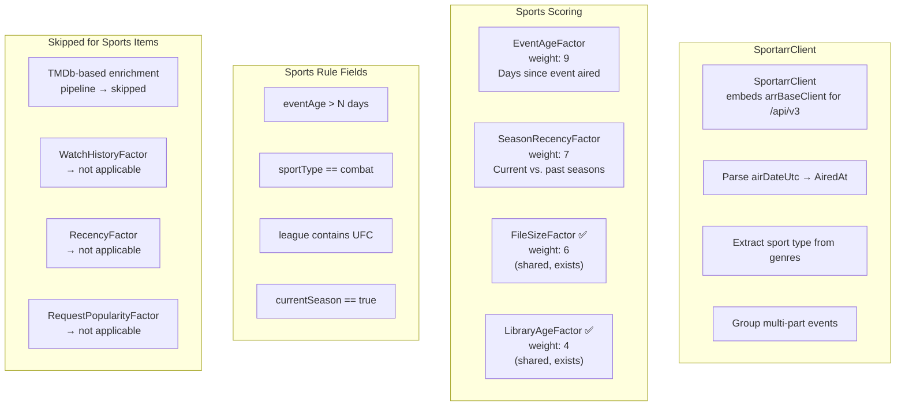

# Sportarr Integration — Sports-Aware Capacity Management

**Status:** 🔲 Planned
**Branch:** `feature/sportarr-integration`

## Background

[Sportarr](https://github.com/Sportarr/Sportarr) is a Sports PVR for Usenet and Torrents — a Sonarr fork (C#/.NET) that manages sports events (UFC, F1, NBA, NFL, soccer, motorsport, etc.) the same way Sonarr manages TV series. It monitors leagues, searches indexers, downloads, renames, and organizes sports media. Runs on port `1867`, uses `X-Api-Key` header authentication.

**Source:** [github.com/Sportarr/Sportarr](https://github.com/Sportarr/Sportarr) (327 stars, 1037 releases, GPLv3)
**Docs:** [sportarr.net/docs](https://sportarr.net/docs) | [API Docs](https://sportarr.net/docs/api)

### Why Sports Needs Dedicated Handling

Sports media has fundamentally different lifecycle characteristics from movies, TV, and music. A naive "treat it like Sonarr" approach would produce broken scoring because:

1. **No TMDb IDs** — Sportarr uses TheSportsDB as its metadata source, not TMDb. All TMDb-based enrichment (watch history, requests, watchlists, collections, labels) would fail silently, producing zero matches.
2. **Top two scoring factors are broken** — WatchHistoryFactor (weight 10) and RecencyFactor (weight 8) require TMDb-matched enrichment data. Without it, every sports item scores 1.0 (maximum deletable) on both — 60% of the default scoring weight is useless.
3. **SeriesStatusFactor is meaningless** — Leagues are perpetual ("continuing" forever). Zero signal.
4. **RatingFactor is rarely useful** — Sports events don't have meaningful 0-10 ratings in *arr.
5. **Time-sensitive content** — Sports events have a rapid value decay curve. A UFC fight from last week is very different from one 3 years ago. The generic model has no concept of "when the event aired."
6. **Seasonal structure** — Current season content is far more valuable than past seasons. No existing factor captures this.

### Sportarr API Surface

Sportarr exposes two API layers:

#### Native API (`/api/`)

| Category | Endpoints | Purpose |
|---|---|---|
| Events | `/api/events` | List/manage sports events |
| Leagues | `/api/leagues`, `/api/library/search` | List/manage sports leagues |
| Download Clients | `/api/downloadclient` | Download client config |
| Indexers | `/api/indexer` | Indexer config |
| IPTV/DVR | `/api/iptv/filtered.m3u`, `/api/iptv/filtered.xml` | IPTV streams (alpha) |
| System | `/api/system/status` | Health & status |

#### Sonarr v3-Compatible API (`/api/v3/`)

Added for Decypharr and Maintainerr compatibility:

| Endpoint | Sportarr Concept | Sonarr v3 Shape |
|---|---|---|
| `/api/v3/series` | Leagues | Full series response (id, title, year, path, genres, tags, seasons, statistics, qualityProfileId, images, added) |
| `/api/v3/episode` | Events | Full episode response (id, seriesId, seasonNumber, episodeNumber, title, airDateUtc, hasFile, monitored) |
| `/api/v3/episodefile` | Event files | File management with sizeOnDisk, quality, path |
| `/api/v3/system/status` | System health | Standard Sonarr connection test |
| `/api/v3/qualityprofile` | Quality profiles | Standard Sonarr quality system |
| `/api/v3/tag` | Tags | Standard Sonarr tag system |
| `/api/v3/rootfolder` | Root folders | Standard Sonarr root folder config |
| `/api/v3/diskspace` | Disk usage | Standard Sonarr disk space reporting |

### Data Model Mapping

| Sportarr Concept | Sonarr v3 Field | Capacitarr `MediaType` | Sports Semantic |
|---|---|---|---|
| League (e.g., "UFC") | `series.title` | `MediaTypeShow` | Show-level deletion = entire league |
| Season (e.g., "Season 2025") | `series.seasons[].seasonNumber` | `MediaTypeSeason` | Year-based grouping |
| Event (e.g., "UFC 300") | `episode.title` | n/a (event-level data used for `AiredAt`) | Individual sporting event |
| Event Date | `episode.airDateUtc` | `MediaItem.AiredAt` (new field) | **Critical signal for sports scoring** |
| Sport Type | `series.genres` | `MediaItem.SportType` (new field) | Combat, motorsport, team sport, etc. |
| Multi-part Events | Multiple episode files per event | Grouped by parent event | Prelims + main card |

### Architecture Decision: Sports-Aware, Not Generic *arr



---

## Implementation Plan

### Phase 1: MediaItem Model Extensions

**Goal:** Add sports-specific fields to `MediaItem` that the scoring engine and rule engine can consume.

#### Step 1.1: Add `AiredAt` field to `MediaItem`

**File:** `backend/internal/integrations/types.go`

Add a new field after the existing `AddedAt` field:

```go
// AiredAt is the original air/broadcast date of the content. For movies
// and TV shows, this is typically the release date or episode air date.
// For sports events, this is the date the event took place. Used by
// EventAgeFactor and SeasonRecencyFactor for time-decay scoring.
// Populated by Sportarr (from airDateUtc) and optionally by Sonarr.
AiredAt *time.Time `json:"airedAt,omitempty"`
```

This field is semantically distinct from `AddedAt` (when the item entered the *arr library) and `LastPlayed` (when someone watched it). `AiredAt` answers "when did this content originally exist in the real world?"

#### Step 1.2: Add `SportType` field to `MediaItem`

**File:** `backend/internal/integrations/types.go`

Add a new field in the metadata section:

```go
// SportType classifies the sport category for Sportarr items. Values
// are normalized from Sportarr's genre/sport classification: "combat",
// "motorsport", "team", "individual", "racing". Empty for non-sports
// integrations. Used by the rule engine for sport-type-based rules.
SportType string `json:"sportType,omitempty"`
```

#### Step 1.3: Add `League` field to `MediaItem`

**File:** `backend/internal/integrations/types.go`

The existing `ShowTitle` field already serves this purpose (league name for seasons, show name for TV). Document this mapping clearly but do NOT add a redundant field. Instead, the rule engine will gain a `league` rule field that reads from `ShowTitle`. This avoids model bloat — the Sonarr v3 API already puts the league name in the series title position.

---

### Phase 2: Sportarr Client

**Goal:** Create a `SportarrClient` that extracts sports-specific semantics from Sportarr's Sonarr v3-compatible API.

#### Step 2.1: Add `IntegrationTypeSportarr` constant

**File:** `backend/internal/integrations/types.go`

Add to the `IntegrationType` const block after `IntegrationTypeTracearr`:

```go
// IntegrationTypeSportarr identifies a Sportarr (sports PVR) integration.
// Sportarr manages sports events (UFC, F1, NFL, etc.) using a Sonarr v3-
// compatible API. Unlike other *arr integrations, Sportarr items use
// TheSportsDB IDs (not TMDb), so TMDb-based enrichment is not applicable.
// Sports-specific scoring factors (EventAgeFactor, SeasonRecencyFactor)
// replace the generic watch-based factors for Sportarr items.
IntegrationTypeSportarr IntegrationType = "sportarr"
```

Update the capability comment block to include:

```
// Sportarr:                         Connectable + MediaSource + DiskReporter + MediaDeleter + RuleValueFetcher (sports-aware)
```

#### Step 2.2: Add `"sportarr"` to `ValidIntegrationTypes`

**File:** `backend/internal/db/validation.go`

Add `"sportarr": true` to the `ValidIntegrationTypes` map.

#### Step 2.3: Create `sportarr.go` client

**File:** `backend/internal/integrations/sportarr.go` (new)

The client embeds `arrBaseClient` for shared Sonarr v3 methods (TestConnection, GetDiskSpace, GetRootFolders, GetQualityProfiles, GetTags, GetLanguages) but provides a sports-aware `GetMediaItems()` and `DeleteMediaItem()`.

```go
// SportarrClient implements Connectable, MediaSource, DiskReporter,
// MediaDeleter, and RuleValueFetcher for Sportarr's Sonarr v3-compatible API.
//
// Unlike SonarrClient, SportarrClient extracts sports-specific fields:
// - AiredAt from episode.airDateUtc (event date)
// - SportType from series.genres (normalized sport classification)
// - League name from series.title (stored in ShowTitle)
//
// Shared *arr methods are provided by the embedded arrBaseClient.
type SportarrClient struct {
    arrBaseClient
}

func NewSportarrClient(url, apiKey string) *SportarrClient {
    return &SportarrClient{
        arrBaseClient: newArrBaseClient(url, apiKey, "/api/v3"),
    }
}
```

##### `GetMediaItems()` — Sports-Aware Parsing

The response shape matches Sonarr v3 `series` + `episode` endpoints. Key differences from `SonarrClient.GetMediaItems()`:

1. **Fetch episodes with files** — Call `/api/v3/episode?seriesId=<id>&hasFile=true` for each league to get `airDateUtc`. Sonarr's series endpoint includes per-season statistics but NOT per-episode air dates. Sportarr's episode endpoint provides the critical `airDateUtc` field.

2. **Parse `airDateUtc`** — Convert to `*time.Time` and store in `MediaItem.AiredAt`. This is the single most important field for sports scoring.

3. **Normalize sport type from genres** — Sportarr's `/api/v3/series` response includes `genres` (e.g., `["Fighting", "MMA"]`, `["Motorsport"]`, `["Basketball", "NBA"]`). Normalize to a canonical set:

   | Sportarr Genres | Normalized `SportType` |
   |---|---|
   | Fighting, MMA, Boxing, Wrestling | `combat` |
   | Motorsport, Formula 1, NASCAR, Rally | `motorsport` |
   | Basketball, Football, Soccer, Hockey, Baseball, Rugby, Cricket | `team` |
   | Tennis, Golf, Cycling, Athletics | `individual` |
   | (fallback) | `other` |

4. **Populate `ShowTitle` as league name** — `series.title` (e.g., "UFC", "Formula 1") goes into `ShowTitle` for season-type items. This is already the pattern used by `SonarrClient`.

5. **Use `AiredAt` from the most recent episode** — For season-level items, set `AiredAt` to the air date of the most recent episode in that season. This represents "how old is the newest content in this season?"

6. **Handle multi-part events** — Sportarr uses multiple episode files per event (prelims, main card). These share the same `airDateUtc` and parent event. Sum their sizes and treat as a single logical unit at the season level (which is the level Capacitarr operates at for Sonarr-family integrations).

##### `DeleteMediaItem()` — Season and League Deletion

Follow the same pattern as `SonarrClient.DeleteMediaItem()`:

- `MediaTypeShow` → `DELETE /api/v3/series/{id}?deleteFiles=true` (delete entire league)
- `MediaTypeSeason` → Fetch episode files for the season, bulk delete via `/api/v3/episodefile/bulk`

The code can be largely copied from `SonarrClient.DeleteMediaItem()` since Sportarr's Sonarr v3-compatible API uses the same delete endpoints.

#### Step 2.4: Register factory

**File:** `backend/internal/integrations/factory.go`

Add to `RegisterAllFactories()` after the Tracearr entry:

```go
RegisterFactory(string(IntegrationTypeSportarr), func(url, apiKey string) interface{} {
    return NewSportarrClient(url, apiKey)
})
```

#### Step 2.5: Write unit tests for `SportarrClient`

**File:** `backend/internal/integrations/sportarr_test.go` (new)

Use `httptest.NewServer` pattern from `sonarr_test.go`. Mock the Sonarr v3 endpoint responses with sports-domain data.

Test cases:

- `TestSportarrClient_TestConnection_Success` — mock `/api/v3/system/status` 200
- `TestSportarrClient_TestConnection_Unauthorized` — mock 401
- `TestSportarrClient_GetMediaItems_ParsesAiredAt` — mock series + episode responses with `airDateUtc`, verify `AiredAt` populated
- `TestSportarrClient_GetMediaItems_NormalizesSportType` — mock series with genre `["Fighting", "MMA"]`, verify `SportType == "combat"`
- `TestSportarrClient_GetMediaItems_LeagueAsShowTitle` — verify `ShowTitle == "UFC"` for season items
- `TestSportarrClient_GetMediaItems_SkipsEmptySeasons` — seasons with `sizeOnDisk == 0` excluded
- `TestSportarrClient_GetMediaItems_MultiPartEvents` — multiple episode files, sizes aggregated correctly
- `TestSportarrClient_DeleteMediaItem_League` — verifies `DELETE /api/v3/series/{id}?deleteFiles=true` called
- `TestSportarrClient_DeleteMediaItem_Season` — verifies episodefile bulk delete flow
- `TestSportarrClient_GetDiskSpace_Success` — inherited from `arrBaseClient`, just verify the endpoint is called

Use sports-domain test data: league "UFC", season 2025, event "UFC 300".

#### Step 2.6: Run `make ci`

Verify all Phase 2 changes pass lint, test, and security checks.

---

### Phase 3: Sports-Specific Scoring Factors

**Goal:** Add scoring factors that produce meaningful signals for sports content, replacing the broken TMDb-dependent factors.

#### Step 3.1: Create `EventAgeFactor`

**File:** `backend/internal/engine/factors.go`

```go
// EventAgeFactor scores items by how long ago the content originally aired.
// For sports events, this is the event date (AiredAt). Older events are
// more deletable — sports content has a rapid value decay curve.
// Falls back to AiredAt == nil → 0.5 (neutral), so non-sports items
// with no AiredAt are unaffected.
//
// Implements MediaTypeScoped — only applies to seasons and shows
// (Sportarr items). Movies and episodes from Sonarr don't have AiredAt
// populated and would always score 0.5 (neutral), adding noise.
type EventAgeFactor struct{}
```

Properties:

| Property | Value |
|---|---|
| `Name()` | `"Event Freshness"` |
| `Key()` | `"event_age"` |
| `Description()` | `"Older events score higher for deletion. Sports content decays in value rapidly after airing."` |
| `DefaultWeight()` | `9` |
| `ApplicableMediaTypes()` | `[MediaTypeSeason, MediaTypeShow]` |

`Calculate()` scoring curve:

```
if AiredAt is nil or zero → 0.5 (neutral)
days := time.Since(AiredAt) / 24
if days < 7   → 0.05 (strongly protect recent events)
if days < 30  → 0.15
if days < 90  → 0.35
if days < 180 → 0.55
if days < 365 → 0.75
else          → 0.95 (old events are highly deletable)
```

The curve is steeper at the start (events lose value fast in the first month) and flattens later (an event from 6 months ago vs. 8 months ago doesn't differ much).

This factor must NOT implement `RequiresIntegration` for Sportarr specifically — it should be silently excluded for items without `AiredAt` via the `ApplicableMediaTypes` + nil check. This avoids hard-coupling the factor to a specific integration type and allows future use if Sonarr/Radarr items gain `AiredAt` population.

However, to prevent the factor from appearing in the weights UI when no Sportarr integration is configured, implement `RequiresIntegration`:

```go
func (f *EventAgeFactor) RequiredIntegrationType() integrations.IntegrationType {
    return integrations.IntegrationTypeSportarr
}
```

#### Step 3.2: Create `SeasonRecencyFactor`

**File:** `backend/internal/engine/factors.go`

```go
// SeasonRecencyFactor scores items by whether their season is current,
// recent, or old. Current-year season content is protected; past seasons
// are increasingly deletable. Uses the item's Year field (which corresponds
// to Sportarr's season year).
//
// Implements MediaTypeScoped — only applies to seasons (the primary
// unit of Sportarr content management).
type SeasonRecencyFactor struct{}
```

Properties:

| Property | Value |
|---|---|
| `Name()` | `"Season Recency"` |
| `Key()` | `"season_recency"` |
| `Description()` | `"Current season is protected. Past seasons are more deletable."` |
| `DefaultWeight()` | `7` |
| `ApplicableMediaTypes()` | `[MediaTypeSeason]` |
| `RequiredIntegrationType()` | `IntegrationTypeSportarr` |

`Calculate()` scoring:

```
currentYear := time.Now().Year()
seasonAge := currentYear - item.Year
if seasonAge <= 0 → 0.1  (current or future season — protect)
if seasonAge == 1 → 0.4  (last year — moderate protection)
if seasonAge == 2 → 0.7  (two years ago — lean toward removal)
else              → 0.9  (old seasons — highly deletable)
```

#### Step 3.3: Add new factors to `DefaultFactors()`

**File:** `backend/internal/engine/factors.go`

Append to the `DefaultFactors()` slice:

```go
func DefaultFactors() []ScoringFactor {
    return []ScoringFactor{
        &WatchHistoryFactor{},
        &RecencyFactor{},
        &FileSizeFactor{},
        &RatingFactor{},
        &LibraryAgeFactor{},
        &SeriesStatusFactor{},
        &RequestPopularityFactor{},
        &EventAgeFactor{},        // new
        &SeasonRecencyFactor{},   // new
    }
}
```

The existing `RequiresIntegration` mechanism ensures these factors are automatically hidden from the UI and excluded from scoring when no Sportarr integration is configured.

#### Step 3.4: Write scoring factor tests

**File:** `backend/internal/engine/factors_test.go`

Test cases for `EventAgeFactor`:

- `TestEventAgeFactor_RecentEvent` — AiredAt 3 days ago → 0.05
- `TestEventAgeFactor_MonthOldEvent` — AiredAt 15 days ago → 0.15
- `TestEventAgeFactor_QuarterOldEvent` — AiredAt 60 days ago → 0.35
- `TestEventAgeFactor_YearOldEvent` — AiredAt 200 days ago → 0.75
- `TestEventAgeFactor_VeryOldEvent` — AiredAt 500 days ago → 0.95
- `TestEventAgeFactor_NilAiredAt` — AiredAt nil → 0.5
- `TestEventAgeFactor_ApplicableMediaTypes` — verify only `[season, show]`
- `TestEventAgeFactor_RequiredIntegrationType` — verify `sportarr`

Test cases for `SeasonRecencyFactor`:

- `TestSeasonRecencyFactor_CurrentSeason` — Year == current year → 0.1
- `TestSeasonRecencyFactor_LastSeason` — Year == current year - 1 → 0.4
- `TestSeasonRecencyFactor_TwoYearsAgo` — Year == current year - 2 → 0.7
- `TestSeasonRecencyFactor_OldSeason` — Year == current year - 5 → 0.9
- `TestSeasonRecencyFactor_FutureSeason` — Year == current year + 1 → 0.1
- `TestSeasonRecencyFactor_ApplicableMediaTypes` — verify only `[season]`
- `TestSeasonRecencyFactor_RequiredIntegrationType` — verify `sportarr`

#### Step 3.5: Run `make ci`

---

### Phase 4: Rule Engine Extensions

**Goal:** Add sports-specific rule fields that let users create natural deletion rules for sports content.

#### Step 4.1: Add `eventAge` rule field

**File:** `backend/internal/engine/rules.go`

Add to the `matchesRuleWithValue` switch:

```go
case "eventage":
    if item.AiredAt == nil || item.AiredAt.IsZero() {
        return false, ""
    }
    ruleNum, err := strconv.ParseFloat(val, 64)
    if err != nil {
        return false, ""
    }
    days := time.Since(*item.AiredAt).Hours() / 24.0
    switch cond {
    case "in_last":
        return days <= ruleNum, fmt.Sprintf("%.0f days", days)
    case "over_ago":
        return days > ruleNum, fmt.Sprintf("%.0f days", days)
    default:
        matched := numberMatch(days, cond, ruleNum)
        return matched, fmt.Sprintf("%.0f days", days)
    }
```

This mirrors the existing `timeinlibrary` pattern but operates on `AiredAt` instead of `AddedAt`. Supports `>`, `<`, `>=`, `<=`, `in_last`, `over_ago` operators.

Example rules:
- `eventAge over_ago 30` → "Remove events that aired more than 30 days ago"
- `eventAge in_last 7` + `always_keep` → "Always keep events from the past week"

#### Step 4.2: Add `sportType` rule field

**File:** `backend/internal/engine/rules.go`

```go
case "sporttype":
    matched := stringMatch(strings.ToLower(item.SportType), cond, val)
    return matched, item.SportType
```

Supports `==`, `!=`, `contains`, `!contains` operators.

Example rules:
- `sportType == combat` + `prefer_keep` → "Prefer keeping combat sports"
- `sportType == team` + `lean_remove` → "Lean toward removing team sports (less rewatchable)"

#### Step 4.3: Add `league` rule field

**File:** `backend/internal/engine/rules.go`

```go
case "league":
    matched := stringMatch(strings.ToLower(item.ShowTitle), cond, val)
    return matched, item.ShowTitle
```

This is an alias for `ShowTitle` that reads naturally for sports content. Supports all string operators.

Example rules:
- `league contains UFC` + `always_keep` → "Always keep UFC content"
- `league == Formula 1` + `lean_keep` → "Lean toward keeping F1"

#### Step 4.4: Add `currentSeason` rule field

**File:** `backend/internal/engine/rules.go`

```go
case "currentseason":
    currentYear := time.Now().Year()
    isCurrent := item.Year == currentYear || item.Year == currentYear-1
    ruleBool := val == boolTrue
    return isCurrent == ruleBool, fmt.Sprintf("%d (current: %d)", item.Year, currentYear)
```

Boolean field. Returns true if the item's year is the current year or previous year (sports seasons often span two calendar years, e.g., "NBA 2024-2025"). Supports `==` with `true`/`false`.

Example rules:
- `currentSeason == true` + `always_keep` → "Always keep current season content"
- `currentSeason == false` + `lean_remove` → "Lean toward removing old seasons"

#### Step 4.5: Add rule field metadata for frontend

**File:** `backend/internal/db/validation.go`

Add the new fields to the `ValidRuleFields` map (or equivalent validation set) if one exists. If validation is handled purely on the frontend, this step updates the frontend rule builder instead (see Phase 5).

#### Step 4.6: Write rule engine tests

**File:** `backend/internal/engine/rules_test.go`

Test cases:

- `TestMatchesRule_EventAge_OverAgo` — AiredAt 45 days ago, rule `eventAge over_ago 30` → match
- `TestMatchesRule_EventAge_InLast` — AiredAt 5 days ago, rule `eventAge in_last 7` → match
- `TestMatchesRule_EventAge_NilAiredAt` — AiredAt nil → no match
- `TestMatchesRule_SportType_Equals` — SportType "combat", rule `sportType == combat` → match
- `TestMatchesRule_SportType_Contains` — SportType "motorsport", rule `sportType contains motor` → match
- `TestMatchesRule_SportType_Empty` — SportType "", rule `sportType == combat` → no match
- `TestMatchesRule_League_Contains` — ShowTitle "UFC", rule `league contains UFC` → match
- `TestMatchesRule_League_NotContains` — ShowTitle "NFL", rule `league !contains UFC` → match
- `TestMatchesRule_CurrentSeason_True` — Year == current year, rule `currentSeason == true` → match
- `TestMatchesRule_CurrentSeason_False_OldYear` — Year == current year - 3, rule `currentSeason == true` → no match
- `TestMatchesRule_CurrentSeason_PreviousYear` — Year == current year - 1, rule `currentSeason == true` → match (spans two years)

#### Step 4.7: Run `make ci`

---

### Phase 5: Enrichment Pipeline — Sportarr Item Exclusion

**Goal:** Prevent TMDb-based enrichers from wasting cycles on Sportarr items that will never match.

#### Step 5.1: Add integration type awareness to enrichment

**File:** `backend/internal/integrations/enrichers.go`

The TMDb-based enrichers (`BulkWatchEnricher`, `TautulliEnricher`, `JellystatEnricher`, `TracearrEnricher`, `RequestEnricher`, `WatchlistEnricher`, `CollectionEnricher`, `LabelEnricher`) already skip items with `TMDbID == 0`:

```go
if item.TMDbID == 0 {
    continue // Skip items without TMDb ID
}
```

Since Sportarr items will never have a `TMDbID`, they are already effectively excluded from TMDb-based enrichment. **No code change needed** — the existing nil-TMDb-ID guards are sufficient.

However, this means Sportarr items will appear in the `unmatched` count of every enricher's log output. To reduce log noise, add a debug-level log at the pipeline level noting how many items lack TMDb IDs:

**File:** `backend/internal/integrations/enrichment_pipeline.go`

In `Run()`, before the enricher loop, count items without TMDb IDs and log once:

```go
noTMDbCount := 0
for _, item := range items {
    if item.TMDbID == 0 {
        noTMDbCount++
    }
}
if noTMDbCount > 0 {
    slog.Debug("Items without TMDb ID will skip TMDb-based enrichment",
        "component", "enrichment", "count", noTMDbCount, "total", len(items))
}
```

#### Step 5.2: Ensure sports scoring factors are excluded for non-sports items

The `RequiresIntegration` interface on `EventAgeFactor` and `SeasonRecencyFactor` (from Phase 3) ensures these factors only participate when a Sportarr integration is configured. For non-Sportarr items in a mixed environment (e.g., user has both Sonarr and Sportarr), the factors need per-item exclusion.

`EventAgeFactor`: Items without `AiredAt` score `0.5` (neutral). Combined with `ApplicableMediaTypes` limiting to `[season, show]`, and Sonarr show/season items that DO have `AiredAt` populated would receive the full scoring curve. This is actually desirable — if we start populating `AiredAt` for Sonarr items from their air dates, they benefit from the same time-decay logic. No special handling needed.

`SeasonRecencyFactor`: Only applies to `MediaTypeSeason` items per `ApplicableMediaTypes`. The `Year` field is already populated for both Sonarr and Sportarr seasons. This is also desirable — old TV seasons are legitimately more deletable than current ones. No special handling needed.

**Conclusion:** No additional exclusion logic needed. The existing `MediaTypeScoped` + `RequiresIntegration` + nil-check patterns provide correct behavior for mixed environments.

---

### Phase 6: Frontend Integration

**Goal:** Add Sportarr to the integration UI and expose sports-specific rule fields.

#### Step 6.1: Update `integrationHelpers.ts`

**File:** `frontend/app/utils/integrationHelpers.ts`

Add `sportarr` entries to all switch statements and maps:

| Property | Value |
|---|---|
| `typeIcon` | `TrophyIcon` from `lucide-vue-next` |
| `typeColor` | `'bg-emerald-500'` |
| `typeTextColor` | `'text-emerald-500'` |
| `namePlaceholders` | `'My Sportarr'` |
| `urlPlaceholders` | `'http://localhost:1867'` |
| `urlHelpTexts` | `'Your Sportarr instance URL. Uses X-Api-Key authentication (same as Sonarr/Radarr). Get your API key from Sportarr Settings → General.'` |

#### Step 6.2: Add Sportarr to type selector

**File:** `frontend/app/components/settings/SettingsIntegrations.vue`

Add after the Readarr `<UiSelectItem>`, grouping it with the *arr-family integrations:

```vue
<UiSelectItem value="sportarr">Sportarr</UiSelectItem>
```

#### Step 6.3: Add sports rule fields to rule builder

**File:** `frontend/app/components/settings/rules/` (rule builder component)

Add the new rule fields to the field dropdown when a Sportarr integration is configured:

| Field | Label | Operators | Value Type |
|---|---|---|---|
| `eventAge` | `Event Age (days)` | `>`, `<`, `>=`, `<=`, `in_last`, `over_ago` | Number input |
| `sportType` | `Sport Type` | `==`, `!=`, `contains`, `!contains` | Dropdown: combat, motorsport, team, individual, other |
| `league` | `League` | `==`, `!=`, `contains`, `!contains` | Text input (with autocomplete from Sportarr tags if possible) |
| `currentSeason` | `Current Season` | `==` | Boolean toggle (true/false) |

These fields should only appear in the dropdown when the selected rule's integration is a Sportarr instance. Conditionally show based on the integration's type.

#### Step 6.4: Add factor descriptions for sports factors

**File:** Frontend factor weights component

The `EventAgeFactor` and `SeasonRecencyFactor` will automatically appear in the factor weights UI when a Sportarr integration is configured (via the existing self-describing factor metadata system). No additional frontend work needed — the backend's `Name()`, `Key()`, and `Description()` methods provide all necessary metadata.

Verify that the color mapping in the frontend covers the new factor keys (`event_age`, `season_recency`). If the frontend uses a static color map, add entries:

| Key | Suggested Color |
|---|---|
| `event_age` | `emerald` (matches Sportarr brand color) |
| `season_recency` | `lime` |

---

### Phase 7: Testing and Documentation

#### Step 7.1: Run full CI

Run `make ci` to verify all changes pass lint, test, and security checks.

#### Step 7.2: Manual integration test

1. Deploy a Sportarr instance via Docker (`sportarr/sportarr:latest`, port 1867)
2. Add a league (e.g., UFC) and let it populate events
3. Get the API key from Sportarr Settings → General
4. Add Sportarr integration in Capacitarr Settings
5. Verify connection test passes (green status)
6. Trigger a poll cycle and verify:
   - Media items appear with correct `AiredAt` dates
   - `SportType` is populated (e.g., "combat" for UFC)
   - `ShowTitle` is the league name
   - Event Age and Season Recency scoring factors appear in the UI
   - New rule fields appear in the rule builder when selecting Sportarr integration
7. Create test rules:
   - `eventAge over_ago 90` + `always_remove` → verify old events score for deletion
   - `league contains UFC` + `always_keep` → verify UFC events are protected
   - `currentSeason == true` + `prefer_keep` → verify current season is protected

#### Step 7.3: Update documentation

- Add Sportarr to the integrations list in `README.md`
- Note the Sonarr v3-compatible API requirement (Sportarr v4.0.973+ which added Maintainerr-compatible endpoints)
- Document the sports-specific rule fields in the rules documentation
- Document the EventAgeFactor and SeasonRecencyFactor scoring behaviors

---

## File Change Summary

| File | Phase | Change | Description |
|------|-------|--------|-------------|
| `backend/internal/integrations/types.go` | 1, 2 | Modify | Add `AiredAt`, `SportType` fields; add `IntegrationTypeSportarr` constant; update capability comments |
| `backend/internal/db/validation.go` | 2 | Modify | Add `"sportarr"` to `ValidIntegrationTypes` |
| `backend/internal/integrations/sportarr.go` | 2 | New | `SportarrClient` with sports-aware `GetMediaItems()` and `DeleteMediaItem()` |
| `backend/internal/integrations/sportarr_test.go` | 2 | New | Unit tests for `SportarrClient` |
| `backend/internal/integrations/factory.go` | 2 | Modify | Register Sportarr factory |
| `backend/internal/engine/factors.go` | 3 | Modify | Add `EventAgeFactor` and `SeasonRecencyFactor`; append to `DefaultFactors()` |
| `backend/internal/engine/factors_test.go` | 3 | Modify | Add scoring factor tests |
| `backend/internal/engine/rules.go` | 4 | Modify | Add `eventAge`, `sportType`, `league`, `currentSeason` rule fields |
| `backend/internal/engine/rules_test.go` | 4 | Modify | Add rule engine tests |
| `backend/internal/integrations/enrichment_pipeline.go` | 5 | Modify | Add debug log for non-TMDb items (minor) |
| `frontend/app/utils/integrationHelpers.ts` | 6 | Modify | Add Sportarr icon, colors, placeholders |
| `frontend/app/components/settings/SettingsIntegrations.vue` | 6 | Modify | Add Sportarr to type selector |
| `frontend/app/components/settings/rules/` | 6 | Modify | Add sports rule fields conditionally |
| `README.md` | 7 | Modify | Add Sportarr to integrations list |

## Risk Assessment

| Risk | Likelihood | Impact | Mitigation |
|------|-----------|--------|------------|
| Sportarr Sonarr v3 API diverges from actual Sonarr v3 shape | Low | Medium | Sportarr explicitly aims for Sonarr v3 compatibility; test against real instance |
| `airDateUtc` missing on some episodes | Medium | Low | Nil-AiredAt items score 0.5 (neutral) — graceful degradation |
| Sport type normalization incomplete (new sports added to Sportarr) | Medium | Low | `"other"` fallback; users can still match by `league` or `genre` rules |
| Mixed Sonarr + Sportarr environment scoring conflicts | Low | Low | `RequiresIntegration` + `MediaTypeScoped` isolate sports factors; existing factors use TMDb guards |
| Sportarr episode fetch adds N+1 API calls per league | Medium | Medium | Can batch via `/api/v3/episode?seriesId=X&hasFile=true`; monitor poll cycle duration |
| Season-spanning sports (e.g., NBA 2024-2025) | Medium | Low | `currentSeason` rule includes previous year; `SeasonRecencyFactor` treats year-1 as moderately protected |

## Open Questions

1. **Should we also populate `AiredAt` for Sonarr items?** Sonarr episodes have `airDateUtc` too. Populating it would let `EventAgeFactor` benefit TV shows (old unwatched TV episodes are also time-sensitive). This could be a follow-up enhancement.

2. **Per-event vs. per-season granularity** — Capacitarr currently operates at season level for Sonarr (delete all files in a season). Should Sportarr support event-level deletion (delete a single event's files)? The existing season-level approach works for most users, but sports users may want to keep specific marquee events (e.g., UFC 300) while deleting the rest of a season. This could be a follow-up enhancement via the existing `MediaTypeEpisode` infrastructure.

3. **Sportarr native API vs. Sonarr v3-compatible API** — We're using the Sonarr v3-compatible API for maximum code reuse. If Sportarr's native API (`/api/events`, `/api/leagues`) provides richer sports metadata that the Sonarr v3 shim strips out, we may want to use the native API for `GetMediaItems()` and the Sonarr v3 API only for shared operations (disk space, quality profiles, etc.). Needs investigation against a live Sportarr instance.
