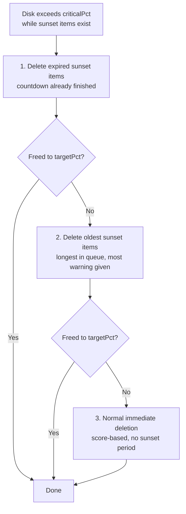
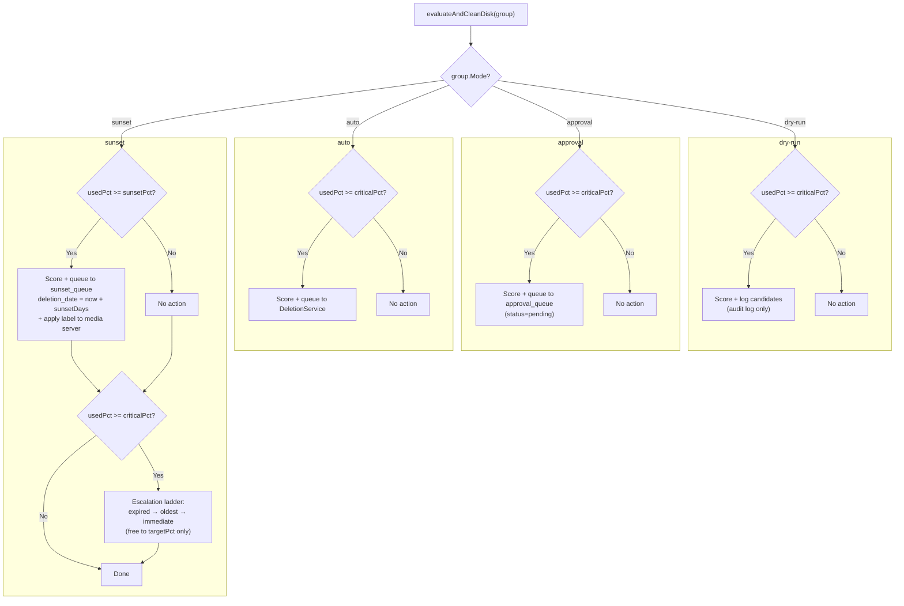
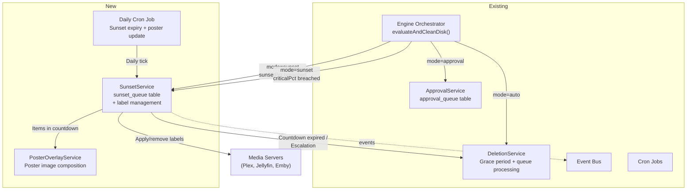
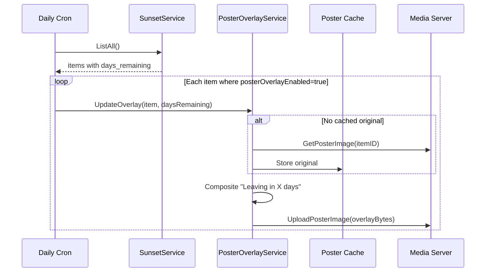

# Sunset Deletion with Media Server Labels & Poster Overlays

**Status:** ✅ Complete
**Scope:** Capacitarr 3.x (breaking change: per-disk-group execution modes)
**Created:** 2026-03-28

---

## Overview

Users want the ability to mark media for deletion after a configurable time frame (typically 30 days), with two key visual feedback mechanisms:

1. **Media server labels** — a configurable label/tag (default: `capacitarr-sunset`) applied to items in the media server (Plex, Jellyfin, Emby) when they enter the sunset queue. Users can then build their own smart collections, filters, or playlists from this label however they choose.
2. **Poster overlays** — a "Leaving in X days" countdown badge rendered onto media posters in the media server, similar to Netflix's "Last day to watch" banners

The term **"sunset"** is used internally to describe the countdown/deferral lifecycle. The `SunsetService` manages the transition period before removal — it does not perform deletions itself. When a sunset countdown expires, the item is handed to the existing `DeletionService` for actual removal.

---

## Design Decisions Record

| Decision | Resolution | Rationale |
|---|---|---|
| **Execution mode scope** | Per-disk-group (not global) | Each disk group runs independently in its own mode. Eliminates the conflict between global mode and per-group overrides. 3.0 breaking change. |
| **Mode options** | `dry-run`, `approval`, `auto`, `sunset` — four peers on `DiskGroup.Mode` | Sunset is a first-class execution mode, not an overlay/modifier on other modes. Each group has exactly one behavior. |
| **Sunset data storage** | Dedicated `sunset_queue` table | Sunset items have a fundamentally different lifecycle from approval items (time-driven vs. user-action-driven, not reconciled, not cleared on threshold drop). Shared table creates behavioral complexity that compounds across every service and query. |
| **Service naming** | `SunsetService` (not `ScheduledDeletionService`) | The service manages the *transition period* before removal, not the deletion itself |
| **Poster overlay approach** | Server-side image composition | Full control over visual output; works with all three media servers; Go `image` stdlib is mature |
| **Media server visibility** | Labels/tags (not managed collections) | Simpler implementation (2-method `LabelManager` vs 5-method `CollectionManager`); users control how labels are displayed; no cross-item state to manage in the media server; less opinionated |
| **Sunset label** | Configurable, default `"capacitarr-sunset"` | Namespaced (won't collide with user labels), lowercase-kebab (consistent across Plex/Jellyfin/Emby), self-descriptive. Static label set once on entry, removed on cancel/expire — no daily churn. |
| **Threshold ordering** | `sunsetPct < targetPct < criticalPct` | Escalation only frees down to `targetPct` (above sunset threshold), preserving the sunset queue. Items promised "leaving in 20 days" keep their promise unless things get catastrophic. |
| **`sunsetPct` default** | `NULL` (not 0) | A default of 0 is dangerous — every engine cycle would see `usedPct >= 0%` and start sunsetting immediately. NULL means sunset mode won't activate until the user explicitly configures the threshold. Engine publishes a warning event if mode is `sunset` but `sunsetPct` is NULL. |
| **TEXT for mode/status columns** | TEXT with Go-level validation (not SQL ENUM/CHECK) | SQLite has no native ENUM type. All constrained string fields in the codebase use the same pattern. CHECK constraints could be added project-wide as a separate effort. |
| **Global `ExecutionMode`** | Renamed to `DefaultDiskGroupMode` on `PreferenceSet`; used only as default for new disk group creation | Existing global mode migrates to each disk group at upgrade time |
| **Per-disk-group rules** | Deferred to separate plan | Rules are currently per-integration; scoring weights are global. Per-disk-group weight overrides are a legitimate need but independent of sunset. Sunset works correctly with global scoring. |

---

## The Critical Threshold Problem and Solution

### The Core Tension

Capacitarr's current model is **reactive** — disk hits critical, engine fires, items are deleted to reach target. A 30-day sunset countdown directly contradicts this: the disk stays full for 30 days, *arr apps stop downloading, and users lose the capacity management Capacitarr exists to provide.

### Solution: Sunset as a Pre-Critical Mode

Sunset mode operates at a **lower threshold** (`sunsetPct`) than the critical threshold (`criticalPct`, stored as `thresholdPct` in the DB), giving items a warning period *before* space is critically needed. The critical threshold is preserved as an escalation safety net.

The threshold ordering for sunset mode is `sunsetPct < targetPct < criticalPct`:

```
Disk usage (sunset-mode disk group):
|---------|-----------|-----------|---------|
0%       75%        90%         95%       100%
          ^           ^           ^
       Sunset      Target      Critical
       (NEW)      (existing)   (existing, now escalation)
```

- **75% (sunset threshold):** Engine evaluates, selects candidates, places them in `sunset_queue` with a 30-day countdown. A `capacitarr-sunset` label is applied to items in the media server. Poster overlays show "Leaving in 30 days." No bytes are freed yet.
- **75–90% (sunset → target):** Normal operation. Sunset items are counting down. Daily cron processes expiries, handing them to `DeletionService`, gradually freeing space. Disk usage fluctuates in this zone.
- **90% (target):** The "healthy" level after escalation. Not a trigger — just the ceiling that escalation frees down to.
- **95% (critical / escalation trigger):** If disk reaches this despite active sunsets (e.g., heavy download period), the engine escalates. Force-expires sunset items, but **only enough to get back to 90% (target)**. Sunset items below 90% are preserved — users who were told "leaving in 20 days" keep their promise.

### Why `sunsetPct < targetPct < criticalPct`

The earlier draft had `targetPct < sunsetPct < criticalPct`, which meant escalation would try to free space all the way down to `targetPct` (below the sunset threshold) — wiping the entire sunset queue every time escalation fires. The corrected ordering ensures escalation is proportionate: it only clears the *excess* above `targetPct`, not the entire sunset queue.

### Escalation Ladder (Sunset-Mode Groups Only)

When a sunset-mode disk group breaches the deletion threshold while sunset items exist:



Note: Escalation targets `targetPct`, **not** `sunsetPct`. Items in the sunset queue below `targetPct` continue their countdown undisturbed.

---

## Per-Disk-Group Execution Modes (3.0 Breaking Change)

### The Change

The global `ExecutionMode` on `PreferenceSet` is replaced by a per-disk-group `Mode` field. Each disk group independently runs in its own mode. The global setting becomes `DefaultDiskGroupMode` — used only as the default when new disk groups are auto-discovered.

### Mode Definitions

| Mode | Behavior | Trigger | Queue / Target |
|---|---|---|---|
| **`dry-run`** | Log what would be deleted. No actual deletions. | `criticalPct` | Audit log only |
| **`approval`** | Engine selects candidates → user approves → immediate deletion | `criticalPct` | `approval_queue` |
| **`auto`** | Engine selects candidates → immediate deletion | `criticalPct` | `DeletionService` directly |
| **`sunset`** | Engine selects at `sunsetPct` → countdown → gradual deletion. `criticalPct` is the escalation safety net. | `sunsetPct` (primary), `criticalPct` (escalation) | `sunset_queue` (new) |

Each mode is self-contained. No conditional logic, no mode-within-a-mode, no overrides.

### Engine Flow Per Mode



### Schema Changes — `DiskGroup` Model

| Column | Type | Default | Description |
|--------|------|---------|-------------|
| `mode` | TEXT | `"dry-run"` | Execution mode: `dry-run`, `approval`, `auto`, `sunset`. Stored as TEXT (SQLite has no native ENUM; all constrained string fields in the codebase use TEXT + Go-level validation). |
| `sunset_pct` | REAL | `NULL` | Sunset countdown starts at this %. NULL until explicitly configured by the user. |

**Validation rules:**
- `mode` must be one of `dry-run`, `approval`, `auto`, `sunset` — validated in the service layer.
- When `mode == "sunset"` and `sunset_pct IS NULL`, the engine refuses to evaluate the group and publishes a `sunset_misconfigured` warning event. Sunset never activates with an unconfigured threshold.
- When `mode == "sunset"` and `sunset_pct IS NOT NULL`, enforce `sunsetPct < targetPct < criticalPct`.
- For all other modes, `sunset_pct` is ignored.

### Schema Changes — `PreferenceSet` Model

| Column | Change | Description |
|--------|--------|-------------|
| `execution_mode` | Renamed to `default_disk_group_mode` | Used only as default for new disk group creation; no longer the runtime mode |

### Migration Path (2.x → 3.0)

The codebase uses [Goose](https://github.com/pressly/goose) (SQL-only mode) with embedded SQL files in `backend/internal/db/migrations/`. The current highest migration is `00005_schema_info.sql`. Goose automatically tracks applied migrations in its `goose_db_version` table. A separate `schema_info` table holds the `schema_family` lineage marker (`'v2'` → `'v3'`).

#### Migration `00006_sunset_mode.sql`

```sql
-- +goose Up
-- 3.0: Per-disk-group execution modes + sunset queue

-- Add per-disk-group mode (all existing groups start in dry-run)
ALTER TABLE disk_groups ADD COLUMN mode TEXT NOT NULL DEFAULT 'dry-run';
ALTER TABLE disk_groups ADD COLUMN sunset_pct REAL DEFAULT NULL;

-- Create sunset_queue table
CREATE TABLE IF NOT EXISTS sunset_queue (
    id                    INTEGER PRIMARY KEY AUTOINCREMENT,
    media_name            TEXT NOT NULL,
    media_type            TEXT NOT NULL,
    tmdb_id               INTEGER,
    integration_id        INTEGER REFERENCES integration_configs(id),
    external_id           TEXT,
    size_bytes            INTEGER NOT NULL DEFAULT 0,
    score                 REAL NOT NULL DEFAULT 0,
    score_details         TEXT,
    poster_url            TEXT,
    disk_group_id         INTEGER NOT NULL REFERENCES disk_groups(id),
    collection_group      TEXT,
    trigger               TEXT NOT NULL DEFAULT 'engine',
    deletion_date         DATE NOT NULL,
    label_applied         INTEGER NOT NULL DEFAULT 0,
    poster_overlay_active INTEGER NOT NULL DEFAULT 0,
    created_at            DATETIME,
    updated_at            DATETIME
);

CREATE INDEX IF NOT EXISTS idx_sunset_queue_disk_group ON sunset_queue(disk_group_id);
CREATE INDEX IF NOT EXISTS idx_sunset_queue_tmdb_id ON sunset_queue(tmdb_id);
CREATE INDEX IF NOT EXISTS idx_sunset_queue_media_name ON sunset_queue(media_name);
CREATE INDEX IF NOT EXISTS idx_sunset_queue_deletion_date ON sunset_queue(deletion_date);

-- Add sunset preferences to preference_sets
ALTER TABLE preference_sets ADD COLUMN sunset_days INTEGER NOT NULL DEFAULT 30;
ALTER TABLE preference_sets ADD COLUMN sunset_label TEXT NOT NULL DEFAULT 'capacitarr-sunset';
ALTER TABLE preference_sets ADD COLUMN poster_overlay_enabled INTEGER NOT NULL DEFAULT 0;

-- Update schema lineage marker
UPDATE schema_info SET value = 'v3' WHERE key = 'schema_family';

-- +goose Down
DROP INDEX IF EXISTS idx_sunset_queue_deletion_date;
DROP INDEX IF EXISTS idx_sunset_queue_media_name;
DROP INDEX IF EXISTS idx_sunset_queue_tmdb_id;
DROP INDEX IF EXISTS idx_sunset_queue_disk_group;
DROP TABLE IF EXISTS sunset_queue;
UPDATE schema_info SET value = 'v2' WHERE key = 'schema_family';
```

#### Go Fixup: `execution_mode` → `default_disk_group_mode` Rename

SQLite column renames require conditional logic (checking column existence). Added as a post-migration fixup in `migrate.go` following the existing `fixupEngineRunStats` pattern:

```go
func fixupDefaultDiskGroupModeRename(sqlDB *sql.DB) error {
    // Check if old column exists; if so, rename and reset to dry-run
    // SQLite 3.25.0+ supports ALTER TABLE RENAME COLUMN
    // Fallback: create new column, copy, drop old (via table rebuild)
}
```

Called from `RunMigrations()` after `goose.Up()`.

#### Migration Steps Summary

1. Goose applies `00006_sunset_mode.sql`: adds `mode`/`sunset_pct` to `disk_groups`, creates `sunset_queue`, adds sunset preferences, updates `schema_family` to `'v3'`
2. Go fixup renames `execution_mode` → `default_disk_group_mode` on `preference_sets` and resets value to `"dry-run"`
3. All existing disk groups start in `"dry-run"` (column default) — users must explicitly configure each group's mode after upgrading

**Rationale for dry-run reset:** The per-group mode is a fundamentally different execution model (new engine switch paths, sunset thresholds, per-group escalation). Silently carrying forward `auto` or `approval` from the global setting risks unexpected behavior. A dry-run reset makes the breaking change visible and ensures users configure each group intentionally. This mirrors the `sunset_pct` NULL safety pattern — nothing activates without explicit configuration.

**API deprecation:** The global mode read/write endpoints continue to work for one minor version, proxying to `default_disk_group_mode`.

#### 1.x → 3.x Direct Upgrade Path

The 1.x → 2.0 migration uses a backup-and-recreate strategy (`internal/migration/`): the 1.x database is renamed to a backup file, a fresh database is created with all Goose migrations, and `MigrateFrom()` imports configuration data from the backup using raw SQL. A direct 1.x → 3.x upgrade follows the same flow — Goose applies all migrations (00001–00006) to the fresh database, producing a 3.0 schema. Two code changes are required:

**1. Update `DetectLegacySchema()` (`internal/migration/detect.go`)**

The schema family check at line 70 only looks for `'v2'`. Add `'v3'` so that an existing 3.0 database is not misidentified as 1.x:

```go
// Tier 1: Explicit schema version marker (definitive)
if hasSchemaFamily(sqlDB, "v2") || hasSchemaFamily(sqlDB, "v3") {
    return false
}
```

Note: the `disk_groups` table check at line 76 would still catch it as a safety net, but explicit is better than implicit.

**2. Update `ConfirmNotV2()` (`internal/migration/detect.go`)**

Add `"sunset_queue"` to the `v2Tables` list (rename to `knownTables` for clarity) so that a 3.0 database is never accidentally renamed:

```go
knownTables := []string{
    "schema_info",            // migration 00005 (v2+)
    "disk_groups",            // v2 baseline
    "approval_queue_items",   // v2 baseline
    "scoring_factor_weights", // v2 baseline
    "sunset_queue",           // v3 (migration 00006)
}
```

**3. Update `importPreferences()` (`internal/migration/migrate.go`)**

Line 316 writes to `"execution_mode"`, which is renamed to `"default_disk_group_mode"` in 3.0. Update the column name in the `Updates` map:

```go
// Before (2.0):
"execution_mode": db.ModeDryRun,
// After (3.0):
"default_disk_group_mode": db.ModeDryRun,
```

**No changes needed for `importDiskGroups()`** — the `mode` column defaults to `"dry-run"` from the migration DDL, and the new sunset preference columns (`sunset_days`, `sunset_label`, `poster_overlay_enabled`) get their defaults from the schema. The import code only writes fields that existed in 1.x.

### Mode Constants

```go
const (
    ModeDryRun   = "dry-run"    // existing
    ModeApproval = "approval"   // existing
    ModeAuto     = "auto"       // existing
    ModeSunset   = "sunset"     // NEW
)
```

### Settings UI

- **"Disk Group Defaults" section:** Default disk group mode selector (dry-run / approval / auto / sunset). Applied when new disk groups are auto-discovered.
- **Each disk group card:** Mode dropdown. When `sunset` is selected, sunset-specific fields appear (`sunsetPct` slider with validation against `targetPct` and `criticalPct`).
- The global "Running in X mode" banner is replaced by per-group mode indicators on each disk group card.
- A summary line: e.g., "2 groups in approval, 1 in sunset, 1 in dry-run"

---

## Architecture Alignment



### Existing Patterns Reused

| Pattern | Current Usage | Reuse in This Feature |
|---------|--------------|----------------------|
| Capability interfaces (`types.go`) | `WatchDataProvider`, `CollectionDataProvider`, `LabelDataProvider`, etc. | New `LabelManager` (write) and `PosterManager` interfaces |
| Service layer (`internal/services/`) | `ApprovalService`, `DeletionService`, etc. | New `SunsetService`, `PosterOverlayService` |
| Factory registration (`factory.go`) | `RegisterAllFactories()` | No new factories; new interfaces on existing clients |
| Event bus (`internal/events/`) | 53 typed events | New sunset + poster events |
| Cron jobs (`internal/jobs/cron.go`) | Hourly/daily/weekly rollups | Daily sunset tick |
| Registry wiring (`services.Registry`) | `Wired()` validation | New services added |
| TMDb ID cross-referencing | Watch data, collection enrichment | Label application + poster overlay targeting |
| Integration registry | `WatchProviders()`, `CollectionDataProviders()`, etc. | New `LabelManagers()`, `PosterManagers()` |
| Label data reading | `LabelDataProvider`, `GetLabelMemberships()` | `LabelManager` adds write capability to the same integrations |

---

## Part 1: Sunset Core

### New `sunset_queue` Table

Sunset items have a fundamentally different lifecycle from approval items and warrant their own table:

| Property | `approval_queue` | `sunset_queue` |
|---|---|---|
| Lifecycle driver | Engine cycle + user action | Time (daily cron) |
| Reconciled per cycle | Yes (`ReconcileQueue()`) | No — persists across cycles |
| Cleared below threshold | Yes (`ClearQueue()`) | No — countdown continues |
| User interaction | Approve / Reject / Snooze / Dismiss | Cancel / Reschedule |
| Expiry mechanism | `snoozed_until` (returns to pending) | `deletion_date` (triggers deletion) |

#### `SunsetQueueItem` Model

| Column | Type | Description |
|--------|------|-------------|
| `id` | INTEGER | Primary key |
| `media_name` | TEXT | Item title (indexed) |
| `media_type` | TEXT | movie, show, season, episode, artist, book |
| `tmdb_id` | INTEGER | TMDb ID for media server label application (indexed) |
| `integration_id` | INTEGER | FK to `IntegrationConfig` |
| `external_id` | TEXT | *arr external ID |
| `size_bytes` | INTEGER | File size |
| `score` | REAL | Score at time of scheduling |
| `score_details` | TEXT | JSON-encoded score factors |
| `poster_url` | TEXT | Original poster URL from *arr |
| `disk_group_id` | INTEGER | FK to `DiskGroup` (indexed) |
| `collection_group` | TEXT | Collection deletion group |
| `trigger` | TEXT | `"engine"`, `"user"` |
| `deletion_date` | DATE | When the item should be handed to `DeletionService` |
| `label_applied` | BOOLEAN | Whether the sunset label has been applied to the media server |
| `poster_overlay_active` | BOOLEAN | Whether an overlay poster is currently uploaded |
| `created_at` | DATETIME | When the item entered the sunset queue |
| `updated_at` | DATETIME | Last update |

### `SunsetService`

Manages the `sunset_queue` table lifecycle. Handles countdown tracking, cancellation, rescheduling, expiry processing, escalation, and label management. Does **not** perform deletions — hands items to `DeletionService` when countdowns expire.

Follows the established pattern: accepts `*gorm.DB` and `*events.EventBus` in constructor; registered on `services.Registry` as `reg.Sunset`.

```go
type SunsetService struct {
    db  *gorm.DB
    bus *events.EventBus
}
```

**Key methods:**

```go
// QueueSunset creates a new sunset_queue entry with a deletion_date.
// Also applies the sunset label to the item in all enabled media servers.
func (s *SunsetService) QueueSunset(item db.SunsetQueueItem, deps SunsetDeps) error

// BulkQueueSunset creates multiple sunset entries in a transaction.
// Applies labels to all items in enabled media servers.
func (s *SunsetService) BulkQueueSunset(items []db.SunsetQueueItem, deps SunsetDeps) (int, error)

// Cancel removes a sunset item. Removes the label from media servers.
// Publishes sunset_cancelled event.
func (s *SunsetService) Cancel(entryID uint, deps SunsetDeps) error

// Reschedule updates the deletion_date for a sunset item.
func (s *SunsetService) Reschedule(entryID uint, newDate time.Time) (*db.SunsetQueueItem, error)

// ListForDiskGroup returns all sunset items for a given disk group.
func (s *SunsetService) ListForDiskGroup(diskGroupID uint) ([]db.SunsetQueueItem, error)

// ListAll returns all sunset items across all disk groups, ordered by deletion_date.
func (s *SunsetService) ListAll() ([]db.SunsetQueueItem, error)

// GetExpired returns items where deletion_date <= now.
func (s *SunsetService) GetExpired() ([]db.SunsetQueueItem, error)

// DaysRemaining calculates the countdown for a given sunset item.
func (s *SunsetService) DaysRemaining(item db.SunsetQueueItem) int

// ProcessExpired transitions all expired items to DeletionService.
// Removes labels from media servers. Called by the daily cron job.
func (s *SunsetService) ProcessExpired(deps SunsetDeps) (int, error)

// Escalate force-expires sunset items for a disk group during threshold
// breach. Processes expired first, then oldest-in-queue, freeing only
// enough to reach targetPct. Returns bytes freed.
func (s *SunsetService) Escalate(diskGroupID uint, targetBytes int64, deps SunsetDeps) (int64, error)

// CancelAll cancels all sunset items (emergency button). Returns count removed.
func (s *SunsetService) CancelAll(deps SunsetDeps) (int, error)

// CancelAllForDiskGroup cancels all sunset items for a specific disk group.
func (s *SunsetService) CancelAllForDiskGroup(diskGroupID uint, deps SunsetDeps) (int, error)

// IsSunsetted checks if a media item is already in the sunset queue.
func (s *SunsetService) IsSunsetted(mediaName, mediaType string, diskGroupID uint) bool

// ListSunsettedKeys returns "mediaName|mediaType" keys for O(1) lookups.
func (s *SunsetService) ListSunsettedKeys(diskGroupID uint) (map[string]bool, error)
```

```go
// SunsetDeps holds service dependencies for label management and deletion handoff.
// Follows the same pattern as ExecuteApprovalDeps in approval.go.
// SettingsReader is the existing interface defined in deletion.go:104-109 —
// reuse it, do not create a new one.
type SunsetDeps struct {
    Integration *IntegrationService
    Deletion    *DeletionService
    Engine      *EngineService
    Settings    SettingsReader
}
```

### Engine Orchestrator Changes

`evaluateAndCleanDisk()` switches on `group.Mode`:

```go
switch group.Mode {
case db.ModeSunset:
    // 1. Always queue at sunsetPct → score + queue to sunset_queue + apply labels
    // 2. Then escalate at criticalPct → force-expire from queue to free space
    // Both steps run independently each cycle.
case db.ModeAuto:    // unchanged
case db.ModeApproval: // unchanged
default:              // dry-run, unchanged
}
```

For sunset mode specifically (both steps run independently each cycle):
1. Checks `usedPct >= sunsetPct` → if yes, scores items, calls `SunsetService.BulkQueueSunset()`. Skips items already in the sunset queue via `SunsetService.ListSunsettedKeys()`.
2. Checks `usedPct >= criticalPct` → if yes, calls `SunsetService.Escalate()` (frees down to `targetPct` only, preserving the rest of the sunset queue). This processes items that were just queued in step 1 or already existed.

This design ensures items are always marked for sunset once past the sunset threshold, even when the disk is simultaneously past critical. Escalation then processes from the queue rather than bypassing it.

### Approval Queue — Untouched

The `approval_queue` table and `ApprovalService` are **completely untouched** by this feature. They continue to serve only disk groups in `approval` mode. No new columns, no new statuses, no conditional branches.

---

## Part 2: Media Server Labels

Instead of Capacitarr creating and managing collections in the media server, a configurable label/tag is applied to sunset items. Users create their own smart collections, filters, or playlists from this label in whatever way their media server supports.

### Why Labels Instead of Managed Collections

| | Managed Collection | Label/Tag |
|---|---|---|
| **Implementation** | 5-method `CollectionManager` + Plex URI scheme + reconciliation service | 2-method `LabelManager` — add and remove |
| **User control** | Capacitarr dictates collection structure | Users build whatever they want from the label |
| **Media server state** | Capacitarr owns a collection object | Labels are atomic per-item — no cross-item state |
| **Reversibility** | Must track collection ID, handle orphans | Remove label, done |
| **Existing codebase** | New interface from scratch | `LabelDataProvider` already reads labels; `LabelManager` adds writes |
| **Daily operations** | Full reconciliation sync on cron | Point-in-time: set on queue entry, remove on cancel/expire |

### `LabelManager` Capability Interface

Added to `internal/integrations/types.go`:

```go
// LabelManager is implemented by media server integrations that can
// add and remove labels/tags on individual media items. Used by
// SunsetService to apply/remove the sunset label.
type LabelManager interface {
    AddLabel(itemID string, label string) error
    RemoveLabel(itemID string, label string) error
}
```

The codebase already has `LabelDataProvider` and `GetLabelMemberships()` for reading labels. `LabelManager` adds write capability to the same integrations.

### Label API Support

| Platform | Add Label | Remove Label | API |
|----------|:-:|:-:|---|
| **Plex** | ✅ | ✅ | `PUT /library/sections/{id}/all?type=1&id={ratingKey}&label[0].tag.tag={label}` (add), `DELETE` variant (remove) |
| **Jellyfin** | ✅ | ✅ | `POST /Items/{id}` with updated `Tags` array |
| **Emby** | ✅ | ✅ | Same as Jellyfin — `POST /Items/{id}` with `Tags` |

### Label Lifecycle

- **On queue entry** (`QueueSunset` / `BulkQueueSunset`): Apply the configured label to the item in all enabled media servers that implement `LabelManager`. Set `label_applied = true` on the queue row.
- **On cancel** (`Cancel`): Remove the label from media servers. Delete the queue row.
- **On expiry** (`ProcessExpired`): Remove the label from media servers before handing the item to `DeletionService`.
- **On escalation** (`Escalate`): Remove the label from media servers before force-deleting.
- **Static label, no churn**: The label is set once when the item enters the queue and removed once when it leaves. There is no daily update cycle for labels (unlike poster overlays which update the countdown text daily).

### Configurable Label Name

| Preference | Type | Default | Description |
|---|---|---|---|
| `SunsetLabel` | `string` | `"capacitarr-sunset"` | The label/tag applied to items in the media server when they enter the sunset queue. Users can change this to any string they prefer. |

If the user changes the label name while items are in the queue, the service should remove the old label and apply the new one (a one-time migration triggered by the preference save).

### Integration Registry Discovery

```go
// LabelManagers returns all registered integrations that implement LabelManager.
// Follows the existing map[uint]Interface pattern used by WatchProviders(),
// LabelDataProviders(), Deleters(), etc. Returns a defensive copy.
func (r *IntegrationRegistry) LabelManagers() map[uint]LabelManager
```

---

## Part 3: Poster Overlays ("Leaving in X Days")

Server-side image composition: download original poster, composite "Leaving in X days" banner, upload modified poster to media server.

### `PosterManager` Capability Interface

```go
type PosterManager interface {
    GetPosterImage(itemID string) (imageData []byte, contentType string, err error)
    UploadPosterImage(itemID string, imageData []byte, contentType string) error
    RestorePosterImage(itemID string) error
}
```

### Poster Upload API Support

| Platform | API |
|----------|---|
| **Plex** | `POST /library/metadata/{ratingKey}/posters` (multipart) |
| **Jellyfin** | `POST /Items/{itemId}/Images/Primary` (base64 body) |
| **Emby** | `POST /Items/{id}/Images/{Type}` (base64 body) |

### `internal/poster/` Package

```
internal/poster/
├── overlay.go       — image composition (image/draw + x/image/font)
├── overlay_test.go
├── cache.go         — original poster caching (filesystem)
└── cache_test.go
```

- Composite gradient banner at bottom (Netflix-style)
- Bundled SIL-licensed font (Inter or Noto Sans), ~5-15 MB
- Cache originals in `/config/posters/originals/` keyed by `{integrationID}_{tmdbID}_{hash}.jpg`

### Daily Poster Workflow



### Poster Restoration

On cancel, expiry, or escalation: restore original from cache → upload → delete cache file. "Restore All Posters" emergency button in settings UI. Startup validation warns if cached originals are missing.

---

## New Preferences (Global)

| Preference | Type | Default | Description |
|---|---|---|---|
| `DefaultDiskGroupMode` | `string` | `"dry-run"` | Default mode for new disk groups (renamed from `ExecutionMode`) |
| `SunsetDays` | `int` | `30` | Default countdown period in days |
| `SunsetLabel` | `string` | `"capacitarr-sunset"` | Label/tag applied to items in media servers when they enter the sunset queue |
| `PosterOverlayEnabled` | `bool` | `false` | Whether to apply countdown overlays to posters |

## New Events

| Event | Description |
|-------|-------------|
| `sunset_created` | Item added to `sunset_queue` with a `deletion_date` |
| `sunset_cancelled` | Sunset item cancelled (row removed) |
| `sunset_expired` | Countdown expired, item handed to `DeletionService` |
| `sunset_rescheduled` | `deletion_date` changed |
| `sunset_escalated` | Sunset-mode group hit `criticalPct`; items force-expired down to `targetPct` |
| `sunset_misconfigured` | Engine skipped sunset-mode group because `sunsetPct` is NULL |
| `sunset_label_applied` | Sunset label added to item in media server |
| `sunset_label_removed` | Sunset label removed from item in media server |
| `sunset_label_failed` | Label operation failed on media server |
| `poster_overlay_applied` | Overlay poster uploaded |
| `poster_overlay_restored` | Original poster restored |
| `poster_overlay_failed` | Poster overlay operation failed |

## New Cron Job

```go
// Daily: Process expired sunset items + update poster overlays.
_, err = c.AddFunc("@daily", func() {
    // 1. Process expired sunset items → DeletionService
    processed, err := reg.Sunset.ProcessExpired(services.SunsetDeps{
        Integration: reg.Integration,
        Deletion:    reg.Deletion,
        Engine:      reg.Engine,
        Settings:    reg.Settings,
    })
    if err != nil {
        slog.Error("Failed to process expired sunset items", "error", err)
    } else if processed > 0 {
        slog.Info("Processed expired sunset items", "count", processed)
    }

    // 2. Update poster overlays (if enabled)
    prefs, _ := reg.Settings.GetPreferences()
    if prefs.PosterOverlayEnabled {
        reg.PosterOverlay.UpdateAll(reg.Sunset, reg.Integration)
    }
})
```

## REST API Endpoints

```
GET    /api/v1/sunset-queue          — list all sunset items with countdown
DELETE /api/v1/sunset-queue/:id       — cancel a sunset item
PATCH  /api/v1/sunset-queue/:id       — reschedule (change deletion date)
POST   /api/v1/sunset-queue/clear     — cancel all sunset items
```

## Dashboard UX

- New `SunsetQueueCard.vue` on the dashboard (parallel to `SnoozedItemsCard`)
- Shows items with countdown timers ("Leaving in X days"), cancel/reschedule buttons
- Backed by `useSunsetQueue.ts` composable with SSE subscriptions
- Only populates when sunset items exist

---

## Phased Implementation

### Phase 1: Per-Disk-Group Modes + Sunset Core + Labels

**Goal:** Execution mode moves to per-disk-group. Sunset mode is available. Items enter a countdown, labels are applied to media server items, escalation works with `targetPct` ceiling.

#### Schema Changes

1. New table: `sunset_queue`
2. Add to `disk_groups`: `mode` (TEXT, default `"dry-run"`), `sunset_pct` (REAL, default `NULL`)
3. Rename on `preference_sets`: `execution_mode` → `default_disk_group_mode`; add `sunset_days`, `sunset_label`, `poster_overlay_enabled`
4. Data migration: set all existing `disk_groups.mode` to `"dry-run"` (safety reset); rename `execution_mode` → `default_disk_group_mode` on `preference_sets`

#### New Files

```
backend/internal/db/models.go              — SunsetQueueItem model (in same file as other models)
backend/internal/services/sunset.go        — SunsetService
backend/internal/services/sunset_test.go
backend/routes/sunset.go                   — REST API endpoints
backend/routes/sunset_test.go
frontend/app/composables/useSunsetQueue.ts
frontend/app/components/SunsetQueueCard.vue
```

#### Modified Files

```
backend/internal/db/models.go              — ModeSunset constant, DiskGroup.Mode/SunsetPct, PreferenceSet.DefaultDiskGroupMode rename + sunset prefs
backend/internal/services/registry.go      — Add Sunset to Registry
backend/internal/integrations/types.go     — Add LabelManager interface
backend/internal/integrations/plex.go      — LabelManager implementation
backend/internal/integrations/jellyfin.go  — LabelManager implementation
backend/internal/integrations/emby.go      — LabelManager implementation
backend/internal/integrations/registry.go  — Add LabelManagers()
backend/internal/events/types.go           — Sunset + label events
backend/internal/jobs/cron.go              — Daily sunset tick
backend/internal/poller/evaluate.go        — Switch on group.Mode; sunset threshold; escalation to targetPct
backend/routes/api.go                      — Register sunset route group
backend/routes/settings.go                 — DefaultDiskGroupMode rename; disk group mode endpoints
frontend/                                  — Disk group mode selector; SunsetQueueCard; mode indicators
```

#### Steps

1. Add `ModeSunset` constant alongside existing `ModeDryRun`/`ModeApproval`/`ModeAuto`
2. Add `Mode`, `SunsetPct` columns to `DiskGroup` model
3. Rename `ExecutionMode` to `DefaultDiskGroupMode` on `PreferenceSet`; add sunset preference fields (`SunsetDays`, `SunsetLabel`, `PosterOverlayEnabled`)
4. Write data migration: set all existing `disk_groups.mode` to `"dry-run"`; reset `preference_sets.default_disk_group_mode` to `"dry-run"`
5. Create `SunsetQueueItem` model
6. Add validation: `sunsetPct < targetPct < criticalPct` when `mode == "sunset"`; reject if `sunsetPct IS NULL`
7. Create `SunsetService` with full lifecycle methods (including label application/removal)
8. Create `LabelManager` capability interface
9. Implement `LabelManager` on `PlexClient`, `JellyfinClient`, `EmbyClient`
10. Add `LabelManagers()` to `IntegrationRegistry`
11. Add new event types
12. Wire `SunsetService` into `services.Registry`
13. Modify `evaluateAndCleanDisk()`: switch on `group.Mode`, add sunset branch with `sunsetPct` evaluation + escalation ladder (free to `targetPct` only)
14. Add daily cron job for sunset expiry processing
15. Create REST API endpoints in `routes/sunset.go`
16. Update settings routes: `DefaultDiskGroupMode` rename, disk group mode PATCH, sunset label preference
17. Add notification support for new events
18. Build frontend: disk group mode selector in settings, sunset-specific fields conditional on mode, `SunsetQueueCard.vue`, `useSunsetQueue.ts`, mode indicators per disk group card
19. Unit tests for `SunsetService` (in-memory SQLite pattern)
20. Integration tests for label management per media server

### Phase 2: Poster Overlays

**Goal:** Sunset items display "Leaving in X days" on their poster in the media server.

#### New Files

```
backend/internal/poster/overlay.go
backend/internal/poster/overlay_test.go
backend/internal/poster/cache.go
backend/internal/poster/cache_test.go
backend/internal/services/poster_overlay.go
backend/internal/services/poster_overlay_test.go
backend/assets/fonts/
```

#### Modified Files

```
backend/internal/integrations/types.go     — Add PosterManager interface
backend/internal/integrations/plex.go      — PosterManager implementation
backend/internal/integrations/jellyfin.go  — PosterManager implementation
backend/internal/integrations/emby.go      — PosterManager implementation
backend/internal/integrations/registry.go  — Add PosterManagers()
backend/internal/jobs/cron.go              — Add poster overlay step to daily tick
backend/internal/services/sunset.go        — Restore posters on cancel/expire/escalate
```

#### Steps

1. Add `PosterManager` capability interface
2. Implement `PosterManager` on `PlexClient`, `JellyfinClient`, `EmbyClient`
3. Add `PosterManagers()` to `IntegrationRegistry`
4. Create `internal/poster/overlay.go` — image composition
5. Create `internal/poster/cache.go` — filesystem-based original caching
6. Create `PosterOverlayService`
7. Add poster overlay step to daily cron (after sunset expiry processing)
8. Add poster restoration to `Cancel()`, `ProcessExpired()`, `Escalate()`
9. Add "Restore All Posters" emergency button in settings
10. Add startup validation for cached originals
11. Unit tests (fixture-based image composition)
12. Integration tests per media server

---

## Related Future Work (Separate Plans)

### Per-Disk-Group Scoring Weight Overrides

Custom rules are currently per-integration; scoring factor weights are global. With per-disk-group modes, users may want different scoring priorities per group (e.g., weight file size heavily on a small SSD but lightly on a large NAS).

**Recommended approach:** Each disk group can optionally override global factor weights. Rules stay per-integration. A new `disk_group_weight_overrides` table with `(disk_group_id, factor_key, weight)` tuples. The engine merges global weights with per-group overrides before calling the evaluator. This is independent of sunset and should be planned separately.

---

## Key Architectural Decisions

| Decision | Resolution | Rationale |
|---|---|---|
| **Execution mode scope** | Per-disk-group `Mode` field | Eliminates global-vs-per-group conflicts; each group is self-contained |
| **Sunset data storage** | Dedicated `sunset_queue` table | Different lifecycle from approval queue; avoids behavioral complexity |
| **Service naming** | `SunsetService` | Manages transition period, not deletion |
| **Threshold ordering** | `sunsetPct < targetPct < criticalPct` | Escalation frees to `targetPct` only, preserving sunset queue below |
| **Media server visibility** | Labels/tags via `LabelManager` (not managed collections) | Simpler; users control display; no cross-item state; existing `LabelDataProvider` pattern |
| **Sunset label** | Static, configurable, default `"capacitarr-sunset"` | Set once on entry, removed on exit; no daily churn; namespaced |
| **Poster overlay** | Server-side image composition | Full visual control; Go stdlib mature |
| **Poster cache** | Filesystem (`/config/posters/originals/`) | Avoids SQLite BLOBs |
| **Multi-server** | Labels + overlays applied to ALL enabled media servers | Users may have Plex + Jellyfin |
| **Font** | Bundled SIL-licensed (Inter or Noto Sans) | i18n support; ~5 MB |
| **Overlay frequency** | Daily | Appropriate for 30-day countdown cadence |
| **Per-disk-group rules** | Deferred to separate plan | Independent of sunset; scoring works correctly with global weights |

---

## Risk Assessment

| Risk | Severity | Mitigation |
|---|---|---|
| **3.0 breaking change** — per-disk-group modes | High | All existing disk groups reset to `dry-run` on upgrade (safety-first); API deprecation period for global mode endpoints; clear upgrade docs |
| **Poster corruption** | High | Cache originals before upload; `poster_overlay_active` flag; "Restore All Posters" emergency button |
| **Disk fills during sunset window** | High | Escalation ladder frees to `targetPct` only; `criticalPct` is always the safety net |
| **Media server API breakage** | Medium | Integration tests; graceful degradation |
| **Performance at scale** | Medium | Batch label operations; poster composition once/day |
| **Label rename while items queued** | Low | On preference save, remove old label and apply new one across all sunset items |
| **TMDb ID matching gaps** | Low | Existing pattern: items without TMDb IDs skipped |
| **Write operations to media servers** | Low | Labels are atomic per-item; trivially reversible |
| **Race condition with user poster edits** | Low | Content hash comparison; re-cache if changed |

---

## Codebase Alignment Checklist

- [x] **Service layer** — `SunsetService`, `PosterOverlayService` follow `*gorm.DB` + `*events.EventBus` pattern
- [x] **Capability interfaces** — `LabelManager`, `PosterManager` follow existing pattern
- [x] **No new factories** — new interfaces on existing clients
- [x] **Event bus** — new event types for SSE, notifications, activity
- [x] **Cron pattern** — daily tick follows `jobs/cron.go` pattern
- [x] **Registry wiring** — `reg.Sunset` with `Wired()` validation
- [x] **Route handlers** — thin, no direct DB access
- [x] **Integration registry** — `LabelManagers()`, `PosterManagers()` follow discovery pattern
- [x] **TMDb matching** — reuses existing cross-reference
- [x] **New table** — `sunset_queue` follows GORM patterns with indexes and FK references
- [x] **Approval queue untouched** — zero changes to `approval_queue` or `ApprovalService`
- [x] **Notification support** — new events feed into existing dispatch
- [x] **No direct DB access from routes**
- [x] **No integration client creation from routes**
- [x] **Unit tests** — in-memory SQLite pattern
- [x] **`make ci` passes**
