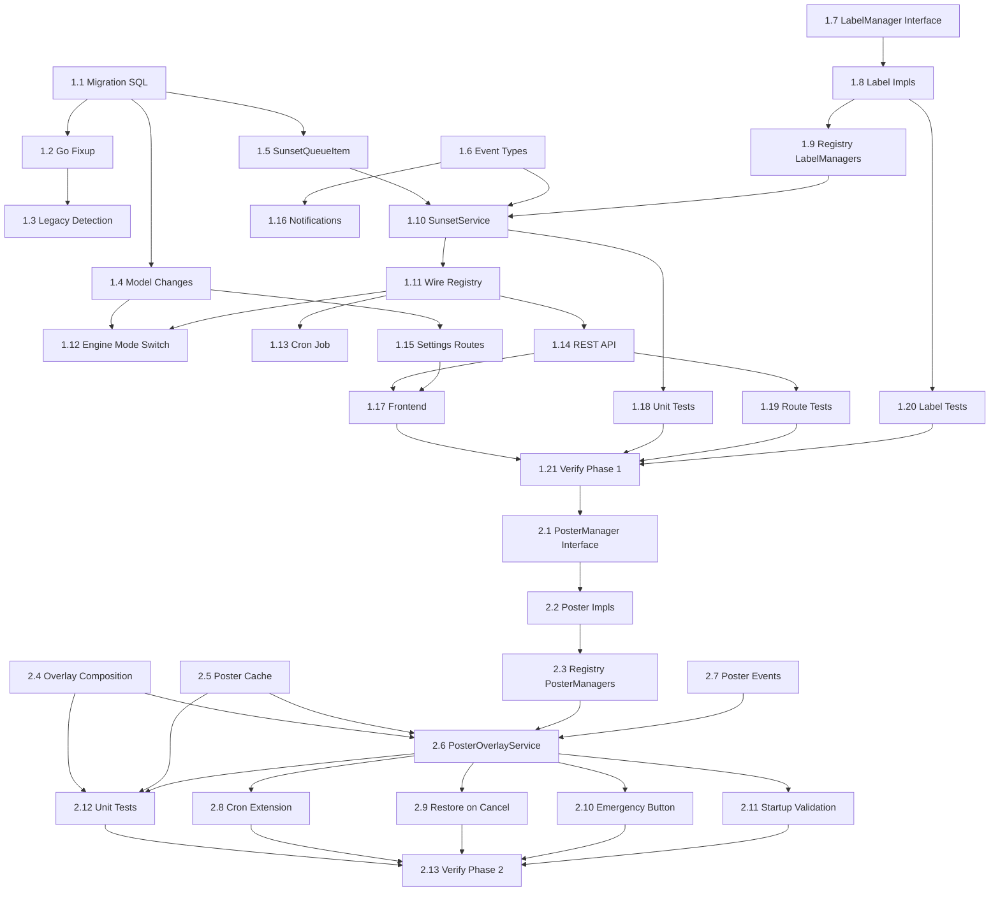

# Sunset Deletion — Implementation Plan

**Status:** ✅ Complete
**Scope:** Capacitarr 3.x
**Created:** 2026-03-29
**Design Document:** [`20260328T0408Z-scheduled-deletion-collections-poster-overlays.md`](./20260328T0408Z-scheduled-deletion-collections-poster-overlays.md)

---

## Phase 1: Per-Disk-Group Modes + Sunset Core + Labels

### Step 1.1 — Database Migration (`00006_sunset_mode.sql`)

**Status:** ✅ Complete

Create `backend/internal/db/migrations/00006_sunset_mode.sql`:

- [x] `ALTER TABLE disk_groups ADD COLUMN mode TEXT NOT NULL DEFAULT 'dry-run'`
- [x] `ALTER TABLE disk_groups ADD COLUMN sunset_pct REAL DEFAULT NULL`
- [x] `CREATE TABLE sunset_queue` (full DDL per design doc)
- [x] Create indexes: `idx_sunset_queue_disk_group`, `idx_sunset_queue_tmdb_id`, `idx_sunset_queue_media_name`, `idx_sunset_queue_deletion_date`
- [x] `ALTER TABLE preference_sets ADD COLUMN sunset_days INTEGER NOT NULL DEFAULT 30`
- [x] `ALTER TABLE preference_sets ADD COLUMN sunset_label TEXT NOT NULL DEFAULT 'capacitarr-sunset'`
- [x] `ALTER TABLE preference_sets ADD COLUMN poster_overlay_enabled INTEGER NOT NULL DEFAULT 0`
- [x] `UPDATE schema_info SET value = 'v3' WHERE key = 'schema_family'`
- [x] Write `-- +goose Down` rollback section

**Files:**
- New: `backend/internal/db/migrations/00006_sunset_mode.sql`

### Step 1.2 — Go Fixup: `execution_mode` → `default_disk_group_mode` Rename

**Status:** ✅ Complete

Add post-migration fixup in `migrate.go` following the existing `fixupEngineRunStats` pattern at line 64:

- [x] Add `"preference_sets"` to `tableColumnCheckers` map (line 94) so `hasColumnInTable` can query it
- [x] Create `fixupDefaultDiskGroupModeRename(sqlDB *sql.DB) error`:
  - Check if `execution_mode` column exists on `preference_sets`
  - If yes: `ALTER TABLE preference_sets RENAME COLUMN execution_mode TO default_disk_group_mode` (SQLite 3.25.0+)
  - Reset value to `"dry-run"`: `UPDATE preference_sets SET default_disk_group_mode = 'dry-run'`
- [x] Call `fixupDefaultDiskGroupModeRename` from `RunMigrations()` after `goose.Up()` (line 33)

**Files:**
- Modified: `backend/internal/db/migrate.go`

### Step 1.3 — Update Legacy Schema Detection (1.x → 3.x path)

**Status:** ✅ Complete

- [x] `DetectLegacySchema()` (`detect.go:70`): Add `hasSchemaFamily(sqlDB, "v3")` check alongside existing `"v2"` check
- [x] `ConfirmNotV2()` (`detect.go:110-122`): Add `"sunset_queue"` to the table existence safety net list; rename `v2Tables` → `knownTables` for clarity
- [x] `importPreferences()` (`migration/migrate.go:312-323`): Replace `"execution_mode": db.ModeDryRun` with `"default_disk_group_mode": db.ModeDryRun`

**Files:**
- Modified: `backend/internal/migration/detect.go`
- Modified: `backend/internal/migration/migrate.go`

### Step 1.4 — Model Changes: Mode Constants + `DiskGroup` + `PreferenceSet`

**Status:** ✅ Complete

All changes in `backend/internal/db/models.go`:

- [x] Add `ModeSunset = "sunset"` to the execution mode constants block (after line 150)
- [x] Add fields to `DiskGroup` struct (after line 30):
  ```go
  Mode      string   `gorm:"not null;default:'dry-run'" json:"mode"`
  SunsetPct *float64 `json:"sunsetPct,omitempty"`
  ```
- [x] Rename `ExecutionMode` field to `DefaultDiskGroupMode` on `PreferenceSet` (line 95):
  ```go
  DefaultDiskGroupMode string `gorm:"column:default_disk_group_mode;default:'dry-run';not null" json:"defaultDiskGroupMode"`
  ```
- [x] Add sunset preference fields to `PreferenceSet` (after `StaleContentDays`):
  ```go
  SunsetDays          int    `gorm:"default:30;not null" json:"sunsetDays"`
  SunsetLabel         string `gorm:"default:'capacitarr-sunset';not null" json:"sunsetLabel"`
  PosterOverlayEnabled bool  `gorm:"default:false;not null" json:"posterOverlayEnabled"`
  ```

**Files:**
- Modified: `backend/internal/db/models.go`

**Ripple effects — update all references to `ExecutionMode`:**

- [x] `backend/internal/services/settings.go` — any methods reading/writing `ExecutionMode`
- [x] `backend/internal/poller/evaluate.go` — `prefs.ExecutionMode` (line 355)
- [x] `backend/routes/settings.go` — settings API request/response structs
- [x] `backend/internal/migration/migrate.go` — already handled in Step 1.3
- [x] `backend/internal/events/types.go` — any events referencing `ExecutionMode`
- [x] `backend/internal/services/engine.go` — if it reads `ExecutionMode`
- [x] `backend/internal/notifications/` — any notification templates using mode
- [x] `frontend/` — all components/composables referencing `executionMode` in API payloads
- [x] `backend/internal/db/db.go` — update `db.Init()` seed data: the default `PreferenceSet` row must use `DefaultDiskGroupMode` instead of `ExecutionMode`
- [x] Verify with `make ci` that no references remain

### Step 1.5 — `SunsetQueueItem` Model

**Status:** ✅ Complete

Add to `backend/internal/db/models.go` (following the `ApprovalQueueItem` pattern at line 167):

- [x] Define `SunsetQueueItem` struct with all columns per design doc
- [x] Add `func (SunretQueueItem) TableName() string { return "sunset_queue" }` — note: verify naming convention against `ApprovalQueueItem.TableName()` which returns `"approval_queue"`
- [x] Add sunset-specific trigger constants if needed (existing `TriggerEngine`/`TriggerUser` at line 203 may suffice)

**Files:**
- Modified: `backend/internal/db/models.go`

### Step 1.6 — New Event Types

**Status:** ✅ Complete

Add to `backend/internal/events/types.go` (following the `<Domain><Action>Event` pattern):

- [x] `SunsetCreatedEvent` → `"sunset_created"` — item added to sunset queue
- [x] `SunsetCancelledEvent` → `"sunset_cancelled"` — item removed from queue
- [x] `SunsetExpiredEvent` → `"sunset_expired"` — countdown done, handed to DeletionService
- [x] `SunsetRescheduledEvent` → `"sunset_rescheduled"` — deletion_date changed
- [x] `SunsetEscalatedEvent` → `"sunset_escalated"` — threshold breach, items force-expired
- [x] `SunsetMisconfiguredEvent` → `"sunset_misconfigured"` — sunsetPct is NULL
- [x] `SunsetLabelAppliedEvent` → `"sunset_label_applied"` — label added to media server
- [x] `SunsetLabelRemovedEvent` → `"sunset_label_removed"` — label removed
- [x] `SunsetLabelFailedEvent` → `"sunset_label_failed"` — label operation failed

Each event needs `EventType() string` and `EventMessage() string` methods. Include relevant fields (media name, disk group ID, days remaining, etc.) for notification dispatch and SSE.

- [x] **No SSE broadcaster changes needed** — the broadcaster (`sse_broadcaster.go`) broadcasts ALL events via an unfiltered `Subscribe()` channel. Filtering happens client-side via `EventSource.addEventListener`. The frontend `useSunsetQueue.ts` composable must register listeners for the new event type strings.

**Files:**
- Modified: `backend/internal/events/types.go`

### Step 1.7 — `LabelManager` Capability Interface

**Status:** ✅ Complete

Add to `backend/internal/integrations/types.go` (adjacent to `LabelDataProvider` at line 129):

- [x] Define `LabelManager` interface:
  ```go
  type LabelManager interface {
      AddLabel(itemID string, label string) error
      RemoveLabel(itemID string, label string) error
  }
  ```

**Files:**
- Modified: `backend/internal/integrations/types.go`

### Step 1.8 — `LabelManager` Implementations

**Status:** ✅ Complete

Implement `LabelManager` on each media server client. Research exact API calls before implementing.

- [x] **PlexClient** (`backend/internal/integrations/plex.go`) — `AddLabel` via `PUT /library/sections/{id}/all?type=1&id={ratingKey}&label[0].tag.tag={label}`; `RemoveLabel` via DELETE variant
- [x] **JellyfinClient** (`backend/internal/integrations/jellyfin.go`) — `AddLabel` / `RemoveLabel` via `POST /Items/{id}` with updated `Tags` array (read-modify-write)
- [x] **EmbyClient** (`backend/internal/integrations/emby.go`) — Same pattern as Jellyfin

**Files:**
- Modified: `backend/internal/integrations/plex.go`
- Modified: `backend/internal/integrations/jellyfin.go`
- Modified: `backend/internal/integrations/emby.go`

### Step 1.9 — `IntegrationRegistry` — `LabelManagers()`

**Status:** ✅ Complete

Add label manager tracking to the integration registry (following `LabelDataProviders()` pattern at line 253 of `registry.go`):

- [x] Add `labelManagers map[uint]LabelManager` field to `IntegrationRegistry` struct (line 12)
- [x] Add `LabelManagers() map[uint]LabelManager` accessor method (returns defensive copy — same pattern as `WatchProviders()`, `LabelDataProviders()`, `Deleters()`)
- [x] Update `Register()` / factory registration to detect `LabelManager` interface and register implementations
- [x] Update `Unregister()` to clean up `labelManagers` map entries

**Files:**
- Modified: `backend/internal/integrations/registry.go`
- Modified: `backend/internal/integrations/factory.go` (if factory handles capability detection)

### Step 1.10 — `SunsetService`

**Status:** ✅ Complete

Create `backend/internal/services/sunset.go` — the core service managing the sunset queue lifecycle. Follows the `*gorm.DB` + `*events.EventBus` constructor pattern.

- [x] `NewSunsetService(db *gorm.DB, bus *events.EventBus) *SunsetService`
- [x] `SunsetDeps` struct for cross-service dependencies (follows `ExecuteApprovalDeps` pattern in `approval.go:610`; reuse the existing `SettingsReader` interface from `deletion.go:104`, do not create a new one)
- [x] `QueueSunset(item db.SunsetQueueItem, deps SunsetDeps) error` — create entry + apply label
- [x] `BulkQueueSunset(items []db.SunsetQueueItem, deps SunsetDeps) (int, error)` — transaction + batch labels
- [x] `Cancel(entryID uint, deps SunsetDeps) error` — remove entry + remove label + publish event
- [x] `Reschedule(entryID uint, newDate time.Time) (*db.SunsetQueueItem, error)`
- [x] `ListForDiskGroup(diskGroupID uint) ([]db.SunsetQueueItem, error)`
- [x] `ListAll() ([]db.SunsetQueueItem, error)` — ordered by deletion_date
- [x] `GetExpired() ([]db.SunsetQueueItem, error)` — `deletion_date <= now`
- [x] `DaysRemaining(item db.SunsetQueueItem) int`
- [x] `ProcessExpired(deps SunsetDeps) (int, error)` — hand to DeletionService + remove labels
- [x] `Escalate(diskGroupID uint, targetBytes int64, deps SunsetDeps) (int64, error)` — escalation ladder: expired → oldest → immediate
- [x] `CancelAll(deps SunsetDeps) (int, error)` — emergency button
- [x] `CancelAllForDiskGroup(diskGroupID uint, deps SunsetDeps) (int, error)`
- [x] `IsSunsetted(mediaName, mediaType string, diskGroupID uint) bool`
- [x] `ListSunsettedKeys(diskGroupID uint) (map[string]bool, error)` — O(1) lookup keys
- [x] `MigrateLabel(oldLabel, newLabel string, deps SunsetDeps) error` — remove old label, apply new label across all queued items (called from settings save)
- [x] Validation: `sunsetPct < targetPct < criticalPct` when mode is sunset

**Files:**
- New: `backend/internal/services/sunset.go`

### Step 1.11 — Wire `SunsetService` into `services.Registry`

**Status:** ✅ Complete

- [x] Add `Sunset *SunsetService` field to `Registry` struct (`registry.go:22`)
- [x] Construct `SunsetService` in `NewRegistry()` (`registry.go:48`)
- [x] Wire any cross-service dependencies (SunsetService may need lazy injection for circular deps)
- [x] Add to `Validate()` check if `SunsetService` implements `wireable`

**Files:**
- Modified: `backend/internal/services/registry.go`

### Step 1.12 — Engine Orchestrator: Per-Disk-Group Mode Switching

**Status:** ✅ Complete

Modify `evaluateAndCleanDisk()` in `backend/internal/poller/evaluate.go`:

- [x] Change the mode switch from `prefs.ExecutionMode` (line 355) to `group.Mode`
- [x] Add `case db.ModeSunset:` branch:
  1. Check `group.SunsetPct == nil` → publish `SunsetMisconfiguredEvent`, skip group
  2. Check `usedPct >= group.CriticalPct` (stored as `ThresholdPct`) → call `SunsetService.Escalate()` (free to `targetPct` only)
  3. Else check `usedPct >= *group.SunsetPct` → score items, filter already-sunsetted via `ListSunsettedKeys()`, call `BulkQueueSunset()`
- [x] Existing `ModeAuto`, `ModeApproval`, `ModeDryRun` cases remain functionally unchanged but now read from `group.Mode` instead of `prefs.ExecutionMode`
- [x] Pass `group` to any helper functions that currently derive mode from preferences

**Files:**
- Modified: `backend/internal/poller/evaluate.go`

### Step 1.13 — Daily Cron Job: Sunset Expiry Processing

**Status:** ✅ Complete

Add a new `@daily` cron entry in `backend/internal/jobs/cron.go` (after the existing 7 jobs):

- [x] Call `reg.Sunset.ProcessExpired(deps)` to hand expired items to DeletionService
- [x] Log count of processed items
- [x] Error handling: log but don't crash (matches existing cron pattern)

**Files:**
- Modified: `backend/internal/jobs/cron.go`

### Step 1.14 — REST API Endpoints (`routes/sunset.go`)

**Status:** ✅ Complete

Create `backend/routes/sunset.go` with `RegisterSunsetRoutes(g *echo.Group, reg *services.Registry)`:

- [x] `GET /api/v1/sunset-queue` — list all sunset items with computed `daysRemaining`
- [x] `DELETE /api/v1/sunset-queue/:id` — cancel a sunset item (calls `SunsetService.Cancel`)
- [x] `PATCH /api/v1/sunset-queue/:id` — reschedule (accepts `{ "deletionDate": "YYYY-MM-DD" }`)
- [x] `POST /api/v1/sunset-queue/clear` — cancel all sunset items (calls `SunsetService.CancelAll`)
- [x] All handlers are thin: parse request, call service, format response. No direct DB access.

Register in `backend/routes/api.go`:
- [x] Add `RegisterSunsetRoutes(protected, reg)` call (after `RegisterApprovalRoutes`)

**Files:**
- New: `backend/routes/sunset.go`
- Modified: `backend/routes/api.go`

### Step 1.15 — Update Settings Routes

**Status:** ✅ Complete

- [x] Update `backend/routes/settings.go`: rename `ExecutionMode` → `DefaultDiskGroupMode` in request/response structs and handler logic
- [x] Add disk group mode PATCH endpoint (or extend existing disk group update endpoint):
  - Validate `mode` is one of `dry-run`, `approval`, `auto`, `sunset`
  - When `mode == "sunset"`: validate `sunsetPct < targetPct < criticalPct`; reject if `sunsetPct` is nil
  - Persist via `DiskGroupService`
- [x] Add sunset label preference to settings read/write
- [x] **Label rename migration**: when the user changes `SunsetLabel` while items are in the queue, the settings save handler must detect the change (compare old vs. new value), then call `SunsetService.MigrateLabel(oldLabel, newLabel, deps)` to remove the old label and apply the new one across all queued items in all enabled media servers. This is a one-time operation triggered by the preference save, not a recurring job.
- [x] API deprecation shim: if the old global mode endpoint is hit, proxy to `default_disk_group_mode` on `PreferenceSet`

**Files:**
- Modified: `backend/routes/settings.go`
- Modified: `backend/routes/disk_groups.go` (if disk group routes are separate)
- Modified: `backend/internal/services/settings.go` (any mode validation logic)
- Modified: `backend/internal/services/disk_group.go` (update method to accept mode + sunset_pct)

### Step 1.16 — Notification Support for Sunset Events

**Status:** ✅ Complete

- [x] Add `OnSunsetActivity bool` field to `NotificationConfig` model (default `true` to match existing channel behavior for new event types)
- [x] Add `ALTER TABLE notification_configs ADD COLUMN on_sunset_activity INTEGER NOT NULL DEFAULT 1` to migration `00006_sunset_mode.sql` (keeps all 3.0 schema changes in one migration)
- [x] Update notification dispatch to handle new event types
- [x] Format sunset-specific notification messages (item name, days remaining, escalation details)

**Files:**
- Modified: `backend/internal/db/models.go` (NotificationConfig struct)
- Modified: `backend/internal/notifications/` (dispatch logic, message formatting)
- Modified: `backend/internal/services/notification_dispatch.go` (event → notification mapping)

### Step 1.17 — Frontend: Disk Group Mode Selector + Sunset Queue

**Status:** ✅ Complete

- [x] **Settings page — Disk Group Defaults section:**
  - Add `DefaultDiskGroupMode` selector (dry-run / approval / auto / sunset)
  - Update API calls to use renamed field
- [x] **Settings page — Each disk group card:**
  - Add mode dropdown per disk group
  - Conditionally show sunset fields when `mode == "sunset"`: `sunsetPct` slider with validation
  - Replace global "Running in X mode" banner with per-group mode indicators
  - Add summary line: e.g., "2 groups in approval, 1 in sunset, 1 in dry-run"
- [x] **Dashboard — `SunsetQueueCard.vue`:**
  - New component parallel to `SnoozedItemsCard`
  - Shows items with "Leaving in X days" countdown, cancel/reschedule buttons
  - Only renders when sunset items exist
- [x] **Composable — `useSunsetQueue.ts`:**
  - Fetch sunset queue from `GET /api/v1/sunset-queue`
  - SSE subscriptions for `sunset_created`, `sunset_cancelled`, `sunset_expired`, `sunset_rescheduled`, `sunset_escalated` events
  - Cancel/reschedule API calls
- [x] Update all existing `executionMode` references in frontend code to `defaultDiskGroupMode`

**Files:**
- New: `frontend/app/components/SunsetQueueCard.vue`
- New: `frontend/app/composables/useSunsetQueue.ts`
- Modified: `frontend/app/components/` (settings components, disk group cards)
- Modified: `frontend/app/composables/` (settings composable)
- Modified: `frontend/app/pages/` (dashboard, settings pages)

### Step 1.18 — Unit Tests: `SunsetService`

**Status:** ✅ Complete — 15 tests covering QueueSunset, BulkQueue, Cancel, Reschedule, ProcessExpired (without/with deletion), DaysRemaining, ListSunsettedKeys, IsSunsetted, CancelAll, CancelAllForDiskGroup, Escalate (order + target bytes), Escalate (preserves queue below target), Validation (sunset pct ordering), Validation (null sunset pct)

Create `backend/internal/services/sunset_test.go` using the in-memory SQLite pattern:

- [x] `TestQueueSunset` — verify item creation, deletion_date calculation, label_applied flag
- [x] `TestBulkQueueSunset` — batch creation, transaction rollback on failure
- [x] `TestCancel` — verify row deletion, event publication
- [x] `TestReschedule` — verify date update, event publication
- [x] `TestProcessExpired` — items with past deletion_date are returned; label removed
- [x] `TestEscalate` — escalation ladder order (expired → oldest → immediate); stops at targetPct
- [x] `TestEscalate_PreservesQueueBelowTarget` — items below targetPct are not touched
- [x] `TestListSunsettedKeys` — verify key format and O(1) lookup semantic
- [x] `TestIsSunsetted` — true for queued items, false otherwise
- [x] `TestCancelAll` / `TestCancelAllForDiskGroup` — bulk cancellation
- [x] `TestDaysRemaining` — correct calculation for various dates
- [x] `TestValidation_SunsetPctOrdering` — reject if `sunsetPct >= targetPct` or `sunsetPct >= criticalPct`
- [x] `TestValidation_NullSunsetPct` — sunset mode refused when sunsetPct is NULL

**Files:**
- New: `backend/internal/services/sunset_test.go`

### Step 1.19 — Unit Tests: Route Handlers

**Status:** ✅ Complete — 6 tests covering GET, DELETE, DELETE 404, PATCH, PATCH past date, POST clear

Create `backend/routes/sunset_test.go`:

- [x] `TestGetSunsetQueue` — returns items with computed daysRemaining
- [x] `TestCancelSunsetItem` — valid ID, invalid ID (404)
- [x] `TestRescheduleSunsetItem` — valid date, invalid date, past date rejected
- [x] `TestClearSunsetQueue` — bulk cancel returns count

**Files:**
- New: `backend/routes/sunset_test.go`

### Step 1.20 — Integration Tests: Label Management

**Status:** ✅ Complete — 8 tests covering Plex, Jellyfin, and Emby: AddLabel, RemoveLabel, AddLabel (idempotent), RemoveLabel (no-op) with mocked HTTP

Tests that verify `LabelManager` implementations against real (or mocked) media server APIs:

- [x] Plex: `AddLabel` / `RemoveLabel` with ratingKey
- [x] Jellyfin: `AddLabel` / `RemoveLabel` with item ID (read/modify/write Tags array)
- [x] Emby: `AddLabel` / `RemoveLabel` with item ID

**Files:**
- New or modified: test files adjacent to each integration client

### Step 1.21 — Verify Phase 1

**Status:** ✅ Complete — `make ci` passes (lint, tests, security)

- [x] Run `make ci` — all lint, test, and security checks pass
- [x] Manual smoke test via `docker compose up --build`:
  - Verify 2.x → 3.x migration: all disk groups start in `dry-run`, `default_disk_group_mode` appears in settings
  - Configure a disk group to `sunset` mode with a sunset threshold
  - Verify engine evaluates at `sunsetPct`, skips when below
  - Verify sunset queue API endpoints work
  - Verify label application to media server (if test environment available)
  - Verify escalation behavior when `criticalPct` is breached
  - Verify cancel/reschedule from UI
  - Verify notifications for sunset events
- [x] Fresh install: verify schema creates correctly, defaults are sensible

---

## Phase 2: Poster Overlays

### Step 2.1 — `PosterManager` Capability Interface

**Status:** ✅ Complete

Add to `backend/internal/integrations/types.go`:

- [x] Define `PosterManager` interface:
  ```go
  type PosterManager interface {
      GetPosterImage(itemID string) (imageData []byte, contentType string, err error)
      UploadPosterImage(itemID string, imageData []byte, contentType string) error
      RestorePosterImage(itemID string) error
  }
  ```

**Files:**
- Modified: `backend/internal/integrations/types.go`

### Step 2.2 — `PosterManager` Implementations

**Status:** ✅ Complete

- [x] **PlexClient** — `GetPosterImage` via `GET /library/metadata/{ratingKey}/thumb`; `UploadPosterImage` via `POST /library/metadata/{ratingKey}/posters` (multipart); `RestorePosterImage` via poster restore endpoint (research exact API)
- [x] **JellyfinClient** — `GetPosterImage` via `GET /Items/{id}/Images/Primary`; `UploadPosterImage` via `POST /Items/{id}/Images/Primary` (base64); `RestorePosterImage` (research: may need to delete custom image to restore TMDb default)
- [x] **EmbyClient** — Same pattern as Jellyfin

**Files:**
- Modified: `backend/internal/integrations/plex.go`
- Modified: `backend/internal/integrations/jellyfin.go`
- Modified: `backend/internal/integrations/emby.go`

### Step 2.3 — `IntegrationRegistry` — `PosterManagers()`

**Status:** ✅ Complete

- [x] Add `posterManagers map[uint]PosterManager` field to `IntegrationRegistry`
- [x] Add `PosterManagers() map[uint]PosterManager` accessor method
- [x] Update `Register()` / `Unregister()` for capability detection

**Files:**
- Modified: `backend/internal/integrations/registry.go`

### Step 2.4 — `internal/poster/overlay.go` — Image Composition

**Status:** ✅ Complete

Create `backend/internal/poster/overlay.go`:

- [x] Use Go `image`, `image/draw`, `image/jpeg`, `image/png` stdlib
- [x] Use `golang.org/x/image/font` for text rendering
- [x] Bundle SIL-licensed font (Inter or Noto Sans) in `backend/assets/fonts/`
- [x] `ComposeOverlay(original []byte, daysRemaining int) ([]byte, error)`:
  - Decode original poster
  - Draw gradient banner at bottom (Netflix-style)
  - Render "Leaving in X days" text (or "Last day" / "Leaving tomorrow" for 0/1)
  - Encode result as JPEG
- [x] Handle edge cases: corrupted images, unsupported formats, very small posters
- [x] Content hash comparison: before compositing, check if the current poster on the media server matches the cached original's hash. If the user changed the poster since it was cached, re-download and re-cache before compositing. This prevents overwriting a user's intentional poster change with an overlay based on a stale original.

**Files:**
- New: `backend/internal/poster/overlay.go`
- New: `backend/assets/fonts/` (bundled font files)

### Step 2.5 — `internal/poster/cache.go` — Original Poster Caching

**Status:** ✅ Complete

Create `backend/internal/poster/cache.go`:

- [x] Store originals in `/config/posters/originals/` keyed by `{integrationID}_{tmdbID}_{hash}.jpg`
- [x] `Store(key string, data []byte) error`
- [x] `Get(key string) ([]byte, bool, error)`
- [x] `Delete(key string) error`
- [x] `CacheKey(integrationID uint, tmdbID int, contentHash string) string`
- [x] `ListAll() ([]string, error)` — for startup validation
- [x] Create cache directory on startup if it doesn't exist

**Files:**
- New: `backend/internal/poster/cache.go`

### Step 2.6 — `PosterOverlayService`

**Status:** ✅ Complete

Create `backend/internal/services/poster_overlay.go`:

- [x] `NewPosterOverlayService(db *gorm.DB, bus *events.EventBus) *PosterOverlayService`
- [x] `UpdateOverlay(item db.SunsetQueueItem, daysRemaining int, deps PosterDeps) error`:
  - Get original from cache (or download and cache)
  - Compose overlay
  - Upload to all enabled media servers
  - Set `poster_overlay_active = true` on queue item
  - Publish `PosterOverlayAppliedEvent`
- [x] `RestoreOriginal(item db.SunsetQueueItem, deps PosterDeps) error`:
  - Get original from cache
  - Upload original to all media servers
  - Delete cache entry
  - Set `poster_overlay_active = false`
  - Publish `PosterOverlayRestoredEvent`
- [x] `UpdateAll(sunset *SunsetService, integration *IntegrationService) error` — daily batch update
- [x] `RestoreAll(sunset *SunsetService, deps PosterDeps) (int, error)` — emergency restore button

Wire into `services.Registry` as `reg.PosterOverlay`.

**Files:**
- New: `backend/internal/services/poster_overlay.go`
- Modified: `backend/internal/services/registry.go`

### Step 2.7 — Poster Overlay Event Types

**Status:** ✅ Complete

Add to `backend/internal/events/types.go`:

- [x] `PosterOverlayAppliedEvent` → `"poster_overlay_applied"`
- [x] `PosterOverlayRestoredEvent` → `"poster_overlay_restored"`
- [x] `PosterOverlayFailedEvent` → `"poster_overlay_failed"`

**Files:**
- Modified: `backend/internal/events/types.go`

### Step 2.8 — Daily Cron: Poster Overlay Update

**Status:** ✅ Complete

Extend the sunset daily cron job added in Step 1.13:

- [x] After `ProcessExpired`, check `prefs.PosterOverlayEnabled`
- [x] If enabled, call `reg.PosterOverlay.UpdateAll(reg.Sunset, reg.Integration)`

**Files:**
- Modified: `backend/internal/jobs/cron.go`

### Step 2.9 — Poster Restoration on Cancel/Expire/Escalate

**Status:** ✅ Complete

Update `SunsetService` methods to restore posters before removing items:

- [x] `Cancel()` — if `item.PosterOverlayActive`, call `PosterOverlayService.RestoreOriginal()`
- [x] `ProcessExpired()` — restore before handing to DeletionService
- [x] `Escalate()` — restore before force-deleting
- [x] `CancelAll()` / `CancelAllForDiskGroup()` — batch restore

This requires `SunsetService` to have access to `PosterOverlayService` — add to `SunsetDeps` or wire as a lazy dependency.

**Files:**
- Modified: `backend/internal/services/sunset.go`

### Step 2.10 — "Restore All Posters" Emergency Button

**Status:** ✅ Complete

- [x] Add `POST /api/v1/sunset-queue/restore-posters` endpoint in `routes/sunset.go`
- [x] Calls `PosterOverlayService.RestoreAll()`
- [x] Add button in frontend settings UI (sunset/poster configuration section)

**Files:**
- Modified: `backend/routes/sunset.go`
- Modified: frontend settings components

### Step 2.11 — Startup Validation: Poster Cache Integrity

**Status:** ✅ Complete

- [x] On startup, list all sunset queue items where `poster_overlay_active = true`
- [x] For each, verify cached original exists in filesystem
- [x] Log warnings for any missing cached originals
- [x] Publish event for dashboard visibility if cache is degraded

**Files:**
- Modified: startup sequence (likely `main.go` or a service init method)

### Step 2.12 — Unit Tests: Poster Overlay

**Status:** ✅ Complete

- [x] `backend/internal/poster/overlay_test.go` — fixture-based tests:
  - Compose overlay on a test poster image
  - Verify output is valid JPEG
  - Test text for various day counts (0, 1, 7, 30)
  - Handle corrupt input gracefully
- [x] `backend/internal/poster/cache_test.go`:
  - Store/Get/Delete round-trip
  - Cache key generation
  - Missing key returns false
  - ListAll enumerates entries
- [x] `backend/internal/services/poster_overlay_test.go`:
  - UpdateOverlay with mocked PosterManager
  - RestoreOriginal with mocked PosterManager
  - RestoreAll batch operation

**Files:**
- New: `backend/internal/poster/overlay_test.go`
- New: `backend/internal/poster/cache_test.go`
- New: `backend/internal/services/poster_overlay_test.go`

### Step 2.13 — Verify Phase 2

**Status:** ✅ Complete

- [x] Run `make ci` — all lint, test, and security checks pass
- [x] Manual smoke test via `docker compose up --build`:
  - Enable poster overlays in settings
  - Queue a sunset item, verify overlay appears on poster in media server
  - Verify daily countdown update (may need to fast-forward or use short `sunsetDays`)
  - Cancel item, verify original poster is restored
  - Test "Restore All Posters" emergency button
  - Test escalation restores posters before deletion
- [x] Verify startup cache validation log output when originals are missing

---

## Risk Mitigations

| Risk | Phase | Mitigation Step |
|------|-------|-----------------|
| 3.0 breaking change — all groups reset to dry-run | 1 | Step 1.1, 1.2 (migration), verified in 1.21 |
| Poster corruption — original lost | 2 | Step 2.5 (cache), 2.11 (startup validation), 2.10 (emergency restore) |
| Disk fills during sunset window | 1 | Step 1.12 (escalation ladder in engine) |
| Label rename while items queued | 1 | Step 1.15 (settings route handles rename migration) |
| `sunsetPct` NULL with sunset mode | 1 | Step 1.12 (engine refuses to evaluate, publishes warning) |
| Stale `ExecutionMode` references | 1 | Step 1.4 (ripple effect audit + `make ci`) |

---

## Dependencies Between Steps



---

## Estimated Execution Order

Steps can be parallelized where the dependency graph allows. Recommended serial execution order:

**Phase 1 — Foundation:**
1. Step 1.1 (Migration SQL)
2. Step 1.2 (Go fixup)
3. Step 1.3 (Legacy detection)
4. Step 1.4 (Model changes + ripple)
5. Step 1.5 (SunsetQueueItem model)

**Phase 1 — Interfaces & Implementations:**
6. Step 1.6 (Event types) — can parallel with 1.7
7. Step 1.7 (LabelManager interface) — can parallel with 1.6
8. Step 1.8 (Label implementations)
9. Step 1.9 (Registry LabelManagers)

**Phase 1 — Core Service & Wiring:**
10. Step 1.10 (SunsetService)
11. Step 1.11 (Wire registry)
12. Step 1.12 (Engine mode switch)
13. Step 1.13 (Cron job)

**Phase 1 — API & UI:**
14. Step 1.14 (REST API) — can parallel with 1.15
15. Step 1.15 (Settings routes) — can parallel with 1.14
16. Step 1.16 (Notifications)
17. Step 1.17 (Frontend)

**Phase 1 — Testing:**
18. Step 1.18 (SunsetService tests) — can parallel with 1.19, 1.20
19. Step 1.19 (Route tests) — can parallel with 1.18, 1.20
20. Step 1.20 (Label integration tests) — can parallel with 1.18, 1.19
21. Step 1.21 (Verify phase 1)

**Phase 2 — Poster Overlays:**
22–34. Steps 2.1–2.13
