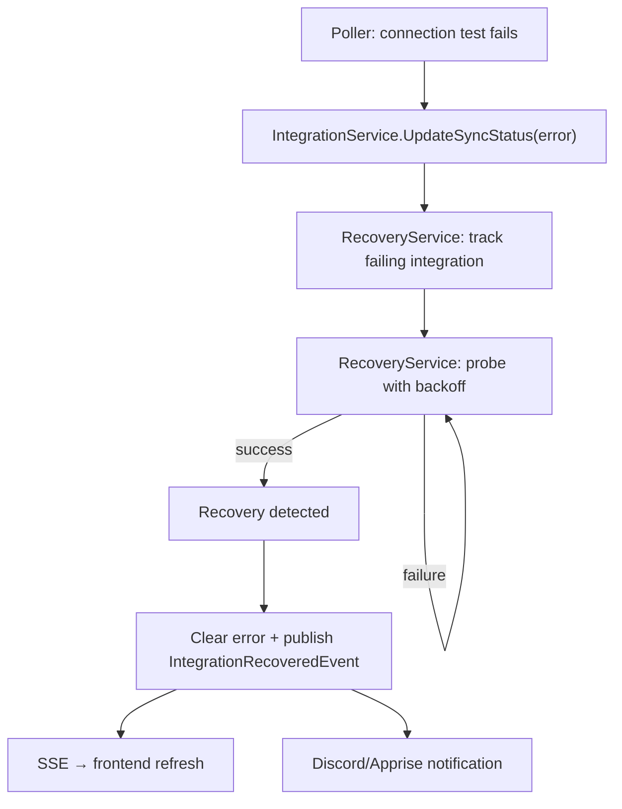

# Automatic Integration Recovery

**Status:** ✅ Complete (merged to feature/3.0 as 7c8e31f)
**Created:** 2026-04-02T10:42Z
**Category:** Feature (02-features)
**Branch:** `feature/automatic-integration-recovery`

## Problem

When an integration goes down temporarily (e.g., Sonarr restarts, network blip, reverse proxy reload), Capacitarr:

1. Marks it as failed during the poll cycle connection test
2. Skips it for the current engine cycle
3. Waits until the **next** poll cycle (5+ minutes) to check again
4. During the wait, there is no recovery probing — the user has no visibility into when recovery will be detected

This means a 10-second Sonarr restart causes a full poll-interval blind spot. The engine cannot use the integration until the next cycle, even if it recovered seconds after failure detection.

## Solution

Add a **RecoveryService** that actively probes failing integrations between poll cycles using exponential backoff. When recovery is detected, the integration is immediately marked healthy and a recovery event is published.

### Architecture

### Backoff Schedule

| Attempt | Delay | Cumulative |
|---------|-------|------------|
| 1       | 30s   | 30s        |
| 2       | 60s   | 1m 30s     |
| 3       | 120s  | 3m 30s     |
| 4       | 240s  | 7m 30s     |
| 5+      | 300s  | capped     |

The cap at 300s (5 min) ensures recovery probes happen at least as often as the default poll interval. If the poll interval is shorter, recovery is delegated to the poll cycle's own connection test.

### Health States (In-Memory)

- **healthy**: No entry in the recovery map (default state)
- **failing**: Entry exists with consecutive failure count and next retry time
- On recovery probe success or poll cycle success → entry removed (back to healthy)
- On startup: scan DB for integrations with non-empty `LastError` and seed the recovery map

## Implementation Plan

### Phase 1: Backend — RecoveryService

#### Step 1.1: Add `consecutive_failures` to IntegrationConfig model
- Add `ConsecutiveFailures int` field to `db.IntegrationConfig` (default 0)
- Create Goose migration `00009_consecutive_failures.sql`
- Field is incremented on failure, reset to 0 on success
- **Service method:** `IntegrationService.UpdateSyncStatus()` (modified)

#### Step 1.2: Create RecoveryService
- New file: `internal/services/recovery.go`
- Struct: `RecoveryService` with `*IntegrationService`, `*events.EventBus`, `done chan`, `mu sync.Mutex`
- In-memory state: `map[uint]*recoveryState` where `recoveryState` = `{consecutiveFailures int, nextRetry time.Time, lastError string}`
- Constructor: `NewRecoveryService(integrationSvc *IntegrationService, bus *events.EventBus)`
- Methods:
  - `Start()` — spawns background goroutine, seeds from DB
  - `Stop()` — signals shutdown
  - `TrackFailure(id uint, intType, name, url, errMsg string)` — adds/updates entry
  - `TrackRecovery(id uint)` — removes entry
  - `HealthStatus() []IntegrationHealthEntry` — returns current recovery state for API
  - `probe(id uint, url, apiKey, intType string) error` — single connection test
  - `tick()` — called every 15s, probes integrations due for retry

#### Step 1.3: Wire RecoveryService into lifecycle
- Add `Recovery *RecoveryService` to `services.Registry`
- Construct in `NewRegistry()` after IntegrationService
- Start in `main.go` after poller
- Stop in graceful shutdown

#### Step 1.4: Update IntegrationService.UpdateSyncStatus
- When `lastError != ""`: increment `ConsecutiveFailures`, call `recovery.TrackFailure()`
- When `lastError == ""`: reset `ConsecutiveFailures` to 0, call `recovery.TrackRecovery()`
- The recovery service ref is injected via `SetRecoveryTracker()` interface

#### Step 1.5: Add new event type
- `IntegrationRecoveryAttemptEvent` — published on each probe (success or failure)
- Fields: `IntegrationID`, `IntegrationType`, `Name`, `Attempt`, `Success`, `Error`, `NextRetrySeconds`

### Phase 2: API

#### Step 2.1: Health endpoint
- `GET /api/v1/integrations/health` — returns recovery status for all tracked integrations
- Response: `[{id, name, type, consecutiveFailures, lastError, nextRetryAt, recovering}]`
- Uses `RecoveryService.HealthStatus()`

#### Step 2.2: Include recovery fields in integration list
- Add `consecutiveFailures` to the JSON response of `GET /api/v1/integrations`
- Already present on the model after Step 1.1

### Phase 3: Frontend

#### Step 3.1: SSE subscription for recovery events
- Subscribe to `integration_recovered` in dashboard SSE handler → trigger integration refetch
- Subscribe to `integration_recovery_attempt` → update recovery indicator in real-time

#### Step 3.2: Integration cards — recovery indicator
- Show consecutive failure count on integration cards when > 0
- Show "Recovering..." indicator with next retry countdown
- Show "Back online" flash when recovery event received

#### Step 3.3: IntegrationErrorBanner — recovery probing
- Add "Attempting recovery..." text below error message
- Show attempt count: "Retry 3/5 in 42s"

#### Step 3.4: Activity feed
- Add `integration_recovered` and `integration_recovery_attempt` to `activityEventTypes`
- Map to appropriate icons and colors

### Phase 4: Testing

#### Step 4.1: Unit tests for RecoveryService
- Test backoff calculation
- Test state transitions (healthy → failing → healthy)
- Test concurrent access safety
- Test startup seeding from DB
- Test probe success/failure paths

#### Step 4.2: Integration test
- Test full flow: create integration → simulate failure → verify recovery probing → simulate recovery

## Files Changed

### New Files
- `backend/internal/services/recovery.go`
- `backend/internal/services/recovery_test.go`
- `backend/internal/db/migrations/00009_consecutive_failures.sql`

### Modified Files
- `backend/internal/db/models.go` — add `ConsecutiveFailures` field
- `backend/internal/events/types.go` — add `IntegrationRecoveryAttemptEvent`
- `backend/internal/services/registry.go` — add `Recovery` field, construct + wire
- `backend/internal/services/integration.go` — modify `UpdateSyncStatus()`, add `RecoveryTracker` interface
- `backend/internal/services/notification_dispatch.go` — handle recovery attempt event
- `backend/routes/integrations.go` — add health endpoint
- `backend/main.go` — start/stop RecoveryService
- `frontend/app/pages/index.vue` — SSE subscriptions for recovery events
- `frontend/app/components/settings/SettingsIntegrations.vue` — recovery indicator
- `frontend/app/components/IntegrationErrorBanner.vue` — recovery probing indicator
- `frontend/app/types/api.ts` — add `consecutiveFailures` field
