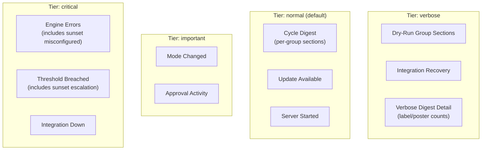
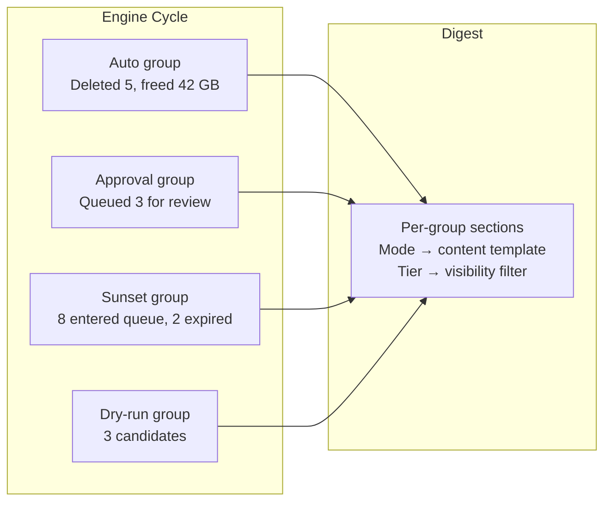
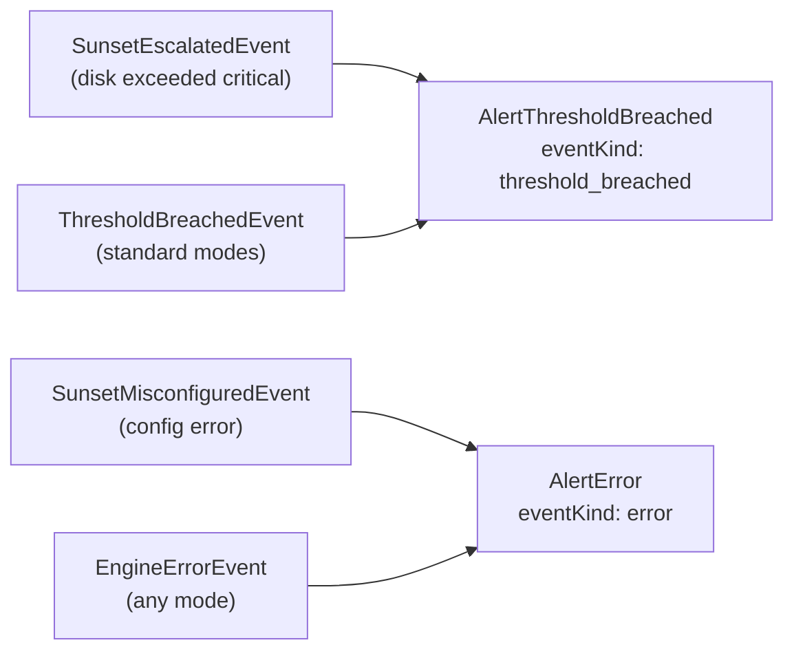
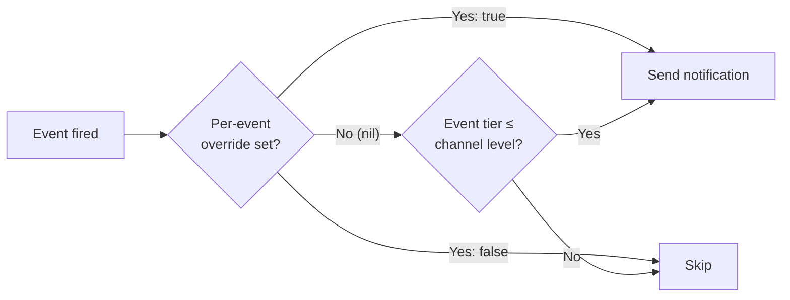
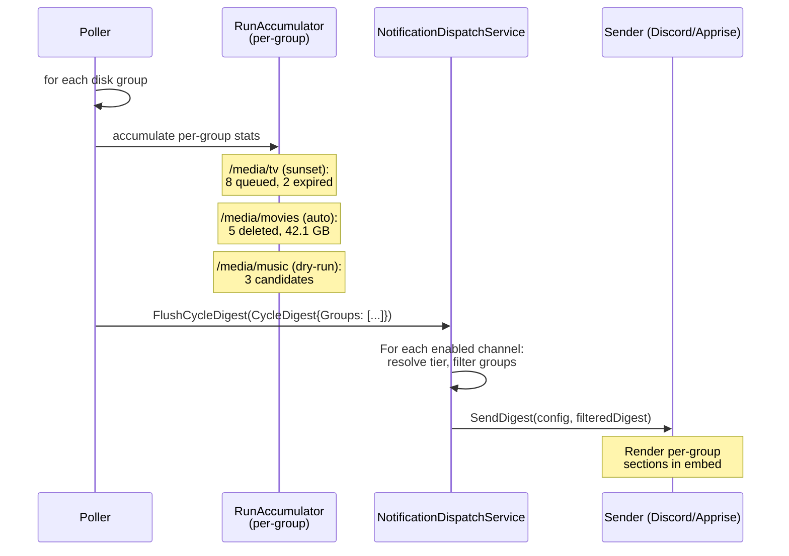
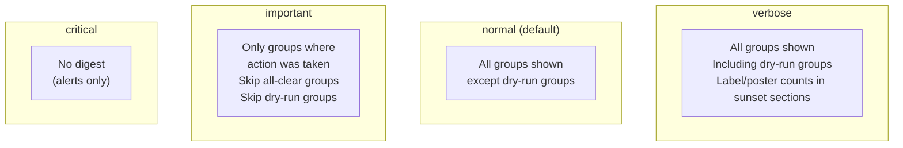

# Notification Tiers & Multi-Group Digest

**Status:** ✅ Complete (`make ci` passes — only pre-existing lodash audit vuln remains)
**Branch:** `feature/notification-tiers`
**Scope:** Notification configuration model, dispatch service, digest rendering, DB migration, frontend settings UI
**Supersedes:** Sunset notification suppression comment in `notification_dispatch.go`

---

## Background

The notification system was overhauled in [20260307T1403Z-notification-overhaul.md](../02-features/20260307T1403Z-notification-overhaul.md), which replaced per-item noise with a batched cycle digest + immediate alerts. That design works well for single-mode deployments, but three changes have exposed scaling problems:

### Problem 1: Toggle Fatigue

Each notification channel has **10 boolean toggles** (with `OnSunsetActivity` existing in the DB but not wired). Adding sunset properly requires 1-2 more. Every future feature area adds 1-3 toggles. A user with 2 channels manages 20-26 individual switches, most of which they never touch because they want one of a handful of common configurations:

| User intent | Toggles required |
|------------|-----------------|
| "Tell me everything" | All 12 on |
| "Just the summary" | 1 on, 11 off |
| "Only when something's wrong" | 3 on, 9 off |
| "Important stuff + summary" | 5 on, 7 off |

### Problem 2: Disk-Group Blindness

Each disk group has its own `Mode` (dry-run, approval, auto, sunset), but the cycle digest uses the global `DefaultDiskGroupMode` and flattened counters:

```go
// poller.go line 361-362 (current)
p.reg.NotificationDispatch.FlushCycleDigest(notifications.CycleDigest{
    ExecutionMode: prefs.DefaultDiskGroupMode,  // global fallback
    Evaluated:     int(evaluated),               // aggregated across all groups
    ...
})
```

A user with `/media/tv` (sunset), `/media/movies` (auto), and `/media/music` (dry-run) gets one notification saying "dry-run: 16 evaluated, 8 candidates, 5 deleted, 42 GB freed" — the mode is wrong and there's no way to tell which group did what.

### Problem 3: Sunset Notification Noise

Sunset generates 11 event types. Wiring them as individual alerts would produce 100-150 Discord messages per cycle on a medium library. The cycle digest batching pattern solves this, but the current `CycleDigest` struct has no sunset fields and no per-group breakdown.

### Problem 4: `OnSunsetActivity` Never Wired

The `OnSunsetActivity` boolean field was added to `NotificationConfig` in migration `00006_sunset_mode.sql` and exists in the DB model (`models.go:344`), but it was **never connected** to the dispatch service or the frontend:

- **`PartialUpdate()`** (`notification_channel.go:78-91`) — does not include `OnSunsetActivity`. Every PUT request silently resets it to its GORM zero value (`false`), regardless of what the user intended. A user who creates a channel with `OnSunsetActivity: true` (the default) will have it silently set to `false` the first time they edit any other field on that channel.
- **`SettingsNotifications.vue`** — no toggle rendered in the channel card or the create/edit modal. The `channelForm` reactive object and the `onChannelSubmit` body both omit `onSunsetActivity`.
- **`notification_dispatch.go` `handle()`** — no `case` for any sunset event type. Explicit suppression comment at lines 225-229.

This means sunset notifications are completely inert: the DB column exists and defaults to `true`, but no code reads it, and any channel edit destroys the default value. Phase 0 fixes the `PartialUpdate` gap so the migration in Phase 1 reads correct `OnSunsetActivity` values when computing tiers.

### Key Design Principle: Modes Are Not Notification Categories

Sunset is not a special notification category — it is an execution mode, just like auto, approval, and dry-run. Each mode produces per-group cycle results that belong in the digest, and each mode can trigger generic alerts (threshold breaches, configuration errors) that map to existing alert types.

The mapping:

| Sunset-specific event | What it actually is | Maps to |
|---|---|---|
| `SunsetEscalatedEvent` | Disk exceeded critical threshold → items force-deleted | `AlertThresholdBreached` |
| `SunsetMisconfiguredEvent` | Configuration error preventing evaluation | `AlertError` |
| Items entering sunset queue | Normal cycle activity for sunset mode | Per-group digest section |
| Items expiring from queue | Normal cycle activity for sunset mode | Per-group digest section |
| Items saved (score dropped) | Normal cycle activity for sunset mode | Per-group digest section |
| Labels applied / posters overlayed | Operational detail | Per-group digest section (verbose) |

No `AlertSunsetActivity` type exists. No `sunset_escalation` or `sunset_misconfigured` event kind in the tier map. Sunset events reuse existing generic alert types and the per-group digest.

### Why One Plan

These four problems are interdependent:
- Fixing sunset noise requires per-group digest data (Problem 2)
- Per-group digest data multiplies the toggle surface (Problem 1)
- Tiers solve the toggle surface before per-group data makes it worse
- The `OnSunsetActivity` wiring gap (Problem 4) must be fixed before the boolean→tier migration can produce correct results

All four must be addressed together.

## Goals

1. **Replace N-boolean toggles with a single notification level** per channel (off, critical, important, normal, verbose), with optional per-event overrides for power users
2. **Per-group digest sections** in cycle notifications — each disk group's mode, counts, and progress bar rendered separately
3. **Mode-agnostic digest** — the mode determines what content a group produces; the tier determines whether that content is shown. No mode gets special treatment.
4. **Sunset events map to existing alert types** — escalation is a threshold breach, misconfigured is an error. No sunset-specific notification category.
5. **Zero-configuration for existing users** — migration maps current booleans to the nearest tier
6. **Sustainable growth** — new features assign events to tiers; no user reconfiguration needed

## Non-Goals

- Per-channel-per-disk-group routing (rejected: combinatorial explosion)
- New notification channel types (Telegram, Gotify) — future work enabled by existing Sender interface
- Quiet hours / rate limiting — potential future enhancement, not in scope
- Notification history / delivery log — separate concern

---

## Architecture

### Notification Level Tiers

Events are assigned to severity tiers. Each channel's `NotificationLevel` determines the minimum tier it receives. Higher tiers include all events from lower tiers. **No mode-specific entries** — modes are a rendering concern for the digest, not a notification routing concern.



### Tier Definitions

| Level | Events included | Target user |
|-------|----------------|-------------|
| **off** | Nothing | "I'll check the dashboard" |
| **critical** | Engine errors (any mode), threshold breaches (any mode, including sunset escalation), integration down | "Only wake me up if something's broken" |
| **important** | Critical + mode changes, approval activity | "Tell me about actionable events" |
| **normal** *(default)* | Important + cycle digest (all modes except dry-run rendered per-group), update available, server started | "Keep me in the loop" |
| **verbose** | Normal + dry-run group sections in digest, integration recovery, verbose digest detail (label/poster counts) | "I want to see everything" |

### Mode → Digest Rendering (Uniform)

The mode determines **what content** a group section contains. The tier determines **whether** that section is shown.



| Group mode | Digest section content |
|------------|----------------------|
| auto | "🧹 Deleted X of Y, freeing Z GB" + progress bar |
| approval | "📋 Queued X of Y for approval" |
| sunset | "☀️ X items entered sunset • Y expired • Z saved" + progress bar |
| dry-run | "🔍 X candidates, would free Z GB" |

### Mode → Alert Mapping (Uniform)

Sunset events that represent errors or threshold breaches map to the **same generic alert types** used by all other modes:



### Tier Resolution with Overrides



### Event Flow — Multi-Group Digest



### Digest Content by Tier



### Per-Group Digest Embed (Discord Example)

A single Discord message with per-group sections:

```
┌──────────────────────────────────────────────┐
│ ⚡ Capacitarr v3.0.0               (author)   │
├──────────────────────────────────────────────┤
│ 📊 Engine Cycle Complete                      │
│                                              │
│ ──── /media/tv • sunset ─────                │
│ ☀️ 8 items entered sunset                     │
│ 2 countdowns expired → queued for deletion   │
│ 1 saved by popular demand                    │
│ `▓▓▓▓▓▓▓▓▓▓▓▓░░░░░░░░` **62%** / 70%       │
│                                              │
│ ──── /media/movies • auto ────               │
│ 🧹 Deleted 5 of 234, freeing 42.1 GB        │
│ `▓▓▓▓▓▓▓▓▓▓▓▓▓▓░░░░░░` **72%** → 75%       │
│                                              │
│ ──── /media/music • dry-run ──               │
│ 🔍 3 candidates, would free 8.2 GB          │
│                                              │
│ ⏱️ 2.4s • 📦 v3.1.0 available!              │
└──────────────────────────────────────────────┘
  Color: #2ECC71 (green — based on most active group)
```

At "important" tier, only `/media/tv` and `/media/movies` would appear (action taken). At "verbose," all three plus sunset label/poster counts. At "normal," `/media/tv` and `/media/movies` (dry-run excluded).

### Immediate Alert Embeds

Critical alerts remain per-group and fire immediately — not batched. Sunset escalation uses the same `AlertThresholdBreached` type as standard threshold breaches:

**Sunset escalation (threshold breach):**
```
┌──────────────────────────────────────────────┐
│ ⚡ Capacitarr v3.0.0 • Threshold Breached      │
├──────────────────────────────────────────────┤
│ 🔴 /media/tv — Threshold Breached            │
│                                              │
│ Disk exceeded critical threshold.            │
│ 5 items force-expired to free **48.3 GB**    │
│                                              │
│ `▓▓▓▓▓▓▓▓▓▓▓▓▓▓▓▓▓░░░` **87%** → 75%       │
└──────────────────────────────────────────────┘
  Color: #E74C3C (red)
```

**Sunset misconfigured (error):**
```
┌──────────────────────────────────────────────┐
│ ⚡ Capacitarr v3.0.0 • Engine Error            │
├──────────────────────────────────────────────┤
│ ⚠️ /media/tv — Sunset Misconfigured           │
│                                              │
│ Sunset mode skipped — sunset threshold not   │
│ configured. Set sunsetPct in disk group      │
│ settings.                                    │
└──────────────────────────────────────────────┘
  Color: #E74C3C (red)
```

### Frontend UI — Channel Card

Before (10+ toggles):

```
┌─────────────────────────┐
│ Discord Alerts     [ON] │
├─────────────────────────┤
│ Triggers                │
│ ☐ Cycle Digest          │
│   ☐ Include Dry-Run     │
│ ☐ Critical Breached     │
│ ☐ Approval Activity     │
│ ☐ Errors                │
│ ☐ Integration Status    │
│ ☐ Mode Changed          │
│ ☐ Server Started        │
│ ☐ Update Available      │
│ ☐ Sunset Activity       │  ← would need this
│ ☐ Sunset Escalation     │  ← and this
├─────────────────────────┤
│ [Test]  [Edit]  [Delete]│
└─────────────────────────┘
```

After (single dropdown + optional advanced):

```
┌─────────────────────────┐
│ Discord Alerts     [ON] │
├─────────────────────────┤
│ Notification Level      │
│ [Normal           ▾]   │
│                         │
│ ℹ️ Cycle digests, errors│
│ thresholds, mode changes│
│ and update notices.     │
│                         │
│ ▸ Advanced overrides    │
├─────────────────────────┤
│ [Test]  [Edit]  [Delete]│
└─────────────────────────┘
```

Expanded advanced section (collapsed by default):

```
│ ▾ Advanced overrides    │
│                         │
│ These override the level│
│ setting for individual  │
│ event types.            │
│                         │
│ Cycle Digest    [auto ▾]│
│ Errors          [auto ▾]│
│ Threshold Breach[auto ▾]│
│ Mode Changed    [auto ▾]│
│ Approval        [auto ▾]│
│ Integration     [auto ▾]│
│ Server Started  [auto ▾]│
│ Update Available[auto ▾]│
│                         │
│ Each: [auto] [on] [off] │
```

Where "auto" means "follow the tier," "on" forces it always, "off" forces it never. Note: no "Sunset Activity" override — sunset results are part of the cycle digest, and sunset errors/escalation are part of "Errors" / "Threshold Breach."

---

## DB Schema Changes

### NotificationConfig Model — Before vs After

| Remove | Add | Notes |
|--------|-----|-------|
| `on_cycle_digest` (bool) | `notification_level` (string, default 'normal') | Tier selector |
| `on_dry_run_digest` (bool) | `override_cycle_digest` (nullable int) | Tri-state: null/1/0 |
| `on_error` (bool) | `override_error` (nullable int) | |
| `on_mode_changed` (bool) | `override_mode_changed` (nullable int) | |
| `on_server_started` (bool) | `override_server_started` (nullable int) | |
| `on_threshold_breach` (bool) | `override_threshold_breach` (nullable int) | |
| `on_update_available` (bool) | `override_update_available` (nullable int) | |
| `on_approval_activity` (bool) | `override_approval_activity` (nullable int) | |
| `on_integration_status` (bool) | `override_integration_status` (nullable int) | |
| `on_sunset_activity` (bool) | *(removed — no replacement)* | Sunset is not a notification category |

The `on_sunset_activity` column is dropped entirely. Sunset cycle results are part of the cycle digest. Sunset escalation is a threshold breach. Sunset misconfigured is an error. No separate override needed.

### Migration Strategy

The first statement in the migration repairs `on_sunset_activity` values corrupted by the `PartialUpdate` bug (Problem 4) — this is necessary for correct boolean→tier computation even though the column is ultimately dropped.

Existing boolean combinations are then mapped to the closest tier:

```
1. Repair: UPDATE notification_configs SET on_sunset_activity = 1
2. Compute tier:
   IF all booleans are false → "off"
   ELSE IF only error/threshold flags are true → "critical"
   ELSE IF error/threshold/mode/approval are true, digest is false → "important"
   ELSE IF all are true → "verbose"
   ELSE → "normal" (with overrides for any non-standard booleans)
3. Set overrides for any booleans that deviate from the assigned tier's defaults
4. Drop old boolean columns
```

Any booleans that don't match the assigned tier's defaults become explicit overrides, so no existing user's behavior changes.

### CycleDigest Struct — Before vs After

**Before:**
```go
type CycleDigest struct {
    ExecutionMode      string  // single global mode
    Evaluated          int
    Candidates         int
    Deleted            int
    Failed             int
    FreedBytes         int64
    DurationMs         int64
    DiskUsagePct       float64
    DiskThreshold      float64
    DiskTargetPct      float64
    CollectionsDeleted int
    Version            string
    UpdateAvailable    bool
    LatestVersion      string
    ReleaseURL         string
}
```

**After:**
```go
type CycleDigest struct {
    Groups          []GroupDigest // per-group breakdown
    DurationMs      int64
    Version         string
    UpdateAvailable bool
    LatestVersion   string
    ReleaseURL      string
}

type GroupDigest struct {
    MountPath          string
    Mode               string   // per-group: "dry-run", "approval", "auto", "sunset"
    Evaluated          int
    Candidates         int
    Deleted            int
    Failed             int
    FreedBytes         int64
    DiskUsagePct       float64
    DiskThreshold      float64
    DiskTargetPct      float64
    CollectionsDeleted int
    // Sunset-specific counters (zero when mode != "sunset").
    // These are regular per-group stats, not a separate notification category.
    SunsetQueued       int
    SunsetExpired      int
    SunsetSaved        int
    EscalatedItems     int
    EscalatedBytes     int64
}
```

---

## Service Layer Compliance Audit

Every data access in this plan goes through the appropriate service. This section documents compliance for each step.

| Step | Data Access | Service Method | Direct DB? |
|------|-------------|----------------|------------|
| 0.1 | Update notification channel | `NotificationChannelService.PartialUpdate()` | ❌ |
| 2.1 | Read/write notification configs | `NotificationChannelService.PartialUpdate()` | ❌ |
| 2.1 | List enabled channels | `NotificationChannelService.ListEnabled()` | ❌ |
| 3.1 | Resolve tier + overrides | `NotificationDispatchService.shouldNotify()` | ❌ |
| 3.2 | Flush cycle digest | `NotificationDispatchService.FlushCycleDigest()` | ❌ |
| 3.3 | Dispatch alerts | `NotificationDispatchService.dispatchAlert()` | ❌ |
| 4.1 | Per-group accumulation | `RunAccumulator` (in-memory, poller) | ❌ |
| 5.1 | Export notification channels | `BackupService.Export()` | ❌ |
| 5.2 | Import notification channels | `BackupService.Import()` | ❌ |
| 6.1 | CRUD notification channels | `NotificationChannelService.*()` | ❌ |

No step in this plan accesses `reg.DB` directly from route handlers, middleware, orchestrators, or event subscribers.

---

## Implementation Steps

### Phase 0: Fix `OnSunsetActivity` Wiring Gap (Prerequisite)

The boolean→tier migration in Phase 1 reads all 10 boolean columns to compute the best-fit tier. If `OnSunsetActivity` has been silently reset to `false` by `PartialUpdate`, the migration will incorrectly conclude the user disabled sunset notifications — when in reality they never touched it and the default (`true`) was destroyed by a bug.

Even though `OnSunsetActivity` is dropped in Phase 1, fixing the wiring ensures correctness during the migration window and prevents the same class of bug from recurring with future fields.

#### Step 0.1: Wire `OnSunsetActivity` in `PartialUpdate`

**File:** `internal/services/notification_channel.go`

Add the missing assignment in `PartialUpdate()` after the `OnIntegrationStatus` line (line 90):

```go
existing.OnIntegrationStatus = req.OnIntegrationStatus
existing.OnSunsetActivity = req.OnSunsetActivity    // ← add this line
existing.UpdatedAt = time.Now()
```

#### Step 0.2: Tests for `OnSunsetActivity` preservation

**File:** `internal/services/notification_channel_test.go`

Add test: `TestPartialUpdate_PreservesOnSunsetActivity` — create a channel (defaults to `OnSunsetActivity: true`), partial-update a different field, assert `OnSunsetActivity` is still `true`.

---

### Phase 1: DB Schema & Model

#### Step 1.1: Create migration file

**File:** `internal/db/migrations/00008_notification_tiers.sql`

Up migration:
1. Repair `on_sunset_activity` values corrupted by the `PartialUpdate` bug: `UPDATE notification_configs SET on_sunset_activity = 1` — since no user could have intentionally set it to `false` (the UI toggle never existed), blanket-restoring the default is safe
2. Add column `notification_level TEXT NOT NULL DEFAULT 'normal'`
3. Add override columns (`override_cycle_digest`, `override_error`, `override_mode_changed`, `override_server_started`, `override_threshold_breach`, `override_update_available`, `override_approval_activity`, `override_integration_status`) as nullable `INTEGER` (SQLite boolean convention)
4. Map existing boolean columns to `notification_level`:
   - Compute the best-fit tier from the current boolean combination
   - Set per-event overrides for any booleans that deviate from the assigned tier's defaults
5. Drop old boolean columns (`on_cycle_digest`, `on_dry_run_digest`, `on_error`, `on_mode_changed`, `on_server_started`, `on_threshold_breach`, `on_update_available`, `on_approval_activity`, `on_integration_status`, `on_sunset_activity`)

Down migration: reverse (create boolean columns, map back from tier + overrides, drop new columns).

Note: no `override_sunset_activity` column — sunset has no separate notification category.

#### Step 1.2: Update `db.NotificationConfig` model

**File:** `internal/db/models.go`

Replace the 10 boolean fields with:
```go
type NotificationConfig struct {
    // ... existing channel fields (ID, Type, Name, WebhookURL, AppriseTags, Enabled) ...
    NotificationLevel         string `gorm:"default:'normal';not null" json:"notificationLevel"`
    OverrideCycleDigest       *bool  `json:"overrideCycleDigest,omitempty"`
    OverrideError             *bool  `json:"overrideError,omitempty"`
    OverrideModeChanged       *bool  `json:"overrideModeChanged,omitempty"`
    OverrideServerStarted     *bool  `json:"overrideServerStarted,omitempty"`
    OverrideThresholdBreach   *bool  `json:"overrideThresholdBreach,omitempty"`
    OverrideUpdateAvailable   *bool  `json:"overrideUpdateAvailable,omitempty"`
    OverrideApprovalActivity  *bool  `json:"overrideApprovalActivity,omitempty"`
    OverrideIntegrationStatus *bool  `json:"overrideIntegrationStatus,omitempty"`
    // ... timestamps ...
}
```

No `OverrideSunsetActivity` — sunset cycle results flow through `OverrideCycleDigest`, sunset escalation through `OverrideThresholdBreach`, sunset errors through `OverrideError`.

Add validation for `NotificationLevel` in `internal/db/validation.go`:
```go
var ValidNotificationLevels = map[string]bool{
    "off": true, "critical": true, "important": true,
    "normal": true, "verbose": true,
}
```

#### Step 1.3: Tests for migration

**File:** `internal/db/migrations_test.go` (extend)

Test that:
- All-true booleans → `verbose` tier with no overrides
- All-false booleans → `off` tier with no overrides
- Only error+threshold → `critical` with no overrides
- Mixed booleans → appropriate tier + correct overrides for deviations
- Corrupted `on_sunset_activity = 0` is repaired before tier computation
- Down migration restores original boolean values

---

### Phase 2: Tier Resolution Engine

#### Step 2.1: Define tier event mapping

**File:** `internal/notifications/tiers.go` (new)

Define the canonical mapping of event types to tiers. **No mode-specific entries** — modes produce digest content, they don't have their own notification routing:

```go
type NotificationTier int

const (
    TierOff       NotificationTier = 0
    TierCritical  NotificationTier = 1
    TierImportant NotificationTier = 2
    TierNormal    NotificationTier = 3
    TierVerbose   NotificationTier = 4
)

// EventTier maps each notification event kind to its default tier.
// Mode-specific events (sunset escalation, sunset misconfigured) are
// mapped to their generic equivalents — modes are a rendering concern,
// not a notification routing concern.
var EventTier = map[string]NotificationTier{
    // Critical — something is wrong or needs immediate attention
    "error":              TierCritical,
    "threshold_breached": TierCritical,
    "integration_down":   TierCritical,

    // Important — user action may be relevant
    "mode_changed":       TierImportant,
    "approval_activity":  TierImportant,

    // Normal — informational
    "cycle_digest":       TierNormal,
    "update_available":   TierNormal,
    "server_started":     TierNormal,

    // Verbose — everything
    "dry_run_digest":     TierVerbose,
    "integration_recovery": TierVerbose,
}
```

Define `ParseLevel(s string) NotificationTier` to convert DB string to tier.

Define `ShouldNotify(channelLevel NotificationTier, eventKind string, override *bool) bool`:
```
if override != nil → return *override
eventTier := EventTier[eventKind]
return eventTier <= channelLevel  (lower tier number = higher severity)
```

#### Step 2.2: Define tier description text

**File:** `internal/notifications/tiers.go`

Define `TierDescription(tier NotificationTier) string` returning the human-readable summary shown in the frontend dropdown:

```go
func TierDescription(tier NotificationTier) string {
    switch tier {
    case TierCritical:
        return "Errors, threshold breaches, and integration failures"
    case TierImportant:
        return "Critical events plus mode changes and approval activity"
    case TierNormal:
        return "Cycle digests, update notices, and all important events"
    case TierVerbose:
        return "Everything including dry-run digests and integration recovery"
    default:
        return "No notifications"
    }
}
```

Note: no mode-specific language in tier descriptions. Sunset, auto, approval, and dry-run results all appear in cycle digests — the tier just controls whether the digest is sent and which groups are shown.

#### Step 2.3: Tests for tier resolution

**File:** `internal/notifications/tiers_test.go` (new)

Test matrix:
- Channel at "normal" level + "error" event (critical) → true
- Channel at "normal" level + "dry_run_digest" event (verbose) → false
- Channel at "normal" + override `OverrideCycleDigest = false` → false (forced off)
- Channel at "critical" + override `OverrideCycleDigest = true` → true (forced on)
- Channel at "off" + any event → false
- Channel at "off" + override true → true (override wins)
- All combinations of (5 tiers × N event kinds)
- Verify no sunset-specific event kinds exist in `EventTier`

---

### Phase 3: Dispatch Service Refactor

#### Step 3.1: Replace boolean subscription checks with tier resolution

**File:** `internal/services/notification_dispatch.go`

Replace the current subscription lambdas:
```go
// BEFORE
s.dispatchAlert(alert, func(cfg db.NotificationConfig) bool { return cfg.OnError })

// AFTER
s.dispatchAlert(alert, "error")
```

Update `dispatchAlert` signature:
```go
func (s *NotificationDispatchService) dispatchAlert(alert notifications.Alert, eventKind string)
```

Inside, resolve per-channel:
```go
for _, cfg := range configs {
    level := notifications.ParseLevel(cfg.NotificationLevel)
    override := resolveOverride(cfg, eventKind)
    if !notifications.ShouldNotify(level, eventKind, override) {
        continue
    }
    // ... dispatch via sender
}
```

Add `resolveOverride(cfg db.NotificationConfig, eventKind string) *bool` that maps event kind strings to the corresponding `Override*` field on the config.

#### Step 3.2: Update `dispatchDigest` for tier-based filtering

**File:** `internal/services/notification_dispatch.go`

Replace the boolean checks:
```go
// BEFORE
if !cfg.OnCycleDigest { continue }
if digest.ExecutionMode == notifications.ModeDryRun && !cfg.OnDryRunDigest { continue }

// AFTER
level := notifications.ParseLevel(cfg.NotificationLevel)
override := resolveOverride(cfg, "cycle_digest")
if !notifications.ShouldNotify(level, "cycle_digest", override) { continue }
```

Pass the channel's tier to the sender so it can filter which `GroupDigest` sections to render:
```go
sender.SendDigest(sc, d, level)
```

Update the `Sender` interface:
```go
type Sender interface {
    SendDigest(config SenderConfig, digest CycleDigest, level NotificationTier) error
    SendAlert(config SenderConfig, alert Alert) error
}
```

#### Step 3.3: Map sunset events to generic alert types

**File:** `internal/services/notification_dispatch.go`

Add cases to `handle()`. These use existing alert types — no sunset-specific category:

```go
case events.SunsetEscalatedEvent:
    // Escalation IS a threshold breach — same alert type, same tier
    s.dispatchAlert(notifications.Alert{
        Type:    notifications.AlertThresholdBreached,
        Title:   fmt.Sprintf("🔴 Threshold Breached — %s", e.MountPath),
        Message: fmt.Sprintf("Disk exceeded critical threshold. %d items force-expired to free **%s**",
            e.ItemsExpired, notifications.HumanSize(e.BytesFreed)),
        Version: s.version,
    }, "threshold_breached")

case events.SunsetMisconfiguredEvent:
    // Misconfigured IS an engine error for this group
    s.dispatchAlert(notifications.Alert{
        Type:    notifications.AlertError,
        Title:   fmt.Sprintf("⚠️ Sunset Misconfigured — %s", e.MountPath),
        Message: "Sunset mode skipped — sunset threshold not configured. Set sunsetPct in disk group settings.",
        Version: s.version,
    }, "error")
```

Remove the suppression comment at lines 225-229.

Note: `SunsetCreatedEvent`, `SunsetExpiredEvent`, `SunsetSavedEvent`, `SunsetLabelAppliedEvent`, `PosterOverlayAppliedEvent` are NOT wired as alerts. Their counts flow through the per-group digest (Phase 4).

#### Step 3.4: Tests for refactored dispatch

**File:** `internal/services/notification_dispatch_test.go` (update)

Update existing tests to use tier-based assertions:
- Channel at "normal" receives digest → passes
- Channel at "critical" does not receive digest → passes
- Channel at "normal" + override `OverrideCycleDigest = false` → does not receive digest
- `SunsetEscalatedEvent` → dispatched as `AlertThresholdBreached` to "critical" and above
- `SunsetMisconfiguredEvent` → dispatched as `AlertError` to "critical" and above
- `SunsetEscalatedEvent` → NOT dispatched to channel at "important"
- No `AlertSunsetActivity` type exists anywhere in the codebase

---

### Phase 4: Per-Group Digest Data

#### Step 4.1: Refactor `RunAccumulator` to per-group tracking

**File:** `internal/poller/poller.go`

Replace the flat `RunAccumulator` with per-group accumulation:

```go
type RunAccumulator struct {
    Groups map[uint]*GroupAccumulator // keyed by DiskGroup.ID
}

func NewRunAccumulator() *RunAccumulator {
    return &RunAccumulator{Groups: make(map[uint]*GroupAccumulator)}
}

func (a *RunAccumulator) GetOrCreate(groupID uint, mountPath, mode string) *GroupAccumulator {
    if ga, ok := a.Groups[groupID]; ok {
        return ga
    }
    ga := &GroupAccumulator{MountPath: mountPath, Mode: mode}
    a.Groups[groupID] = ga
    return ga
}

// Totals returns aggregate counts across all groups (for engine stats, etc.)
func (a *RunAccumulator) Totals() (evaluated, candidates, protected, collections int64, freedBytes int64) {
    for _, ga := range a.Groups {
        evaluated += ga.Evaluated
        candidates += ga.Candidates
        protected += ga.Protected
        collections += ga.Collections
        freedBytes += ga.FreedBytes
    }
    return
}

type GroupAccumulator struct {
    MountPath     string
    Mode          string
    Evaluated     int64
    Candidates    int64
    Protected     int64
    FreedBytes    int64
    Collections   int64
    DiskUsagePct  float64
    DiskThreshold float64
    DiskTargetPct float64
    // Sunset-mode counters (zero for other modes — same struct, mode determines usage)
    SunsetQueued  int
    SunsetExpired int
    SunsetSaved   int
}
```

Update `evaluateAndCleanDisk` and `evaluateSunsetMode` to write to the group-specific accumulator:
```go
groupAcc := acc.GetOrCreate(group.ID, group.MountPath, group.Mode)
groupAcc.Evaluated += int64(evalResult.TotalCount)
groupAcc.DiskUsagePct = currentPct
groupAcc.DiskThreshold = group.ThresholdPct
groupAcc.DiskTargetPct = group.TargetPct
```

#### Step 4.2: Populate sunset counters from the poller

**File:** `internal/poller/evaluate.go`

In `evaluateSunsetMode`, after `BulkQueueSunset` succeeds:
```go
groupAcc.SunsetQueued += created
```

After `Escalate` succeeds:
```go
groupAcc.FreedBytes += freed
```

The poller doesn't currently track sunset expirations per cycle (they happen in `SunsetService.ProcessExpiredItems()` called by cron, not by the poller). Two options:

**Option A:** The dispatch service accumulates `SunsetExpiredEvent` / `SunsetSavedEvent` from the bus during the engine cycle and merges them into the digest before flushing.

**Option B:** The poller calls a new `SunsetService.GetCycleSummary(diskGroupID)` method after evaluation to get expiry/saved counts from the last cycle.

**Decision:** Option A — accumulate from bus events. This keeps the poller simple and reuses the existing event flow. The dispatch service already subscribes to the bus; it just needs a small accumulator for per-group expired/saved counts between `EngineStartEvent` and the digest flush. This is a **generic digest enrichment** pattern, not a sunset-specific notification category.

#### Step 4.3: Build `CycleDigest` from per-group accumulators

**File:** `internal/poller/poller.go`

Replace the current flat `FlushCycleDigest` call:
```go
// Build per-group digests from the accumulator
var groups []notifications.GroupDigest
for _, ga := range acc.Groups {
    groups = append(groups, notifications.GroupDigest{
        MountPath:          ga.MountPath,
        Mode:               ga.Mode,
        Evaluated:          int(ga.Evaluated),
        Candidates:         int(ga.Candidates),
        Deleted:            /* per-group deletion count */,
        FreedBytes:         ga.FreedBytes,
        DiskUsagePct:       ga.DiskUsagePct,
        DiskThreshold:      ga.DiskThreshold,
        DiskTargetPct:      ga.DiskTargetPct,
        CollectionsDeleted: int(ga.Collections),
        SunsetQueued:       ga.SunsetQueued,
    })
}

p.reg.NotificationDispatch.FlushCycleDigest(notifications.CycleDigest{
    Groups:     groups,
    DurationMs: time.Since(pollStart).Milliseconds(),
})
```

Use `acc.Totals()` for engine stats and `EngineCompleteEvent` (preserves existing behavior).

#### Step 4.4: Digest enrichment — expired/saved event accumulation

**File:** `internal/services/notification_dispatch.go`

Add a per-group counter accumulator that collects `SunsetExpiredEvent` / `SunsetSavedEvent` events between `EngineStartEvent` and `FlushCycleDigest`:

```go
type digestEnrichment struct {
    expired map[uint]int  // diskGroupID → count
    saved   map[uint]int
}
```

In `handle()`:
```go
case events.EngineStartEvent:
    s.resetDigestEnrichment()

case events.SunsetExpiredEvent:
    s.enrichment.expired[e.DiskGroupID]++

case events.SunsetSavedEvent:
    s.enrichment.saved[e.DiskGroupID]++
```

In `FlushCycleDigest()`, merge accumulated counts into the matching `GroupDigest` entries before rendering. This is generic infrastructure — any future mode that needs to enrich digests with bus events can use the same pattern.

#### Step 4.5: Tests for per-group accumulation

**File:** `internal/poller/poller_test.go` (extend)

Test that:
- Two disk groups with different modes produce two `GroupDigest` entries
- Sunset-mode group includes sunset counters
- Auto-mode group has zero sunset counters
- `Totals()` returns correct aggregates across groups
- Accumulated sunset expired/saved events are merged into the correct group's digest

---

### Phase 5: Sender Rendering Updates

#### Step 5.1: Update `CycleDigest` and `GroupDigest` structs

**File:** `internal/notifications/sender.go`

Replace `CycleDigest` with the per-group version defined in the Architecture section above. Remove the flat `ExecutionMode`, `Evaluated`, `Candidates`, `Deleted`, `Failed`, `FreedBytes`, `DiskUsagePct`, `DiskThreshold`, `DiskTargetPct`, `CollectionsDeleted` fields.

Remove `AlertSunsetActivity` from the `AlertType` constants (if it exists from prior work). Sunset has no dedicated alert type.

Add shared rendering helpers:
- `groupTitle(g GroupDigest) string` — mode-specific title per group (auto → "🧹", approval → "📋", sunset → "☀️", dry-run → "🔍")
- `groupDescription(g GroupDigest) string` — per-group summary text based on mode
- `filterGroups(groups []GroupDigest, level NotificationTier) []GroupDigest` — tier-based group filtering (critical: none, important: action-taken only, normal: all except dry-run, verbose: all)
- `digestColor(groups []GroupDigest) int` — color based on most severe group action
- `hasActivity(g GroupDigest) bool` — returns true if the group had any action (deleted > 0, candidates > 0, sunset queued > 0, etc.)

#### Step 5.2: Update `DiscordSender.SendDigest()`

**File:** `internal/notifications/discord.go`

Accept `NotificationTier` parameter. Filter groups by tier. Render per-group sections in the embed description:

```go
func (s *DiscordSender) SendDigest(config SenderConfig, digest CycleDigest, level NotificationTier) error {
    groups := filterGroups(digest.Groups, level)
    if len(groups) == 0 {
        return nil // nothing to show at this tier
    }

    desc := ""
    for _, g := range groups {
        desc += fmt.Sprintf("──── %s • %s ────\n", g.MountPath, g.Mode)
        desc += groupDescription(g) + "\n"
        if g.DiskUsagePct > 0 {
            desc += fmt.Sprintf("`%s` **%.0f%%** / %.0f%%\n",
                ProgressBar(g.DiskUsagePct, 20), g.DiskUsagePct, g.DiskThreshold)
        }
        desc += "\n"
    }
    // ... build embed with desc, duration footer, update banner
}
```

#### Step 5.3: Update `AppriseSender.SendDigest()`

**File:** `internal/notifications/apprise.go`

Same per-group rendering in plain text (Apprise doesn't support embeds):

```
📊 Engine Cycle Complete

── /media/tv • sunset ──
☀️ 8 items entered sunset
2 countdowns expired → queued for deletion
▓▓▓▓▓▓▓▓▓▓▓▓░░░░░░░░ 62% / 70%

── /media/movies • auto ──
🧹 Deleted 5 of 234, freeing 42.1 GB
▓▓▓▓▓▓▓▓▓▓▓▓▓▓░░░░░░ 72% → 75%
```

#### Step 5.4: Update sender tests

**Files:** `internal/notifications/discord_test.go`, `apprise_test.go`

Update existing tests for the new `SendDigest` signature (3 args). Add tests:
- Multi-group digest renders per-group sections
- Sunset-mode group renders sunset counters using `groupDescription`
- Auto-mode group renders deletion stats using `groupDescription`
- "important" tier filters out all-clear and dry-run groups
- "verbose" tier includes everything
- Single-group digest (backwards compatible look for users with 1 disk group)
- Empty groups list → no message sent
- No `AlertSunsetActivity` type referenced anywhere

---

### Phase 6: Notification Channel Service Updates

#### Step 6.1: Update `PartialUpdate` for new fields

**File:** `internal/services/notification_channel.go`

Replace the boolean field assignments with:
```go
existing.NotificationLevel = req.NotificationLevel
existing.OverrideCycleDigest = req.OverrideCycleDigest
existing.OverrideError = req.OverrideError
existing.OverrideModeChanged = req.OverrideModeChanged
existing.OverrideServerStarted = req.OverrideServerStarted
existing.OverrideThresholdBreach = req.OverrideThresholdBreach
existing.OverrideUpdateAvailable = req.OverrideUpdateAvailable
existing.OverrideApprovalActivity = req.OverrideApprovalActivity
existing.OverrideIntegrationStatus = req.OverrideIntegrationStatus
```

No `OverrideSunsetActivity` — the field doesn't exist.

Add validation for `NotificationLevel` against `db.ValidNotificationLevels`.

#### Step 6.2: Update route handlers

**File:** `routes/notifications.go`

Update POST validation to require `notificationLevel` (defaulting to "normal" if omitted). Remove references to old boolean fields. Validate `notificationLevel` against `ValidNotificationLevels`.

#### Step 6.3: Update backup service

**File:** `internal/services/backup.go`

Update `notificationChannelExport` struct:
```go
type notificationChannelExport struct {
    Name              string `json:"name"`
    Type              string `json:"type"`
    Enabled           bool   `json:"enabled"`
    AppriseTags       string `json:"appriseTags,omitempty"`
    NotificationLevel string `json:"notificationLevel"`
    // Override fields (omitted when nil)
    OverrideCycleDigest       *bool `json:"overrideCycleDigest,omitempty"`
    OverrideError             *bool `json:"overrideError,omitempty"`
    OverrideModeChanged       *bool `json:"overrideModeChanged,omitempty"`
    OverrideServerStarted     *bool `json:"overrideServerStarted,omitempty"`
    OverrideThresholdBreach   *bool `json:"overrideThresholdBreach,omitempty"`
    OverrideUpdateAvailable   *bool `json:"overrideUpdateAvailable,omitempty"`
    OverrideApprovalActivity  *bool `json:"overrideApprovalActivity,omitempty"`
    OverrideIntegrationStatus *bool `json:"overrideIntegrationStatus,omitempty"`
}
```

Add **backwards compatibility** in `Import()`: if an imported payload contains the old boolean fields (from a pre-migration backup), map them to the tier + overrides using the same logic as the DB migration. This ensures users can import old backups into the new schema. Any `onSunsetActivity` field in old backups is ignored (no replacement column).

#### Step 6.4: Tests for service updates

**Files:** `internal/services/notification_channel_test.go`, `routes/notifications_test.go`

Test:
- Create channel with `notificationLevel: "critical"` → persisted correctly
- PartialUpdate with override fields → persisted, nil overrides stay nil
- Import old-format backup (with boolean fields) → maps to tier correctly
- Import old-format backup with `onSunsetActivity` → field is ignored without error
- Invalid level string → validation error

---

### Phase 7: Frontend Updates

#### Step 7.1: Update TypeScript types

**File:** `frontend/app/types/api.ts`

Replace `NotificationChannel` interface:
```ts
export interface NotificationChannel {
  id: number;
  type: 'discord' | 'apprise';
  name: string;
  webhookUrl?: string;
  appriseTags?: string;
  enabled: boolean;
  notificationLevel: 'off' | 'critical' | 'important' | 'normal' | 'verbose';
  overrideCycleDigest?: boolean | null;
  overrideError?: boolean | null;
  overrideModeChanged?: boolean | null;
  overrideServerStarted?: boolean | null;
  overrideThresholdBreach?: boolean | null;
  overrideUpdateAvailable?: boolean | null;
  overrideApprovalActivity?: boolean | null;
  overrideIntegrationStatus?: boolean | null;
  createdAt: string;
  updatedAt: string;
}
```

No `overrideSunsetActivity`. Update `NotificationExport` similarly.

#### Step 7.2: Redesign channel card component

**File:** `frontend/app/components/settings/SettingsNotifications.vue`

Replace the toggle list with:
1. **Notification Level dropdown** — UiSelect with 5 options (Off, Critical, Important, Normal, Verbose)
2. **Tier description text** — dynamic ℹ️ text below the dropdown explaining what the selected tier includes
3. **Advanced overrides collapsible** — UiCollapsible, collapsed by default, containing per-event tri-state selectors (Auto / On / Off)

The channel form modal gets the same treatment: level dropdown + collapsed advanced section.

Override list in advanced section:
- Cycle Digest
- Errors
- Threshold Breach
- Mode Changed
- Approval Activity
- Integration Status
- Server Started
- Update Available

No "Sunset Activity" override — sunset results appear in the cycle digest, and sunset errors/escalation flow through "Errors" / "Threshold Breach."

#### Step 7.3: Update channel form reactive state

Replace the boolean form fields:
```ts
const channelForm = reactive({
  type: 'discord' as 'discord' | 'apprise',
  name: '',
  webhookUrl: '',
  appriseTags: '',
  notificationLevel: 'normal' as NotificationChannel['notificationLevel'],
  overrideCycleDigest: null as boolean | null,
  overrideError: null as boolean | null,
  overrideModeChanged: null as boolean | null,
  overrideServerStarted: null as boolean | null,
  overrideThresholdBreach: null as boolean | null,
  overrideUpdateAvailable: null as boolean | null,
  overrideApprovalActivity: null as boolean | null,
  overrideIntegrationStatus: null as boolean | null,
});
```

#### Step 7.4: Update localization strings

**File:** `frontend/app/locales/en.json`

Add tier-related strings:
```json
{
  "notifications.level": "Notification Level",
  "notifications.levelOff": "Off",
  "notifications.levelCritical": "Critical Only",
  "notifications.levelImportant": "Important",
  "notifications.levelNormal": "Normal",
  "notifications.levelVerbose": "Verbose",
  "notifications.levelOffDesc": "No notifications from this channel",
  "notifications.levelCriticalDesc": "Errors, threshold breaches, and integration failures",
  "notifications.levelImportantDesc": "Critical events plus mode changes and approval activity",
  "notifications.levelNormalDesc": "Cycle digests, update notices, and all important events",
  "notifications.levelVerboseDesc": "Everything including dry-run digests and integration recovery",
  "notifications.advancedOverrides": "Advanced Overrides",
  "notifications.overrideAuto": "Auto",
  "notifications.overrideOn": "Always On",
  "notifications.overrideOff": "Always Off"
}
```

Remove old toggle strings (`notifications.integrationStatus`, `notifications.integrationStatusDesc`, etc.). Note: no mode-specific language in tier descriptions — modes are a digest rendering concern.

---

### Phase 8: Documentation

#### Step 8.1: Update notification guide

**File:** `docs/guides/notifications.md`

Rewrite the "Subscription Toggles" section to document:
- Notification levels with a tier table
- Advanced overrides (collapsed, power-user feature)
- Per-group digest format with example
- How different modes render in the digest (auto, approval, sunset, dry-run)
- Critical alert types (immediate) — including how sunset escalation appears as a threshold breach and sunset misconfigured appears as an error

Update the example embed mockup to show the multi-group format.

#### Step 8.2: Update site documentation

**File:** `site/content/docs/guides/notifications.md`

Mirror the changes from `docs/guides/notifications.md`.

---

### Phase 9: Verification

#### Step 9.1: Run `make ci`

Run `make ci` inside the `capacitarr/` directory to verify all lint, test, and security checks pass.

#### Step 9.2: Docker integration test

Run `docker compose up --build` and verify:

**Tier behavior:**
- Channel at "normal" → receives cycle digest, does NOT receive dry-run-only groups
- Channel at "critical" → receives threshold breach alert (including sunset escalation), does NOT receive digest
- Channel at "verbose" → receives everything including dry-run group sections
- Channel at "off" → receives nothing
- Override `OverrideCycleDigest = true` on "critical" channel → receives digest

**Multi-group digest:**
- Two disk groups (auto + sunset) → one notification with two sections
- Three disk groups (auto + sunset + dry-run) at "normal" tier → two sections (dry-run filtered)
- Single disk group → renders cleanly without unnecessary section headers

**Sunset in digest:**
- Sunset items queued → count appears in group's digest section
- Sunset expiry/saved → counts appear in group's digest section (merged from bus events)
- No separate "sunset activity" notification exists

**Sunset as generic alerts:**
- Sunset escalation → fires as `AlertThresholdBreached` with mount path context
- Sunset misconfigured → fires as `AlertError` with mount path context
- Both dispatched to "critical" tier and above
- No `AlertSunsetActivity` type exists in the codebase

**Migration:**
- Existing channel with all booleans true → migrated to "verbose"
- Existing channel with only error+threshold → migrated to "critical"
- Corrupted `on_sunset_activity = 0` → repaired before tier computation
- Import old-format backup → maps correctly, `onSunsetActivity` ignored

---

## Files Changed Summary

| Action | File | Description |
|--------|------|-------------|
| Modify | `internal/services/notification_channel.go` | Wire `OnSunsetActivity` in `PartialUpdate` (Phase 0); replace booleans with tier + overrides (Phase 6) |
| Modify | `internal/services/notification_channel_test.go` | Add `OnSunsetActivity` preservation test (Phase 0); tier field tests (Phase 6) |
| Create | `internal/db/migrations/00008_notification_tiers.sql` | Schema migration: repair sunset, booleans → tier + overrides, drop old columns |
| Modify | `internal/db/models.go` | Replace boolean fields with level + 8 override pointers |
| Modify | `internal/db/validation.go` | Add `ValidNotificationLevels` |
| Create | `internal/notifications/tiers.go` | Tier constants, event mapping (no mode-specific entries), `ShouldNotify()` |
| Create | `internal/notifications/tiers_test.go` | Tier resolution test matrix |
| Modify | `internal/notifications/sender.go` | Replace `CycleDigest` with per-group `GroupDigest`, remove `AlertSunsetActivity`, update `Sender` interface |
| Modify | `internal/notifications/discord.go` | Per-group embed rendering, tier-filtered groups |
| Modify | `internal/notifications/discord_test.go` | Multi-group and tier-filtered tests |
| Modify | `internal/notifications/apprise.go` | Per-group plain-text rendering |
| Modify | `internal/notifications/apprise_test.go` | Multi-group tests |
| Modify | `internal/services/notification_dispatch.go` | Tier resolution, map sunset events to generic alerts, digest enrichment, remove sunset suppression comment |
| Modify | `internal/services/notification_dispatch_test.go` | Tier-based dispatch tests, sunset→generic alert mapping tests |
| Modify | `internal/services/backup.go` | Export/import struct + backwards compat (ignore old `onSunsetActivity`) |
| Modify | `internal/poller/poller.go` | Per-group `RunAccumulator`, per-group `FlushCycleDigest`, `Totals()` for engine stats |
| Modify | `internal/poller/evaluate.go` | Write to group-specific accumulator, populate sunset counters |
| Modify | `internal/poller/poller_test.go` | Multi-group accumulator tests |
| Modify | `routes/notifications.go` | Validate `notificationLevel` instead of booleans |
| Modify | `routes/notifications_test.go` | Updated validation tests |
| Modify | `frontend/app/types/api.ts` | `NotificationChannel` and `NotificationExport` types (no sunset override) |
| Modify | `frontend/app/components/settings/SettingsNotifications.vue` | Level dropdown + advanced overrides (no sunset toggle) |
| Modify | `frontend/app/locales/en.json` | Tier labels and descriptions (no mode-specific language) |
| Modify | `docs/guides/notifications.md` | Rewrite subscription section, per-group digest, mode rendering |
| Modify | `site/content/docs/guides/notifications.md` | Mirror docs update |
