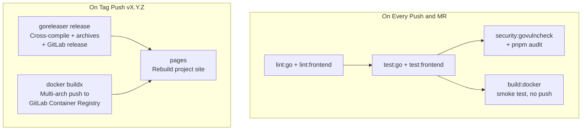

# Build, CI/CD, and Publishing Overhaul

**Status:** ✅ Complete

**Prerequisite:** [ARM64 Support & Pure-Go SQLite Migration](20260303T1653Z-arm64-and-pure-go-sqlite.md) — ✅ Complete

---

## Current State Summary

| Area | Status | Detail |
|------|--------|--------|
| **Frontend build** | ✅ Works | `pnpm run build` → `.output/public` SPA — no issues |
| **Backend build** | ⚠️ Docker-only | No standalone Go build target; version injection only in Dockerfile |
| **Docker image** | ⚠️ Not published | `build:docker` CI job builds multi-arch and discards; no registry push |
| **Multi-arch** | ✅ Done | `docker buildx build --platform linux/amd64,linux/arm64` in Dockerfile and CI (completed in arm64 plan) |
| **Release trigger** | ⚠️ Fragile | Auto-releases on every `main` push; `docs:` commit = patch release |
| **Version files** | ❌ Broken | `package.json` and `CHANGELOG.md` updates are CI artifacts that expire in 1 week, never committed back |
| **Changelog → site** | ✅ Works | `sync-docs.mjs` copies `CHANGELOG.md` into site content; `pages` CI job rebuilds on `main` push |
| **Binary releases** | ❌ Missing | No downloadable archives attached to GitLab releases |
| **Publishing** | ❌ None | No container registry push, no community listings |

### What the ARM64 Plan Already Handled

- Migrated from `mattn/go-sqlite3` (CGO) to `ncruces/go-sqlite3` (pure Go) — `CGO_ENABLED=0` everywhere
- Dockerfile updated with `--platform=$BUILDPLATFORM`, `TARGETOS`/`TARGETARCH` args, `CGO_ENABLED=0`
- CI `build:docker` job updated to use `docker buildx build --platform linux/amd64,linux/arm64`
- Removed all `gcc`, `musl-dev`, `sqlite-dev` dependencies from Dockerfile and CI jobs

### Changelog & Site: What's Already Handled

- `git-cliff` generates `CHANGELOG.md` from conventional commits (configured in `cliff.toml`)
- `site/scripts/sync-docs.mjs` copies `CHANGELOG.md` into the site's content directory during the `pages` CI job
- The `pages` job runs on every `main` push and deploys to GitLab Pages

**Gap:** The `CHANGELOG.md` in the repo is only updated as a CI artifact (expires in 1 week). The committed version in the repo drifts. The site build reads from the committed file, so the site changelog can be stale. This plan fixes that by committing the changelog back before the site build runs.

---

## Phase 1: Build Foundation ✅

### 1.1 Add standalone Makefile targets ✅

Add targets to [`Makefile`](../../Makefile) so frontend and backend can be built independently without Docker:

```makefile
build\:frontend:
    cd frontend && pnpm install --frozen-lockfile && pnpm run build

build\:backend: build\:frontend
    mkdir -p backend/frontend/dist
    cp -r frontend/.output/public/* backend/frontend/dist/
    cd backend && CGO_ENABLED=0 go build \
        -ldflags="-w -s -X main.version=$$(git describe --tags --always) \
        -X main.commit=$$(git rev-parse --short HEAD) \
        -X main.buildDate=$$(date -u +%Y-%m-%dT%H:%M:%SZ)" \
        -o capacitarr main.go
```

> **Note:** `CGO_ENABLED=0` because the project uses `ncruces/go-sqlite3` (pure Go, no CGO required).

### 1.2 Add GoReleaser configuration ✅

Create `.goreleaser.yml` at the project root. GoReleaser handles:

- Cross-compilation (`linux/amd64`, `linux/arm64`) — trivial with `CGO_ENABLED=0`
- Archive packaging (`.tar.gz` with binary + entrypoint + README)
- Checksum generation (`checksums.txt`)
- GitLab release creation with asset uploads

The frontend build runs as a GoReleaser `before` hook so the SPA is embedded into every cross-compiled binary.

> **Note:** Docker image building is handled separately by the CI pipeline (not by GoReleaser), since the existing multi-arch Dockerfile + `docker buildx` setup already works.

### ~~1.3 Multi-arch Dockerfile~~ — ✅ Already Complete

Completed in the [ARM64 plan](20260303T1653Z-arm64-and-pure-go-sqlite.md). The Dockerfile already supports `--platform=$BUILDPLATFORM`, `TARGETOS`/`TARGETARCH`, and `CGO_ENABLED=0`.

---

## Phase 2: CI/CD Overhaul ✅

### 2.1 Switch to tag-triggered releases ✅

Replace the current auto-release-on-main with tag-triggered releases:

- **On every push and MR:** lint → test → security → Docker build smoke test (no push)
- **On `v*` tag push:** GoReleaser (binaries + GitLab release) → Docker push → pages rebuild

This means you control when releases happen. The workflow:

```bash
git cliff --bumped-version                    # see what version would be (e.g. v0.2.0)
git cliff --bump -o CHANGELOG.md              # update changelog

# Update version in package.json files
VERSION=$(git cliff --bumped-version)
SEMVER=${VERSION#v}
npm version "$SEMVER" --no-git-tag-version
cd frontend && npm version "$SEMVER" --no-git-tag-version && cd ..

# Commit and tag
git add CHANGELOG.md package.json frontend/package.json
git commit -m "chore(release): $VERSION"
git tag "$VERSION"
git push origin main --tags                   # triggers release pipeline
```

> **Tip:** The root [`package.json`](../../package.json:11) already has a `release` script that automates this entire flow.

### 2.2 Push Docker images to GitLab Container Registry ✅

The release pipeline pushes multi-arch images to:

- **GitLab Container Registry** — `registry.gitlab.com/starshadow/software/capacitarr`

Image tags follow the standard pattern:

```
capacitarr:latest
capacitarr:0
capacitarr:0.2
capacitarr:0.2.0
```

Multi-arch manifests cover `linux/amd64` and `linux/arm64` under each tag.

GitLab Container Registry uses the built-in `CI_REGISTRY_*` variables (already available in CI — no additional secrets needed).

> **Future:** Docker Hub publishing will be added later as a separate effort.

### 2.3 Attach binary archives to GitLab releases ✅

GoReleaser automatically creates and uploads:

- `capacitarr_0.2.0_linux_amd64.tar.gz`
- `capacitarr_0.2.0_linux_arm64.tar.gz`
- `checksums.txt`

These appear as downloadable assets on the GitLab release page.

### 2.4 Fix changelog and version file persistence ✅

**Approach: Tag is source of truth (Option A)**

The release prep is done locally before pushing the tag. The CI release job does NOT try to commit back — it just reads the tag. This avoids the complexity of CI commit-back loops and project access tokens.

The local release workflow (see 2.1) handles:
- `CHANGELOG.md` — regenerated by `git cliff --bump -o CHANGELOG.md`
- `package.json` (root) — version updated to match the tag
- `frontend/package.json` — version updated so the UI displays the correct version in the navbar and help page
- All three files are committed in the `chore(release): vX.Y.Z` commit before tagging

The `pages` job picks up the committed changelog on the `main` push, so the site is always in sync.

> **Version display context:** The frontend reads `frontend/package.json` version at build time via [`nuxt.config.ts`](../../frontend/nuxt.config.ts:118) → `runtimeConfig.public.appVersion` → [`useVersion()`](../../frontend/app/composables/useVersion.ts) → displayed in [`Navbar.vue`](../../frontend/app/components/Navbar.vue:28) and [`help.vue`](../../frontend/app/pages/help.vue:346). The backend version is injected via `-ldflags` and served at `GET /api/v1/version`. Both must be updated for the UI to show correct versions.

### 2.5 Ensure site rebuilds on release ✅

The `pages` job should run on tag pushes (in addition to or instead of `main` pushes) so the site always reflects the latest release changelog. With Option A above, the changelog is already committed before the tag, so the `pages` job on `main` push already picks it up. Adding a `pages` trigger on tag push is a safety net.

### 2.6 Clean up legacy release job ✅

Remove the current `release` job in [`.gitlab-ci.yml`](../../.gitlab-ci.yml:99) that auto-releases on every `main` push. This job:
- Runs `git cliff --bumped-version` to determine version
- Updates `package.json` and `CHANGELOG.md` as expiring CI artifacts (never committed back)
- Creates tags and GitLab releases automatically

This will be replaced by the GoReleaser-based tag-triggered pipeline.

---

## Phase 3: Publishing & Distribution ✅

### 3.1 Update documentation ✅

- Update [`docs/releasing.md`](../releasing.md) to reflect the new tag-triggered workflow (currently documents auto-release-on-main)
- Update [`README.md`](../../README.md) installation section with GitLab Container Registry pull instructions
- Add container registry badge to README

### 3.2 Future: Docker Hub & community listings

The following items are deferred to a future plan:

- Create Docker Hub account/organization and push images
- Submit Unraid Community Apps template (requires Docker Hub image)
- Update docs with Docker Hub pull instructions
- Add Docker Hub badge to README

---

## Pipeline Architecture



## Files to Create or Modify

| File | Action | Description |
|------|--------|-------------|
| `.goreleaser.yml` | **Create** | GoReleaser config for cross-compilation and GitLab releases |
| `Makefile` | **Modify** | Add standalone `build:frontend`, `build:backend` targets |
| `.gitlab-ci.yml` | **Modify** | Remove auto-release job; add GoReleaser + Docker push; switch to tag triggers |
| ~~`Dockerfile`~~ | ~~Modify~~ | ✅ Already done in arm64 plan — multi-arch with `TARGETARCH` and `CGO_ENABLED=0` |
| `docs/releasing.md` | **Modify** | Document new tag-triggered release workflow |
| `docs/deployment.md` | **Modify** | Update image references to GitLab Container Registry |
| `README.md` | **Modify** | Add GitLab Container Registry badge and pull instructions |
