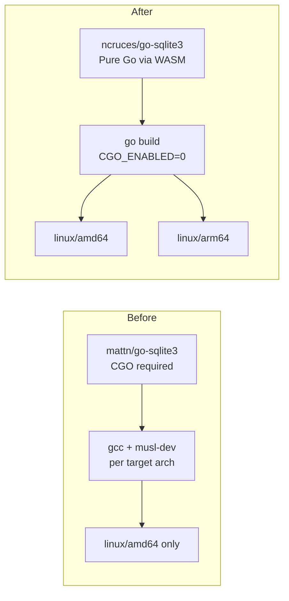

# ARM64 Support & Pure-Go SQLite Migration

**Status:** ✅ Complete — merged to `main`

## Overview

This plan covers two tightly coupled changes:

1. **Migrate from `mattn/go-sqlite3` to `ncruces/go-sqlite3`** — eliminating the CGO requirement
2. **Add `linux/arm64` Docker image support** — trivial once CGO is gone

These changes are coupled because removing CGO is what makes cross-architecture builds simple. Without CGO, `GOOS=linux GOARCH=arm64 go build` just works — no cross-compilers, no QEMU emulation, no special toolchains.

---

## Phase 1: Migrate to `ncruces/go-sqlite3` ✅

### 1.1 Swap the GORM driver dependency ✅

Replaced the CGO-based `gorm.io/driver/sqlite` (which wraps `mattn/go-sqlite3`) with `github.com/ncruces/go-sqlite3/gormlite` (pure-Go, WASM-based). Also added `_ "github.com/ncruces/go-sqlite3/embed"` import to load the embedded SQLite WASM binary.

**Files modified:**

| File | Change |
|------|--------|
| `backend/go.mod` | Removed `gorm.io/driver/sqlite`, added `github.com/ncruces/go-sqlite3` v0.30.5 and `github.com/ncruces/go-sqlite3/gormlite` v0.30.2 |
| `backend/internal/db/db.go` | Changed import to `gormlite`; added `embed` import for WASM binary |
| `backend/internal/poller/stats_test.go` | Same import swap + `embed` import |
| `backend/internal/testutil/testutil.go` | Same import swap + `embed` import |

### 1.2 Remove CGO from the build system ✅

With `ncruces/go-sqlite3`, CGO is no longer needed anywhere.

**Files modified:**

| File | Change |
|------|--------|
| `Dockerfile` | Removed `RUN apk add --no-cache gcc musl-dev sqlite-dev`; changed `CGO_ENABLED=1` to `CGO_ENABLED=0`; removed `sqlite-libs` from runtime `apk add` |
| `.gitlab-ci.yml` | Removed global `CGO_ENABLED: "1"` variable; removed `apk add --no-cache gcc musl-dev sqlite-dev` from `lint:go`, `test:go`, and `security:govulncheck` |

### 1.3 Run `go mod tidy` ✅

Cleaned up `go.mod` and `go.sum`. `mattn/go-sqlite3` and `gorm.io/driver/sqlite` are completely removed from the dependency tree.

### 1.4 Add SQLite driver regression tests ✅

Created `backend/internal/db/driver_test.go` with 6 tests targeting driver-specific behaviors:

| Test | Result |
|------|--------|
| `TestMigrationUpDownUp` | ✅ Pass — all 12 migrations up/down/up cleanly |
| `TestConcurrentAccess` | ✅ Pass — 10 goroutines concurrent read/write |
| `TestJournalMode` | ✅ Pass — `journal_mode = memory` for in-memory DBs |
| `TestDataTypeRoundTrip` | ✅ Pass — DATETIME, REAL, INTEGER, TEXT, NULL fidelity |
| `TestSQLiteVersion` | ✅ Pass — SQLite 3.51.2 |
| `TestForeignKeysEnabled` | ✅ Pass — PRAGMA foreign_keys works |

Also added `RunMigrationsDown()` to `backend/internal/db/migrate.go` for migration reversibility testing.

### 1.5 Run the full test suite ✅

All tests pass with `CGO_ENABLED=0`:
- `internal/db` — 6 new driver tests + migration tests
- `internal/poller` — stats tests with new driver
- `routes` — all ~30+ integration tests
- `internal/cache`, `internal/engine`, `internal/integrations`, `internal/logger` — all pass

Cross-compilation verified: `CGO_ENABLED=0 GOOS=linux GOARCH=arm64 go build` succeeds.

---

## Phase 2: Add ARM64 Docker Support ✅

### 2.1 Update Dockerfile for multi-arch ✅

Added `--platform=$BUILDPLATFORM` to build stages and `TARGETOS`/`TARGETARCH` args for cross-compilation:

```dockerfile
FROM --platform=$BUILDPLATFORM golang:1.25-alpine AS backend-builder
# ... (no gcc/musl/sqlite-dev needed)

ARG TARGETOS TARGETARCH
RUN CGO_ENABLED=0 GOOS=${TARGETOS} GOARCH=${TARGETARCH} go build \
    -ldflags="..." -o capacitarr main.go
```

### 2.2 Update CI to build multi-arch images ✅

Updated `build:docker` CI job to use `docker buildx` with multiple platforms:

```yaml
build:docker:
  before_script:
    - docker buildx create --use --driver docker-container
  script:
    - docker buildx build --platform linux/amd64,linux/arm64 .
```

### 2.3 Update docker-compose.yml — Skipped

Docker automatically selects the correct platform manifest for the host architecture. Adding an explicit `platform` field to `docker-compose.yml` is unnecessary and would complicate local development (e.g., hardcoding `amd64` would break on arm64 hosts).

---

## Phase 3: Verification ✅

### 3.1 Local verification ✅

- `CGO_ENABLED=0 go test ./...` — all tests pass
- `CGO_ENABLED=0 GOOS=linux GOARCH=arm64 go build` — cross-compiles cleanly
- `docker compose up --build` — container builds, starts, and passes health checks
- Health check confirms database queries work with the new driver

### 3.2 CI verification

Will be validated when changes are pushed; the CI pipeline will run `docker buildx build --platform linux/amd64,linux/arm64`.

---

## Architecture Decision



## Files Changed Summary

| File | Phase | Action |
|------|-------|--------|
| `backend/go.mod` | 1.1 | Swap SQLite driver dependency |
| `backend/go.sum` | 1.3 | Regenerated by `go mod tidy` |
| `backend/internal/db/db.go` | 1.1 | Change import and `Open` call, add `embed` import |
| `backend/internal/db/migrate.go` | 1.4 | Add `RunMigrationsDown()` for test reversibility |
| `backend/internal/poller/stats_test.go` | 1.1 | Change import and `Open` call, add `embed` import |
| `backend/internal/testutil/testutil.go` | 1.1 | Change import and `Open` call, add `embed` import |
| `backend/internal/db/driver_test.go` | 1.4 | **New** — 6 SQLite driver regression tests |
| `Dockerfile` | 1.2, 2.1 | Remove CGO deps, add `TARGETARCH`, set `CGO_ENABLED=0` |
| `.gitlab-ci.yml` | 1.2, 2.2 | Remove CGO/gcc lines, add `docker buildx` multi-arch |
| `frontend/app/assets/css/main.css` | — | Fix PostCSS oklch warnings (color-mix replacement) |

## Relationship to Build/CI/CD Plan

This plan is a **prerequisite subset** of the [Build, CI/CD, and Publishing Overhaul](20260303T1551Z-build-cicd-publishing.md). Specifically:

- Phase 1 here (SQLite migration) simplifies Phase 1.2 of the build plan (GoReleaser cross-compilation becomes trivial)
- Phase 2 here (ARM64 Docker) implements Phase 1.3 of the build plan
- The build plan's Phase 2 (registry push, tag-triggered releases) is a separate follow-up

This plan was executed **before** the full build/CI/CD overhaul, removing the CGO complexity that the build plan would otherwise have to work around.
