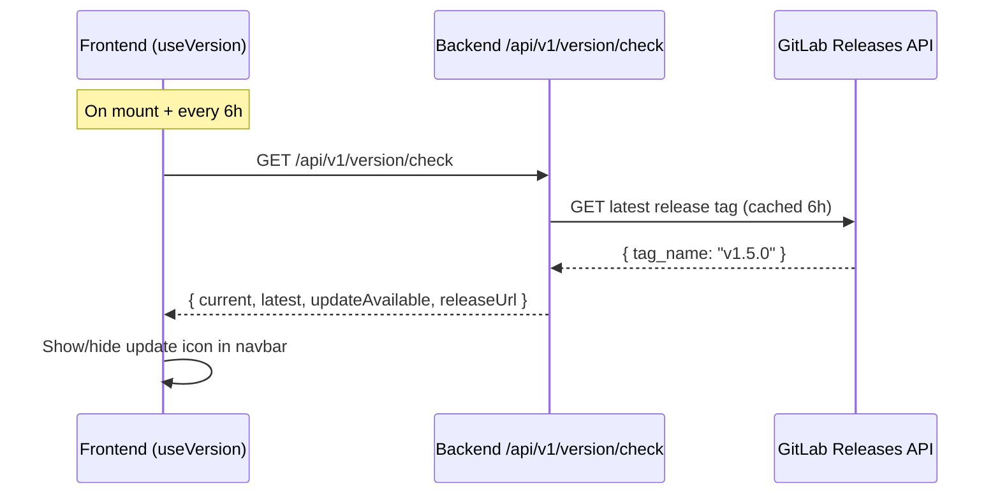
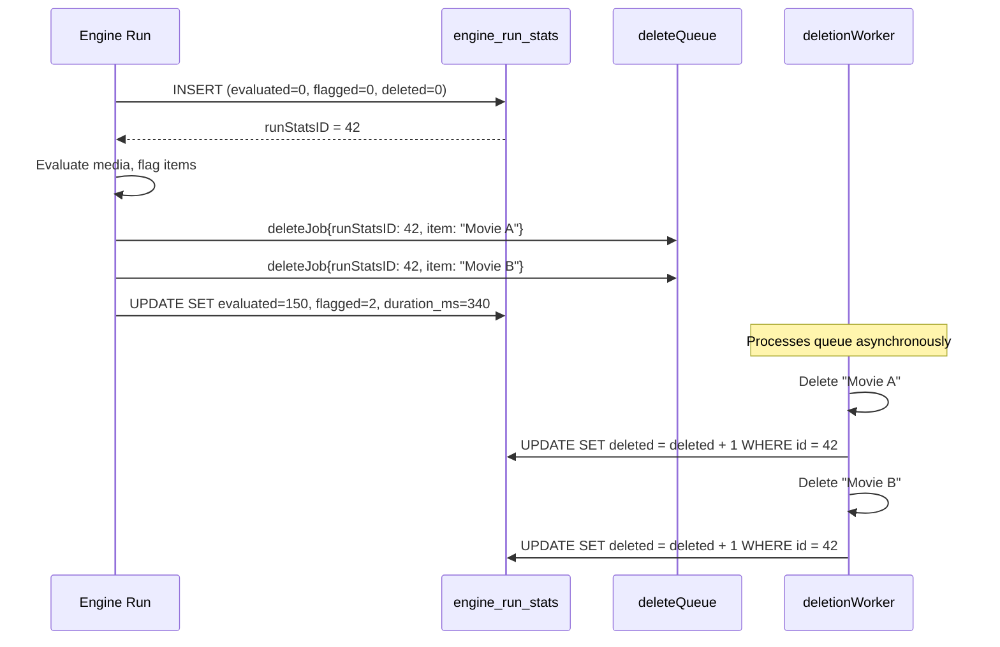
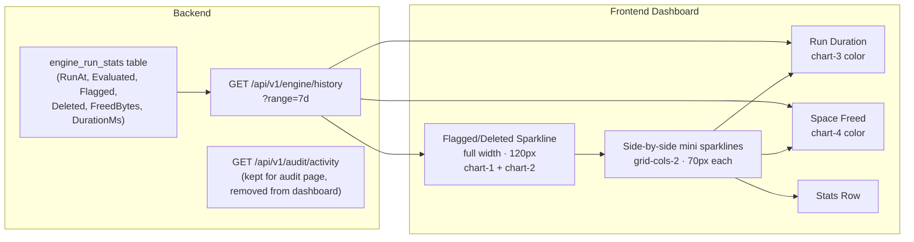

# UX Enhancements Batch

**Date:** 2026-03-05
**Branch:** `feature/ux-enhancements-batch`
**Status:** ✅ Complete
**Size:** L (200–400 lines changed)

## Overview

Five improvements bundled into a single feature branch:

1. **Fix data reset to preserve disk group thresholds** — the "Clear All Scraped Data" action currently deletes `disk_groups` rows entirely, losing user-configured `ThresholdPct` and `TargetPct` values. Change to update-in-place, zeroing only transient fields.

2. **Auto update check with navbar indicator** — add a backend endpoint that checks for new releases, and display an update-available icon in the navbar's right-side icon row. Includes a Serenity (Firefly) SVG easter egg and slogan refresh.

3. **Consolidate engine activity charts onto `engine_run_stats`** — replace the sparse `audit_logs`-based sparkline with continuous `engine_run_stats` data. Add a `Deleted` counter to `EngineRunStats` so the main sparkline can show both flagged and deleted per run. Add two side-by-side mini sparklines for run duration and freed bytes. Deprecate `GET /api/v1/audit/activity` on the dashboard.

4. **Fix silent error swallowing in dashboard** — replace bare `catch {}` blocks with proper error logging so failed API calls are visible in the browser console.

---

## Feature 1: Fix Data Reset to Preserve Thresholds

### Problem

[`handleDataReset()`](backend/routes/data.go:18) step 4 runs:

```go
database.Session(&gorm.Session{AllowGlobalUpdate: true}).Delete(&db.DiskGroup{})
```

This deletes the entire `disk_groups` row, including user-configured `ThresholdPct` and `TargetPct`. On the next engine run, disk groups are re-created with defaults (85%/75%), silently losing the user's customizations.

### Solution

Replace the `Delete` with an `Update` that zeroes only the scraped/transient fields (`total_bytes`, `used_bytes`) while preserving user-configured settings (`threshold_pct`, `target_pct`, `mount_path`).

### Plan

| # | Task | Files | Status |
|---|------|-------|--------|
| 1.1 | Change `Delete(&db.DiskGroup{})` to `Update` zeroing `total_bytes` and `used_bytes` only | `backend/routes/data.go` | ✅ |
| 1.2 | Update response summary key from `diskGroups` (deleted count) to `diskGroupsReset` (updated count) | `backend/routes/data.go` | ✅ |
| 1.3 | Update test to verify thresholds survive the reset | `backend/routes/data_test.go` | ✅ |
| 1.4 | Update frontend description text to clarify thresholds are preserved | `frontend/app/components/settings/SettingsAdvanced.vue` | ✅ |
| 1.5 | Update confirmation dialog text similarly | `frontend/app/components/settings/SettingsAdvanced.vue` | ✅ |

---

## Feature 2: Auto Update Check + Navbar Enhancements

### Design



### Navbar Layout

```
┌──────────────────────────────────────────────────────────────────────┐
│ [DB]  Capacitarr          Dashboard  Rules  Audit  Settings         │
│       UI v1.4.2 · API v1.4.2                                       │
│       [Serenity] I aim to misbehave.       [⚡][🔔][⬆️][🎨][❓][🚪]  │
└──────────────────────────────────────────────────────────────────────┘
```

- **Serenity SVG:** ~14px inline icon before the slogan, `text-muted-foreground/40`
- **Slogan:** "I aim to misbehave." — same discreet styling as current slogan
- **Update icon:** Right-side icon button (e.g., `ArrowUpCircleIcon`), conditional render, green dot badge when update available. Clicking opens a popover with version info and release notes link.
- **No layout shift:** The update icon lives in the right-side flex container among other icon buttons. Its presence/absence doesn't affect the brand area or nav link positions.

### Backend: Update Check Endpoint

- New `GET /api/v1/version/check` endpoint
- Fetches latest release from GitLab Releases API (`/projects/:id/releases?per_page=1`)
- Caches result in memory for 6 hours (simple `sync.Once`-style with TTL)
- Compares semver: current (from build ldflags) vs latest release tag
- Returns: `{ current, latest, updateAvailable, releaseUrl }`
- Respects a new `checkForUpdates` preference (default: true)
- Gracefully returns `{ updateAvailable: false }` if GitLab API is unreachable

### Database: New Preference Field

Add `CheckForUpdates` boolean to `PreferenceSet` model (default: true). Users can disable outbound update checks in Settings > Advanced.

### Plan

| # | Task | Files | Status |
|---|------|-------|--------|
| 2.1 | Add `CheckForUpdates` field to `PreferenceSet` model | `backend/internal/db/models.go` | ✅ |
| 2.2 | Create `backend/routes/version.go` with update check endpoint + in-memory cache | `backend/routes/version.go` | ✅ |
| 2.3 | Register the new route in API router | `backend/routes/api.go` | ✅ |
| 2.4 | Write tests for the version check endpoint | `backend/routes/version_test.go` | ✅ |
| 2.5 | Create Serenity SVG icon file | `frontend/app/assets/images/serenity.svg` | ✅ |
| 2.6 | Update slogan text from "You paid for that disk, use it!" to "I aim to misbehave." with Serenity icon | `frontend/app/components/Navbar.vue` | ✅ |
| 2.7 | Extend `useVersion` composable to call `/api/v1/version/check` on mount + 6h interval | `frontend/app/composables/useVersion.ts` | ✅ |
| 2.8 | Add update icon button to navbar right-side icons with popover | `frontend/app/components/Navbar.vue` | ✅ |
| 2.9 | Add "Check for updates" toggle to Settings > Advanced | `frontend/app/components/settings/SettingsAdvanced.vue` | ✅ |
| 2.10 | Add i18n keys for update-related strings | `frontend/app/locales/*.json` | ✅ |

---

## Feature 3: Consolidate Engine Activity Charts onto `engine_run_stats`

### Problem with current approach

The existing dashboard sparkline uses `GET /api/v1/audit/activity`, which queries `audit_logs` and groups events into time buckets. This has a fundamental issue: **it only returns buckets that have data**. If the engine runs for days without flagging anything (normal behavior when disks aren't full), the chart shows nothing — no zero-fill, no timeline context. When a burst of deletions happens, it appears as a single spike with no surrounding context.

### Solution: Use `engine_run_stats` as the single data source

The `engine_run_stats` table has a row for **every engine run**, even when nothing is flagged. This provides a naturally continuous time series with no gaps. The new `GET /api/v1/engine/history` endpoint serves all four sparkline series from this single table.

### Data model change: Add `Deleted` counter

Currently, [`EngineRunStats`](backend/internal/db/models.go:121) tracks `Flagged` (items flagged per run) but not `Deleted` (items actually deleted). The deletion happens asynchronously in the [`deletionWorker()`](backend/internal/poller/delete.go:61) after the engine run completes.

**Clean approach: Pass the run stats ID to each deletion job.**

The engine run creates the `EngineRunStats` row *before* evaluation begins (with zeroed counters), gets back the row ID, and passes it to each queued `deleteJob`. The deletion worker then increments the `Deleted` counter on that specific row — no subqueries, no "most recent row" guessing, no race conditions.



**Changes to the engine run lifecycle:**

1. **Create stats row before evaluation** — `INSERT` with zeroed counters, get back the auto-increment ID
2. **Pass `runStatsID` to each `deleteJob`** — add field to `deleteJob` struct
3. **Update stats row after evaluation** — `UPDATE` with final `evaluated`, `flagged`, `freedBytes`, `durationMs`
4. **Deletion worker increments `deleted`** — `UPDATE deleted = deleted + 1 WHERE id = job.runStatsID`

This is clean, precise, and each deletion is attributed to the exact engine run that flagged it.

### Architecture



### Dashboard Layout

```
┌─ Engine Activity Card ──────────────────────────────────────────┐
│ [Status banner]                                                 │
│ [Title row: Activity · Run Now · Mode · Evaluated/Flagged]      │
│                                                                 │
│ Engine Activity · Last 7 days    ● Flagged  ● Deleted           │
│ [▁▂▃▅▃▂▁▂▄▃▂▁▂▃▅▃▂▁]  — full width, 120px                    │
│ (chart-1 + chart-2 colors, continuous engine_run_stats data)    │
│                                                                 │
│ ┌─────────────────────────────┐ ┌─────────────────────────────┐ │
│ │ Run Duration · 7d           │ │ Space Freed · 7d            │ │
│ │ Avg: 142ms · Max: 380ms    │ │ Total: 12.4 GB              │ │
│ │ [▁▂▃▅▃▂▁▂▄▃▂▁] chart-3    │ │ [▁▂▃▅▃▂▁▂▄▃▂▁] chart-4    │ │
│ │ 70px                       │ │ 70px                        │ │
│ └─────────────────────────────┘ └─────────────────────────────┘ │
│                                                                 │
│ [Would Free | Queue | Active Delete]                            │
│ [View Audit Log →]                                              │
└─────────────────────────────────────────────────────────────────┘
```

- **Main sparkline:** Flagged (`chart-1`) + Deleted (`chart-2`) — now from `engine_run_stats`, continuous data. Switched from primary/destructive to chart colors for visual consistency across all sparklines.
- **Mini sparklines:** Run Duration (`chart-3`) + Space Freed (`chart-4`) — side by side, 70px each
- **Collapsible:** Single localStorage toggle hides/shows both mini sparklines together
- **All four series** come from the same `GET /api/v1/engine/history` response

### Plan

| # | Task | Files | Status |
|---|------|-------|--------|
| 3.1 | Add `Deleted` field to `EngineRunStats` model (default 0, auto-migrated by GORM) | `backend/internal/db/models.go` | ✅ |
| 3.2 | Add `RunStatsID` field to `deleteJob` struct | `backend/internal/poller/delete.go` | ✅ |
| 3.3 | Refactor engine run to create stats row before evaluation, update after | `backend/internal/poller/poller.go` | ✅ |
| 3.4 | Pass `runStatsID` when queueing deletion jobs in evaluate | `backend/internal/poller/evaluate.go` | ✅ |
| 3.5 | Increment `Deleted` counter in deletion worker on successful deletion | `backend/internal/poller/delete.go` | ✅ |
| 3.6 | Update `QueueDeletion()` public function signature to accept `runStatsID` | `backend/internal/poller/delete.go` | ✅ |
| 3.7 | Update approval route to pass `runStatsID` when calling `QueueDeletion()` | `backend/routes/audit.go` | ✅ |
| 3.8 | Create `backend/routes/engine_history.go` with history endpoint | `backend/routes/engine_history.go` | ✅ |
| 3.9 | Register the new route in API router | `backend/routes/api.go` | ✅ |
| 3.10 | Write tests for the engine history endpoint | `backend/routes/engine_history_test.go` | ✅ |
| 3.11 | Switch main sparkline data source from `/audit/activity` to `/engine/history`; change colors from primary/destructive to chart-1/chart-2 | `frontend/app/pages/index.vue` | ✅ |
| 3.12 | Add duration sparkline (left) to dashboard engine activity card | `frontend/app/pages/index.vue` | ✅ |
| 3.13 | Add freed bytes sparkline (right) to dashboard engine activity card | `frontend/app/pages/index.vue` | ✅ |
| 3.14 | Extend `useThemeColors` to expose `chart1Color`, `chart2Color`, `chart3Color`, `chart4Color` | `frontend/app/composables/useThemeColors.ts` | ✅ |
| 3.15 | Add localStorage toggle for mini sparkline visibility | `frontend/app/pages/index.vue` | ✅ |
| 3.16 | Remove `fetchActivityData()` function and `/audit/activity` call from dashboard | `frontend/app/pages/index.vue` | ✅ |
| 3.17 | Remove `GET /audit/activity` endpoint from backend (only consumer is the dashboard) | `backend/routes/audit.go` | ✅ |
| 3.18 | Remove `audit/activity` tests | `backend/routes/audit_test.go` | ✅ |
| 3.19 | Remove `audit/activity` from OpenAPI spec | `docs/api/openapi.yaml` | ✅ |
| 3.20 | Add i18n keys for duration/freed sparkline labels | `frontend/app/locales/*.json` | ✅ |

> **Note:** `GET /api/v1/audit/activity` has only one consumer (the dashboard `index.vue`). The audit log page (`/audit`) does not use it — it uses `/audit` and `/audit/grouped` instead. Since no real release has shipped yet, we remove it entirely rather than deprecating.

---

## Feature 4: Fix Silent Error Swallowing in Dashboard

### Problem

Several `catch {}` blocks in [`index.vue`](frontend/app/pages/index.vue) silently swallow errors, making it impossible to diagnose failed API calls from the browser console:

- [`fetchDashboardData()`](frontend/app/pages/index.vue:697) — line 697: bare `catch {}`
- [`fetchActivityData()`](frontend/app/pages/index.vue:764) — line 764: bare `catch {}`

### Solution

Replace bare `catch {}` with `catch (err) { console.warn('[Dashboard] ...', err) }` so errors are visible in the browser console while still being non-fatal to the UI.

### Plan

| # | Task | Files | Status |
|---|------|-------|--------|
| 4.1 | Replace bare `catch {}` in `fetchDashboardData()` with `console.warn` | `frontend/app/pages/index.vue` | ✅ |
| 4.2 | Replace bare `catch {}` in `fetchActivityData()` with `console.warn` | `frontend/app/pages/index.vue` | ✅ |
| 4.3 | Audit other components for bare `catch {}` blocks and fix similarly | Various frontend files | ✅ |

---

## Verification

| # | Task | Status |
|---|------|--------|
| V.1 | All existing tests pass (`go test ./...`) | ✅ |
| V.2 | New tests pass for data reset, version check, and engine history | ✅ |
| V.3 | Frontend builds without errors | ✅ |
| V.4 | Docker build succeeds (`docker compose up --build`) | 🔲 |
| V.5 | Manual verification: data reset preserves thresholds | 🔲 |
| V.6 | Manual verification: update icon appears/hides correctly | 🔲 |
| V.7 | Manual verification: main sparkline shows continuous data (no gaps for quiet periods) | 🔲 |
| V.8 | Manual verification: main sparkline shows both flagged and deleted series | 🔲 |
| V.9 | Manual verification: duration sparkline renders with chart-3 color | 🔲 |
| V.10 | Manual verification: freed bytes sparkline renders with chart-4 color | 🔲 |
| V.11 | Manual verification: mini sparkline toggle persists across page loads | 🔲 |
| V.12 | Manual verification: Serenity icon and slogan display correctly | 🔲 |
| V.13 | Manual verification: browser console shows warnings for failed API calls (no silent swallowing) | 🔲 |
| V.14 | Manual verification: deleted counter increments correctly in engine_run_stats after actual deletions | 🔲 |

## Risks

- **GitLab API rate limits:** The update check caches for 6 hours and the endpoint is only called by authenticated users, so rate limiting is unlikely. The endpoint gracefully degrades if the API is unreachable.
- **Serenity SVG licensing:** The SVG should be an original simplified silhouette, not a copyrighted image. A minimal geometric interpretation of the ship shape avoids IP concerns.
- **Engine history data volume:** The `engine_run_stats` table is already pruned by the retention cron job, so the history endpoint won't return unbounded data.
- **GORM auto-migration:** Adding the `Deleted` field to `EngineRunStats` will be auto-migrated by GORM's `AutoMigrate`. Existing rows will have `deleted = 0`, which is correct (historical data won't retroactively show deletion counts, but new runs will).
- **Approval queue deletions:** When items are approved from the approval queue, `QueueDeletion()` is called outside of an engine run context. For these, `runStatsID` can be 0 (or the most recent run's ID). The deletion still gets counted in `LifetimeStats`; it just won't appear in the per-run sparkline. This is acceptable — approval-queue deletions are user-initiated, not engine-initiated.
