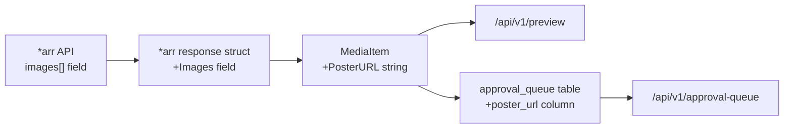
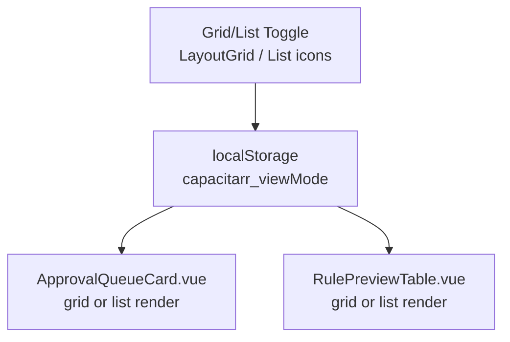
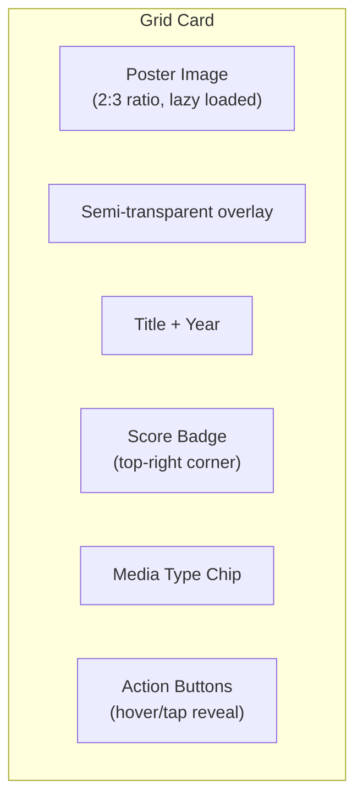

# Grid View with Media Posters

**Created:** 2026-03-06T14:15Z  
**Status:** 📋 Planned  
**Scope:** Approval Queue + Deletion Preview (NOT Audit Log)

## Overview

Add a grid view option with media poster images to the approval queue and deletion preview. Users can toggle between list (default) and grid views, with the preference persisted in localStorage so it survives page navigations and browser restarts.

## Motivation

The current list/table views are data-dense and functional, but a poster grid would:
- Make it easier to visually identify media at a glance
- Feel more like the media management tools users are already familiar with (Plex, Radarr, Sonarr, Overseerr)
- Provide a more engaging experience for the approval workflow where users are making keep/delete decisions

## Architecture

### Data Flow



### Frontend Toggle



### Grid Card Layout (Per Item)



## Scope

| View | Grid Toggle | Notes |
|------|-------------|-------|
| **Approval Queue** (`ApprovalQueueCard.vue`) | ✅ Yes | Action buttons (approve/reject/snooze) adapted for grid cards |
| **Deletion Preview** (`RulePreviewTable.vue`) | ✅ Yes | Search/filter/pagination preserved; grid changes item rendering only |
| **Audit Log** (`audit.vue`) | ❌ No | Tabular log data, not suited for poster grid |

## Phase 1: Backend — Poster URL Plumbing

**Goal:** Make poster URLs available in the API responses without changing any frontend rendering yet.

### Step 1.1: Add `PosterURL` to `MediaItem` struct

**File:** `backend/internal/integrations/types.go`

Add a new field to the `MediaItem` struct:

```go
// Poster image URL (from *arr's images array, coverType=poster)
PosterURL string `json:"posterUrl,omitempty"`
```

### Step 1.2: Parse poster URLs from *arr API responses

Each *arr service returns an `images` array. We need to extract the poster URL.

**Common helper** in `backend/internal/integrations/arr_helpers.go`:

```go
// arrImage represents an image entry in *arr API responses.
type arrImage struct {
    CoverType string `json:"coverType"`
    RemoteURL string `json:"remoteUrl"`
    URL       string `json:"url"`
}

// arrExtractPosterURL finds the poster URL from an *arr images array.
// Prefers remoteUrl (external CDN) over url (local *arr path).
func arrExtractPosterURL(images []arrImage) string {
    for _, img := range images {
        if img.CoverType == "poster" {
            if img.RemoteURL != "" {
                return img.RemoteURL
            }
            return img.URL
        }
    }
    return ""
}
```

**Files to update:**

| File | Struct | Change |
|------|--------|--------|
| `sonarr.go` | `sonarrSeries` | Add `Images []arrImage` field, call `arrExtractPosterURL()`, set on each season's `MediaItem` |
| `radarr.go` | `radarrMovie` | Add `Images []arrImage` field, call `arrExtractPosterURL()`, set on `MediaItem` |
| `lidarr.go` | `lidarrArtist` | Add `Images []arrImage` field, call `arrExtractPosterURL()`, set on `MediaItem` |
| `readarr.go` | `readarrAuthor` | Add `Images []arrImage` field, call `arrExtractPosterURL()`, set on `MediaItem` |

### Step 1.3: Store poster URL in approval queue

**Migration:** `backend/internal/db/migrations/00002_add_poster_url.sql`

```sql
ALTER TABLE approval_queue ADD COLUMN poster_url TEXT NOT NULL DEFAULT '';
```

**Model update:** Add `PosterURL string` to the approval queue model in `backend/internal/db/models.go`.

**Poller update:** When the engine queues items for approval, persist the `PosterURL` from the `MediaItem`.

### Step 1.4: Include poster URL in API responses

- **Preview endpoint** (`/api/v1/preview`): Already returns `EvaluatedItem.Item` which is a `MediaItem` — the new `posterUrl` field will be included automatically after Step 1.2.
- **Approval queue endpoint** (`/api/v1/approval-queue`): Needs to include the new `poster_url` column in the response serialization.

### Step 1.5: Update frontend types

**File:** `frontend/app/types/api.ts`

Add `posterUrl?: string` to:
- `MediaItem` interface
- `ApprovalQueueItem` interface

### Step 1.6: Tests

- Unit tests for `arrExtractPosterURL()` helper (empty array, no poster type, poster with remoteUrl, poster with only url)
- Update existing *arr client tests to include images in mock responses and verify `PosterURL` is populated
- Update approval queue test fixtures to include `poster_url`

### Step 1.7: Verify with `make ci`

Run `make ci` to ensure lint, tests, and security checks pass.

---

## Phase 2: Frontend — Grid View Toggle & Poster Cards

**Goal:** Add a list/grid toggle to the approval queue and deletion preview, with a poster-based grid layout.

### Step 2.1: Extend `useDisplayPrefs` composable

**File:** `frontend/app/composables/useDisplayPrefs.ts`

Add a `viewMode` preference following the same `useState` + `localStorage` pattern already used for timezone, clock format, and exact dates:

```typescript
const viewMode = useState('displayViewMode', () => {
  if (import.meta.client) {
    return (localStorage.getItem('capacitarr_viewMode') as 'list' | 'grid') || 'list';
  }
  return 'list' as 'list' | 'grid';
});

function setViewMode(mode: 'list' | 'grid') {
  viewMode.value = mode;
  if (import.meta.client) localStorage.setItem('capacitarr_viewMode', mode);
}
```

Return `viewMode` and `setViewMode` from the composable.

### Step 2.2: Create `MediaPosterCard.vue` component

A shared card component for grid view items:

**Props:**
- `title: string`
- `posterUrl?: string`
- `year?: number`
- `mediaType: string` (movie, show, season, artist, book)
- `score: number`
- `sizeBytes: number`
- `isProtected?: boolean`
- `isFlagged?: boolean` (below deletion line)

**Rendering:**
- 2:3 aspect ratio container (`aspect-[2/3]`)
- Lazy-loaded poster image with `loading="lazy"` and `decoding="async"`
- Fallback placeholder: gradient background + media type icon (Film, Tv, Music, BookOpen from lucide)
- Semi-transparent bottom gradient overlay for text readability
- Title + year at bottom
- Score badge in top-right corner (colored by score range)
- Media type chip in top-left corner
- Protected/flagged border indicator

**Responsive grid:**
```
grid grid-cols-2 sm:grid-cols-3 md:grid-cols-4 lg:grid-cols-5 xl:grid-cols-6 gap-4
```

### Step 2.3: Add toggle to `ApprovalQueueCard.vue`

**File:** `frontend/app/components/ApprovalQueueCard.vue`

- Add `LayoutGrid` and `List` icons from lucide
- Add toggle buttons next to the existing tab headers (Pending/Snoozed/Approved)
- When `viewMode === 'grid'`:
  - Render items in a CSS grid using `MediaPosterCard.vue`
  - Approval actions (approve/reject/snooze) shown on hover/tap overlay
  - Season expansion: clicking a show card opens a popover/dialog showing individual seasons
  - 3-second confirm timer: show a countdown overlay on the card
- When `viewMode === 'list'`:
  - Current rendering unchanged

**Design considerations for approval grid cards:**
- Approve button: green check overlay
- Reject/snooze button: clock icon overlay
- The 3-second confirmation timer works as a progress ring around the approve button
- Season-grouped shows display a small "×N seasons" badge

### Step 2.4: Add toggle to `RulePreviewTable.vue`

**File:** `frontend/app/components/rules/RulePreviewTable.vue`

- Add toggle buttons next to the search/filter bar
- When `viewMode === 'grid'`:
  - Render filtered/paginated items in grid using `MediaPosterCard.vue`
  - Protected items have a shield badge overlay
  - Flagged (below deletion line) items have a subtle red border/tint
  - Click opens the existing score detail modal
- When `viewMode === 'list'`:
  - Current table rendering unchanged

### Step 2.5: Poster fallback component

Create a `MediaPosterFallback.vue` (or inline in `MediaPosterCard.vue`) that renders when `posterUrl` is empty or the image fails to load:

- Gradient background using theme colors (subtle, not jarring)
- Large centered icon based on media type:
  - movie → `Film`
  - show/season → `Tv`
  - artist → `Music`
  - book → `BookOpen`
- Title text below the icon
- Should look intentional, not broken

### Step 2.6: i18n

Add translation keys for:
- `common.viewList` / `common.viewGrid` (toggle tooltips)
- Any new aria-labels for accessibility

### Step 2.7: Loading skeleton for grid

Create a grid skeleton matching the card layout (shimmer rectangles in 2:3 aspect ratio) to show during data loading.

### Step 2.8: Tests

- Verify toggle persists in localStorage
- Verify grid renders correct number of items
- Verify fallback shows when no posterUrl
- Verify approval actions work in grid mode

### Step 2.9: Verify with `make ci`

Run `make ci` to ensure all checks pass.

---

## Design Decisions

### Poster URL Source

Use the *arr `remoteUrl` field (external CDN — TVDB, TMDB, Fanart.tv, MusicBrainz). This is the simplest approach and covers the vast majority of cases.

**Trade-offs:**
- ✅ Simple — no proxying needed
- ✅ Fast — CDN-served images
- ⚠️ Requires internet access from the user's browser
- ⚠️ External domains in image requests (privacy consideration)

**Future enhancement (not in this plan):** Add an option to proxy images through the *arr API's local image endpoint (`/api/v3/mediacover/{id}/poster.jpg`), keeping all requests local to the network.

### Aspect Ratio

- Movies/Shows: 2:3 (standard poster ratio)
- Music albums: Technically 1:1, but displaying in 2:3 with letterboxing keeps the grid uniform
- Books: Varies, but 2:3 is a reasonable approximation

Using a uniform 2:3 aspect ratio for all cards keeps the grid visually clean.

### View Mode Persistence

Using `localStorage` (same as existing display preferences) rather than a server-side preference. This means:
- ✅ No backend changes needed for preference storage
- ✅ Instant — no API call on page load
- ⚠️ Per-browser (doesn't sync across devices) — acceptable for a display preference

### NOT Applied To

The **audit log** remains list-only because:
- It's a temporal log of past events, not a "pick what to do" interface
- Many entries are for items already deleted (posters may no longer resolve)
- The tabular format with timestamps, actions, and reasons is the right UX for audit data

## Migration Notes

- The `poster_url` column defaults to `''` (empty string), so existing approval queue items won't break
- Existing items in the queue won't have posters until the next engine run re-evaluates them — this is acceptable since the fallback placeholder handles it gracefully
- The `posterUrl` field in `MediaItem` is `omitempty`, so API responses are backward-compatible

## Estimated Effort

| Phase | Effort | Description |
|-------|--------|-------------|
| Phase 1 | ~2-3 hours | Backend plumbing, migration, type updates |
| Phase 2 | ~4-6 hours | Grid component, toggle, approval actions adaptation, polish |
| **Total** | **~6-9 hours** | |
