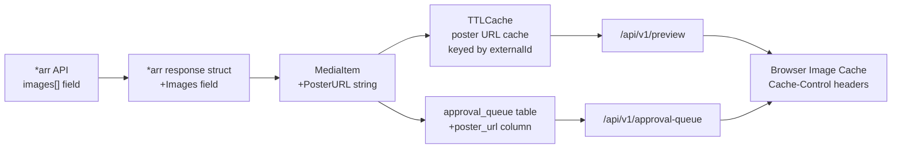
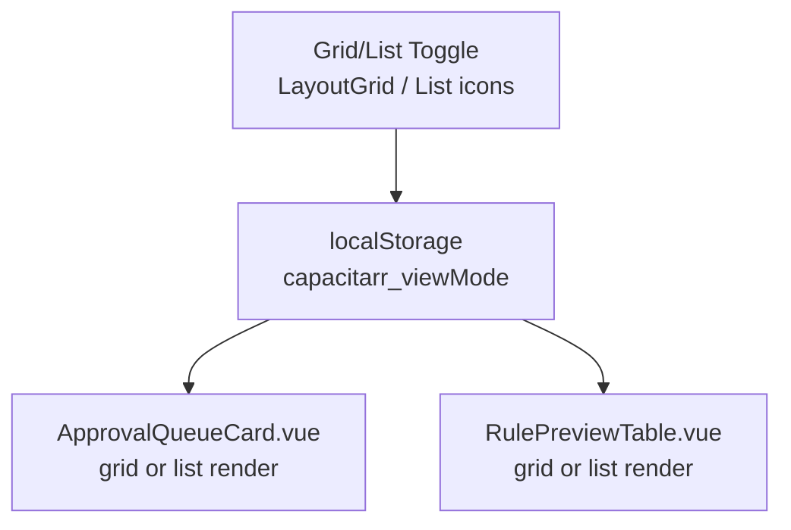
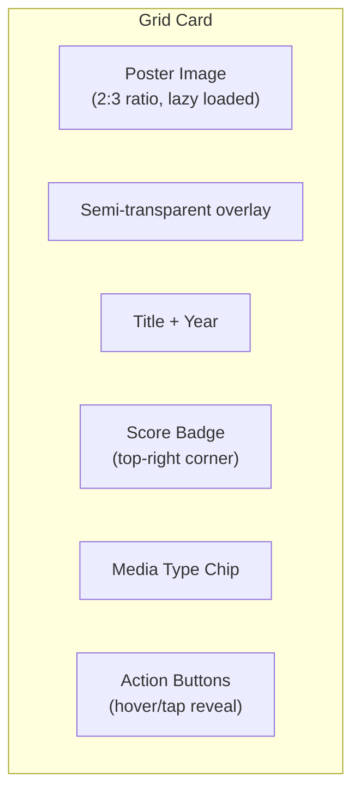

# Grid View with Media Posters

**Created:** 2026-03-06T14:15Z
**Status:** 🔨 In Progress (Phase 1 ✅ Complete, Phase 2 pending)
**Scope:** Approval Queue + Deletion Preview (NOT Audit Log)
**Branch:** `feature/grid-view-posters`

## Overview

Add a grid view option with media poster images to the approval queue and deletion preview. Users can toggle between list (default) and grid views, with the preference persisted in localStorage so it survives page navigations and browser restarts.

## Motivation

The current list/table views are data-dense and functional, but a poster grid would:
- Make it easier to visually identify media at a glance
- Feel more like the media management tools users are already familiar with (Plex, Radarr, Sonarr, Overseerr)
- Provide a more engaging experience for the approval workflow where users are making keep/delete decisions

## Architecture

### Data Flow



### Frontend Toggle



### Grid Card Layout (Per Item)



## Scope

| View | Grid Toggle | Notes |
|------|-------------|-------|
| **Approval Queue** (`ApprovalQueueCard.vue`) | ✅ Yes | Action buttons (approve/reject/snooze) adapted for grid cards |
| **Deletion Preview** (`RulePreviewTable.vue`) | ✅ Yes | Search/filter/pagination preserved; grid changes item rendering only |
| **Audit Log** (`audit.vue`) | ❌ No | Tabular log data, not suited for poster grid |

## Phase 0: Branch & Setup ✅

**Goal:** Create the feature branch and establish the working context.

### Step 0.1: Create feature branch

```bash
git checkout main
git checkout -b feature/grid-view-posters
```

Branch name follows the project convention: `feature/<kebab-case-description>`.

All work for this plan is committed to `feature/grid-view-posters` and merged to `main` via MR when complete.

---

## Phase 1: Backend — Poster URL Plumbing ✅

**Goal:** Make poster URLs available in the API responses without changing any frontend rendering yet.

> **Completed:** All steps pass `make ci`. Poster URLs flow through two paths:
> - **Deletion preview**: `posterUrl` flows live through `MediaItem` from *arr API
> - **Approval queue**: `poster_url` persisted in DB since queue items are snapshots

### Step 1.1: Add `PosterURL` to `MediaItem` struct

**File:** `backend/internal/integrations/types.go`

Add a new field to the `MediaItem` struct:

```go
// Poster image URL (from *arr's images array, coverType=poster)
PosterURL string `json:"posterUrl,omitempty"`
```

### Step 1.2: Parse poster URLs from *arr API responses

Each *arr service returns an `images` array. We need to extract the poster URL.

**Common helper** in `backend/internal/integrations/arr_helpers.go`:

```go
// arrImage represents an image entry in *arr API responses.
type arrImage struct {
    CoverType string `json:"coverType"`
    RemoteURL string `json:"remoteUrl"`
    URL       string `json:"url"`
}

// arrExtractPosterURL finds the poster URL from an *arr images array.
// Prefers remoteUrl (external CDN) over url (local *arr path).
func arrExtractPosterURL(images []arrImage) string {
    for _, img := range images {
        if img.CoverType == "poster" {
            if img.RemoteURL != "" {
                return img.RemoteURL
            }
            return img.URL
        }
    }
    return ""
}
```

**Files to update:**

| File | Struct | Change |
|------|--------|--------|
| `sonarr.go` | `sonarrSeries` | Add `Images []arrImage` field, call `arrExtractPosterURL()`, set on each season's `MediaItem` |
| `radarr.go` | `radarrMovie` | Add `Images []arrImage` field, call `arrExtractPosterURL()`, set on `MediaItem` |
| `lidarr.go` | `lidarrArtist` | Add `Images []arrImage` field, call `arrExtractPosterURL()`, set on `MediaItem` |
| `readarr.go` | `readarrAuthor` | Add `Images []arrImage` field, call `arrExtractPosterURL()`, set on `MediaItem` |

### Step 1.3: Store poster URL in approval queue

**Migration:** `backend/internal/db/migrations/00002_add_poster_url.sql`

```sql
ALTER TABLE approval_queue ADD COLUMN poster_url TEXT NOT NULL DEFAULT '';
```

**Model update:** Add `PosterURL string` to the approval queue model in `backend/internal/db/models.go`.

**Poller update:** When the engine queues items for approval, persist the `PosterURL` from the `MediaItem`.

### Step 1.4: Include poster URL in API responses

- **Preview endpoint** (`/api/v1/preview`): Already returns `EvaluatedItem.Item` which is a `MediaItem` — the new `posterUrl` field will be included automatically after Step 1.2.
- **Approval queue endpoint** (`/api/v1/approval-queue`): Needs to include the new `poster_url` column in the response serialization.

### Step 1.5: Backend poster URL caching

**Goal:** Avoid redundant remote calls by caching resolved poster URLs using the existing `TTLCache` from `backend/internal/cache/cache.go`.

The *arr APIs are already called during each poller cycle to fetch media items. Poster URLs extracted from those responses should be cached so that:
- Preview endpoint requests don't trigger additional *arr API calls just for poster data
- The same poster URL isn't re-resolved on every evaluation cycle

**Implementation:**

Add a dedicated poster cache instance (or reuse the existing `TTLCache` with a `poster:` key prefix):

```go
// In the poller or a shared location
posterCache := cache.New(24 * time.Hour) // Poster URLs are stable — long TTL

// Cache key format: "poster:{integrationId}:{externalId}"
func posterCacheKey(integrationID uint, externalID string) string {
    return fmt.Sprintf("poster:%d:%s", integrationID, externalID)
}
```

**Cache strategy:**
- **Write-through:** When `GetMediaItems()` returns items with poster URLs, cache each URL keyed by `{integrationId}:{externalId}`
- **Read-through on miss:** If a cached poster URL is missing (e.g., item was added between poller cycles), fall back to the `poster_url` stored in the approval queue DB column, or return empty string
- **TTL:** 24 hours — poster URLs from TVDB/TMDB/Fanart.tv rarely change, and a day-long cache avoids stale URLs for artwork refreshes
- **Invalidation:** `InvalidatePrefix("poster:{integrationId}:")` when an integration is re-tested or reconfigured

**No new service layer needed:** The existing `TTLCache` infrastructure handles this cleanly. The cache instance is created alongside the existing rule-value cache in the poller/engine setup.

### Step 1.6: Update frontend types

**File:** `frontend/app/types/api.ts`

Add `posterUrl?: string` to:
- `MediaItem` interface
- `ApprovalQueueItem` interface

### Step 1.7: Tests

- Unit tests for `arrExtractPosterURL()` helper (empty array, no poster type, poster with remoteUrl, poster with only url)
- Update existing *arr client tests to include images in mock responses and verify `PosterURL` is populated
- Update approval queue test fixtures to include `poster_url`

- Verify poster cache hit/miss behavior with TTLCache

### Step 1.8: Verify with `make ci`

Run `make ci` to ensure lint, tests, and security checks pass.

---

## Phase 2: Frontend — Grid View Toggle & Poster Cards

**Goal:** Add a list/grid toggle to the approval queue and deletion preview, with a poster-based grid layout.

### Step 2.1: Extend `useDisplayPrefs` composable

**File:** `frontend/app/composables/useDisplayPrefs.ts`

Add a `viewMode` preference following the same `useState` + `localStorage` pattern already used for timezone, clock format, and exact dates:

```typescript
const viewMode = useState('displayViewMode', () => {
  if (import.meta.client) {
    return (localStorage.getItem('capacitarr_viewMode') as 'list' | 'grid') || 'list';
  }
  return 'list' as 'list' | 'grid';
});

function setViewMode(mode: 'list' | 'grid') {
  viewMode.value = mode;
  if (import.meta.client) localStorage.setItem('capacitarr_viewMode', mode);
}
```

Return `viewMode` and `setViewMode` from the composable.

### Step 2.2: Create `MediaPosterCard.vue` component

A shared card component for grid view items:

**Props:**
- `title: string`
- `posterUrl?: string`
- `year?: number`
- `mediaType: string` (movie, show, season, artist, book)
- `score: number`
- `sizeBytes: number`
- `isProtected?: boolean`
- `isFlagged?: boolean` (below deletion line)

**Rendering:**
- Normalized card container at 2:3 aspect ratio (`aspect-[2/3]`) — see [Media Size Normalization](#media-size-normalization) for rationale
- Lazy-loaded poster image with `loading="lazy"` and `decoding="async"`
- `@error` handler on `` to swap to `MediaPosterFallback` on load failure (404, network error, CORS block)
- `object-fit: cover` for standard posters (movies, shows), `object-fit: contain` with themed background for non-standard aspect ratios (albums, books) — see [Media Size Normalization](#media-size-normalization)
- Semi-transparent bottom gradient overlay for text readability
- Title + year at bottom
- Score badge in top-right corner (colored by score range)
- Media type chip in top-left corner
- Protected/flagged border indicator

**Responsive grid:**
```
grid grid-cols-2 sm:grid-cols-3 md:grid-cols-4 lg:grid-cols-5 xl:grid-cols-6 gap-4
```

### Step 2.3: Add toggle to `ApprovalQueueCard.vue`

**File:** `frontend/app/components/ApprovalQueueCard.vue`

- Add `LayoutGrid` and `List` icons from lucide
- Add toggle buttons next to the existing tab headers (Pending/Snoozed/Approved)
- When `viewMode === 'grid'`:
  - Render items in a CSS grid using `MediaPosterCard.vue`
  - Approval actions (approve/reject/snooze) shown on hover/tap overlay
  - Season expansion: clicking a show card opens a popover/dialog showing individual seasons
  - 3-second confirm timer: show a countdown overlay on the card
- When `viewMode === 'list'`:
  - Current rendering unchanged

**Design considerations for approval grid cards:**
- Approve button: green check overlay
- Reject/snooze button: clock icon overlay
- The 3-second confirmation timer works as a progress ring around the approve button
- Season-grouped shows display a small "×N seasons" badge

### Step 2.4: Add toggle to `RulePreviewTable.vue`

**File:** `frontend/app/components/rules/RulePreviewTable.vue`

- Add toggle buttons next to the search/filter bar
- When `viewMode === 'grid'`:
  - Render filtered/paginated items in grid using `MediaPosterCard.vue`
  - Protected items have a shield badge overlay
  - Flagged (below deletion line) items have a subtle red border/tint
  - Click opens the existing score detail modal
- When `viewMode === 'list'`:
  - Current table rendering unchanged

### Step 2.5: Poster fallback & placeholder system

Graceful degradation is critical — many items may lack poster URLs (newly added items, niche media, items where the *arr API returned no `remoteUrl`). The fallback must look **intentional, not broken**.

**Create `MediaPosterFallback.vue`** (or inline in `MediaPosterCard.vue`):

**Trigger conditions** (fallback renders when any of these occur):
1. `posterUrl` is empty/undefined (no poster data from *arr)
2. `` `@error` fires (image 404'd, CORS blocked, network failure)
3. `` `@load` fires but natural dimensions are 0 (broken image)

**Fallback rendering:**
- Gradient background using theme CSS variables (`--card` / `--muted` tones) — subtle, not jarring
- Large centered icon based on media type:
  - `movie` → `Film` (lucide)
  - `show` / `season` → `Tv` (lucide)
  - `artist` → `Music` (lucide)
  - `book` → `BookOpen` (lucide)
- Title text below the icon (truncated to 2 lines with `line-clamp-2`)
- Year displayed below title if available
- Same 2:3 aspect ratio container as real poster cards — grid alignment is preserved
- Subtle media-type-specific accent color on the gradient (e.g., blue-ish for movies, purple for shows, green for music, amber for books) to add visual variety when many items lack posters

**Loading state:**
- While the `` is loading (`@load` hasn't fired yet), show the fallback with a shimmer/pulse animation overlay
- This prevents a flash of broken image → fallback transition

**`` error recovery:**
```vue
<template>
  <div class="aspect-[2/3] relative overflow-hidden rounded-md">
    
    <MediaPosterFallback
      v-if="!posterUrl || imageError || !imageLoaded"
      :title="title"
      :year="year"
      :media-type="mediaType"
      :show-shimmer="!!posterUrl && !imageError && !imageLoaded"
    />
  </div>
</template>
```

### Step 2.6: Frontend image caching strategy

**Goal:** Minimize redundant remote image fetches on the client side.

Since poster images are served from external CDNs (TVDB, TMDB, Fanart.tv, MusicBrainz), the browser's native HTTP cache handles most of the heavy lifting — these CDNs already set appropriate `Cache-Control` and `ETag` headers. The frontend strategy enhances this:

**Browser-native caching (no code needed):**
- `` elements with the same `src` URL are deduplicated by the browser across page navigations within the same session
- External CDN `Cache-Control: max-age=86400` (typical for TMDB/TVDB) means poster images are cached for ~24h automatically

**Application-level optimizations:**
1. **Lazy loading:** Already specified in Step 2.2 — images outside the viewport don't load until scrolled into view, reducing initial page load
2. **Intersection Observer prefetch (optional enhancement):** Prefetch the next "page" of poster images when the user scrolls near the bottom of the current grid — smoother experience on slow connections
3. **URL stability:** Because we persist `poster_url` in the approval queue DB and cache it in `TTLCache` on the backend, the same URL is returned consistently across API calls — maximizing browser cache hits

**No service worker or custom cache layer needed on the frontend.** The combination of backend `TTLCache` + browser HTTP cache + lazy loading is sufficient.

### Step 2.7: i18n

Add translation keys for:
- `common.viewList` / `common.viewGrid` (toggle tooltips)
- Any new aria-labels for accessibility

### Step 2.8: Loading skeleton for grid

Create a grid skeleton matching the card layout (shimmer rectangles in 2:3 aspect ratio) to show during data loading.

### Step 2.9: Tests

- Verify toggle persists in localStorage
- Verify grid renders correct number of items
- Verify fallback shows when no posterUrl
- Verify approval actions work in grid mode
- Verify `@error` handler triggers fallback on broken image URL
- Verify loading shimmer shows while image is in flight

### Step 2.10: Verify with `make ci`

Run `make ci` to ensure all checks pass.

---

## Design Decisions

### Poster URL Source

Use the *arr `remoteUrl` field (external CDN — TVDB, TMDB, Fanart.tv, MusicBrainz). This is the simplest approach and covers the vast majority of cases.

**Trade-offs:**
- ✅ Simple — no proxying needed
- ✅ Fast — CDN-served images
- ⚠️ Requires internet access from the user's browser
- ⚠️ External domains in image requests (privacy consideration)

**Future enhancement (not in this plan):** Add an option to proxy images through the *arr API's local image endpoint (`/api/v3/mediacover/{id}/poster.jpg`), keeping all requests local to the network.

### Layout Stability (Zero CLS)

The grid must render at its final dimensions **before any poster images load**. No element should resize, shift, or reflow when images arrive. This is achieved through CSS-only dimension reservation:

**How it works:**

```
┌─────────────────────────────────────────────────────────┐
│  CSS Grid (grid-cols-2 sm:grid-cols-3 md:grid-cols-4…)  │   ← Grid columns defined by
│                                                         │      viewport width only
│  ┌──────────┐  ┌──────────┐  ┌──────────┐              │
│  │ aspect-   │  │ aspect-   │  │ aspect-   │              │
│  │ [2/3]     │  │ [2/3]     │  │ [2/3]     │              │   ← Each card has a fixed
│  │           │  │           │  │           │              │      aspect ratio via CSS
│  │  (shimmer │  │  (shimmer │  │  (poster  │              │      aspect-ratio: 2/3
│  │  fallback)│  │  fallback)│  │  loaded)  │              │
│  │           │  │           │  │           │              │   ← All three states occupy
│  └──────────┘  └──────────┘  └──────────┘              │      identical space
│                                                         │
└─────────────────────────────────────────────────────────┘
```

**Key CSS properties:**

1. **Outer container:** `aspect-[2/3]` (Tailwind for `aspect-ratio: 2/3`) — reserves the exact card height based on the grid column width. The browser computes `height = width × 1.5` immediately during layout, before any images are fetched.

2. **`` element:** `absolute inset-0 h-full w-full` — positioned absolutely inside the aspect-ratio container. The image fills the pre-reserved space without affecting the container's dimensions. When the image loads, it fades in over the existing shimmer/fallback.

3. **Fallback/shimmer:** Also `absolute inset-0` — occupies the same space as the image. The transition from shimmer → loaded image is purely visual (opacity transition), not a layout change.

**Result:** The entire grid layout is fully determined by `(viewport width) × (number of columns) × (aspect ratio)` — all computed in a single CSS layout pass, with zero dependence on image load state. Whether 0% or 100% of images have loaded, every card occupies the same rectangle.

**What this prevents:**
- ❌ Cards collapsing to 0 height then expanding when images load
- ❌ Cards starting at wrong height then snapping to poster dimensions
- ❌ Grid rows shifting down as images in the row above load
- ❌ Scrollbar appearing/disappearing as content height changes

### Media Size Normalization

All grid cards use a **uniform 2:3 aspect ratio container** regardless of the source media's native poster dimensions. This keeps the grid visually clean and avoids ragged layouts.

**Native aspect ratios by media type:**

| Media Type | Native Ratio | Source | Normalization Strategy |
|------------|-------------|--------|----------------------|
| **Movies** | 2:3 (≈0.667) | TMDB/TVDB posters | Native fit — `object-fit: cover` fills the container perfectly |
| **TV Shows / Seasons** | 2:3 (≈0.667) | TVDB/TMDB posters | Native fit — same as movies |
| **Music (Artists/Albums)** | 1:1 (square) | MusicBrainz / Fanart.tv | **Contain + themed background:** `object-fit: contain` centers the square image within the 2:3 frame, with the media-type accent color (green-tinted `--muted`) filling the letterbox bands above/below. This preserves album art integrity — cropping a square image to 2:3 would cut off significant content |
| **Books** | ~2:3 to ~1:1.5 (variable) | Readarr/Open Library | **Cover + slight tolerance:** `object-fit: cover` with slight overflow — book covers are close enough to 2:3 that cropping is minimal. For very wide covers, fall back to `contain` + themed background |

**Implementation in `MediaPosterCard.vue`:**

```typescript
const objectFitClass = computed(() => {
  switch (props.mediaType) {
    case 'artist':
      return 'object-contain bg-muted/50';  // Square art centered in 2:3
    case 'book':
      return 'object-cover';                // Close enough to 2:3
    default:
      return 'object-cover';                // Movies + TV posters are native 2:3
  }
});
```

**Why 2:3 as the universal container:**
- It's the standard movie/TV poster ratio — the most common media types in the *arr ecosystem
- Overseerr, Plex, Radarr, and Sonarr all use 2:3 poster grids — users expect this layout
- Square album art looks fine letterboxed (Spotify's artist pages do this)
- Book covers are close enough that minimal cropping occurs
- A uniform container means CSS grid alignment is trivial — no per-item height variance

**Alternative considered:** Per-type aspect ratios (2:3 for movies, 1:1 for music, etc.) — rejected because it creates a ragged grid when media types are mixed in the same view (common in the approval queue). The visual cost of letterboxing square art in a 2:3 frame is much lower than the cost of an uneven grid.

### View Mode Persistence

Using `localStorage` (same as existing display preferences) rather than a server-side preference. This means:
- ✅ No backend changes needed for preference storage
- ✅ Instant — no API call on page load
- ⚠️ Per-browser (doesn't sync across devices) — acceptable for a display preference

### NOT Applied To

The **audit log** remains list-only because:
- It's a temporal log of past events, not a "pick what to do" interface
- Many entries are for items already deleted (posters may no longer resolve)
- The tabular format with timestamps, actions, and reasons is the right UX for audit data

### No Dedicated Service Layer

**Decision:** Poster URL handling does **not** get its own service in `backend/internal/services/`. The functionality is distributed across existing layers.

**Where poster logic lives instead:**

| Concern | Location | Why |
|---------|----------|-----|
| Extract poster URL from *arr JSON | `arr_helpers.go` — `arrExtractPosterURL()` | Pure function, no state or dependencies |
| Set `PosterURL` on `MediaItem` | Each *arr client's `GetMediaItems()` | Already inside integration layer |
| Persist `poster_url` to approval queue | Poller write path + DB migration | Just a new column on the existing write |
| Cache poster URLs in `TTLCache` | Poller write-through | A `cache.Set()` call, not business logic |
| Serialize `posterUrl` in API responses | Existing route handlers | Just include the field |

**Why not a `PosterService`:**
- **No business logic to encapsulate.** Existing services (`ApprovalService`, `DeletionService`, etc.) own state transitions and domain rules. "Look up a cached URL string" is not a state transition.
- **Breaks existing data flow.** Poster URLs flow naturally through `GetMediaItems()` → poller → DB. A service would intercept or duplicate this.
- **Registry bloat.** Would add to `NewRegistry()` constructor chain for something that doesn't need `*gorm.DB` or `*EventBus` access.
- **Artificial abstraction.** Wrapping `cache.Get()` and `arrExtractPosterURL()` in a service adds indirection without adding value.

**When to revisit:** A `MediaImageService` would become justified if the project later adds:
- Image proxying through the backend (privacy — don't expose CDN URLs to the browser)
- Server-side image resizing/thumbnailing (responsive `srcset`)
- Custom poster uploads (user overrides *arr poster)
- Poster URL refresh/staleness detection

Any of those introduce real business logic worth encapsulating. The current plan has none.

## Migration Notes

- The `poster_url` column defaults to `''` (empty string), so existing approval queue items won't break
- Existing items in the queue won't have posters until the next engine run re-evaluates them — this is acceptable since the fallback placeholder handles it gracefully
- The `posterUrl` field in `MediaItem` is `omitempty`, so API responses are backward-compatible

## Estimated Effort

| Phase | Effort | Description |
|-------|--------|-------------|
| Phase 0 | ~5 min | Branch creation |
| Phase 1 | ~3-4 hours | Backend plumbing, migration, poster caching, type updates |
| Phase 2 | ~5-7 hours | Grid component, toggle, fallback system, image caching, approval actions adaptation, polish |
| **Total** | **~8-11 hours** | |
