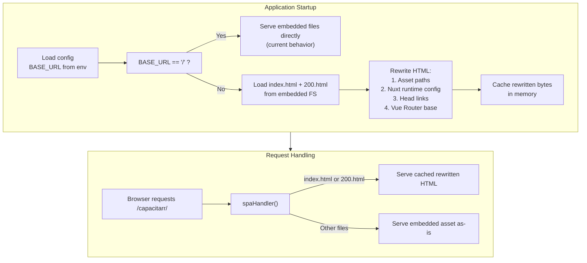

# Runtime Subdirectory Reverse Proxy Support

**Status:** ✅ Complete
**Created:** 2026-03-08T15:04Z
**Scope:** Backend (Go), Frontend (Nuxt config), Documentation, Tests

## Problem Statement

Subdirectory reverse proxy deployment (e.g., `https://example.com/capacitarr/`) is documented but **does not work** with pre-built Docker images. The documentation instructs users to set `BASE_URL` and `NUXT_APP_BASE_URL`, but `NUXT_APP_BASE_URL` is a **Nuxt build-time variable** that has no effect at runtime.

### Root Cause

The Nuxt frontend is built as a static SPA (`ssr: false`) in the Docker image build stage. The `app.baseURL` in `nuxt.config.ts` is evaluated at build time via `process.env.NUXT_APP_BASE_URL || '/'`. Since the Dockerfile does not pass this variable during the frontend build, all published images have assets hardcoded to root paths:

- `<script src="/_assets/abc123.js">` — should be `/capacitarr/_assets/...`
- `<link href="/favicon.svg">` — should be `/capacitarr/favicon.svg`
- Vue Router base path: `/` — should be `/capacitarr/`
- API calls resolve to `/api/v1/...` — should be `/capacitarr/api/v1/...`
- SSE connects to `/api/v1/events` — should be `/capacitarr/api/v1/events`

The Go backend correctly mounts routes at the `BASE_URL` prefix, but the HTML served to the browser still references root-level paths, causing 404s for all assets and API calls.

### What Already Works

- **Backend routing:** `main.go` correctly creates API group at `{BASE_URL}/api/v1` and SPA handler at `{BASE_URL}/*`
- **Cookie paths:** `auth.go` already sets cookie `Path` to `cfg.BaseURL`
- **SPA handler:** `spaHandler()` correctly strips the base URL prefix when looking up embedded files

### What's Broken

| Component | Expected Path | Actual Path (baked in) | Result |
|-----------|--------------|----------------------|--------|
| JS/CSS assets | `/capacitarr/_assets/...` | `/_assets/...` | 404 |
| favicon.svg | `/capacitarr/favicon.svg` | `/favicon.svg` | 404 |
| site.webmanifest | `/capacitarr/site.webmanifest` | `/site.webmanifest` | 404 |
| Vue Router base | `/capacitarr/` | `/` | Navigation breaks |
| API calls | `/capacitarr/api/v1/...` | `/api/v1/...` | 404 |
| SSE stream | `/capacitarr/api/v1/events` | `/api/v1/events` | 404 |

## Solution: Runtime HTML Rewriting

When `BASE_URL != "/"`, the Go backend will rewrite the HTML entry points (`index.html` and `200.html`) at startup to inject the correct base path. This is a one-time operation cached in memory — no per-request overhead.

### Design



### What Gets Rewritten in HTML

The Nuxt-generated `index.html` and `200.html` contain several path references that must be updated:

1. **Script/CSS asset paths:** `src="/_assets/..."` → `src="/capacitarr/_assets/..."`
2. **Head link tags:** `href="/favicon.svg"` → `href="/capacitarr/favicon.svg"`, `href="/site.webmanifest"` → `href="/capacitarr/site.webmanifest"`
3. **Nuxt runtime config injection:** The `__NUXT__` payload embedded in the HTML contains `apiBaseUrl` — this needs to be set to the base URL so `useApi()` and `useEventStream()` construct correct API paths
4. **Nuxt `app.baseURL`:** Nuxt embeds the base URL in a `<script>` tag or the `__NUXT__` config — this controls Vue Router's base path

### Frontend Changes

The frontend API composables already read from runtime config:

- `useApi.ts` uses `config.public.apiBaseUrl` as the `baseURL` for ofetch
- `useEventStream.ts` uses `config.public.apiBaseUrl` to prefix the SSE URL

These will work correctly once the runtime config in the HTML is rewritten to include the base path. No changes needed to these composables.

However, the `useEventStream.ts` SSE URL construction currently does `${baseURL}/api/v1/events`. If `apiBaseUrl` is set to `/capacitarr`, this produces `/capacitarr/api/v1/events` — correct. If `apiBaseUrl` is empty (default), it produces `/api/v1/events` — also correct. No change needed.

## Implementation Steps

### Step 1: Add HTML Rewriting to `main.go`

Create a new function `rewriteHTML(htmlBytes []byte, baseURL string) []byte` in `main.go` that performs the following replacements on the raw HTML:

**1a. Rewrite asset paths:**
Replace all occurrences of `"/_assets/` with `"{baseURL}_assets/` in script `src` and link `href` attributes.

**1b. Rewrite head link paths:**
Replace `href="/favicon.svg"` with `href="{baseURL}favicon.svg"` and `href="/site.webmanifest"` with `href="{baseURL}site.webmanifest"`.

**1c. Inject `apiBaseUrl` into Nuxt runtime config:**
Nuxt embeds runtime config as a JSON payload in the HTML. Find the `__NUXT__` or `__NUXT_DATA__` script and inject/update the `apiBaseUrl` field to equal the base URL path (without trailing slash, e.g., `/capacitarr`). This is what `useApi()` and `useEventStream()` read at runtime.

**1d. Rewrite Nuxt `app.baseURL`:**
Nuxt embeds `"baseURL":"/"` in the HTML payload. Replace it with `"baseURL":"{baseURL}"` so Vue Router uses the correct base path for client-side navigation.

### Step 2: Cache Rewritten HTML at Startup

In `main()`, after loading the embedded FS and checking `cfg.BaseURL`:

- If `cfg.BaseURL == "/"`: no rewriting needed, serve files directly (current behavior)
- If `cfg.BaseURL != "/"`: read `index.html` and `200.html` from the embedded FS, run `rewriteHTML()` on each, and store the resulting `[]byte` in a struct or map

### Step 3: Modify `serveEmbeddedFile()` to Use Cached HTML

When serving `index.html` or `200.html` and cached rewritten versions exist, serve the cached bytes instead of reading from the embedded FS. All other files (JS, CSS, images) are served unchanged.

### Step 4: Add a Root Redirect

When `BASE_URL != "/"`, add a redirect from `/` to `{BASE_URL}` so users who navigate to the root get redirected to the correct subdirectory. This is a convenience — without it, hitting `https://example.com/` returns a 404 from the Go backend.

### Step 5: Update `NUXT_APP_BASE_URL` Handling

**5a. Remove `NUXT_APP_BASE_URL` from user-facing documentation.** It is no longer needed — `BASE_URL` is the single source of truth.

**5b. Keep `NUXT_APP_BASE_URL` in `nuxt.config.ts`** for development use (when running the frontend dev server outside Docker), but document it as a development-only variable.

### Step 6: Fix the Caddy Subdirectory Example

The current Caddy example uses `handle_path` which strips the prefix:

```
handle_path /capacitarr/* {
    reverse_proxy capacitarr:2187
}
```

This contradicts the Traefik warning about not stripping prefixes. Change to:

```
handle /capacitarr/* {
    reverse_proxy capacitarr:2187
}
```

### Step 7: Add SSE Proxy Config for Subdirectory nginx

The current nginx subdirectory example doesn't include SSE-specific configuration. Add a note or combined example showing both the general proxy and the SSE endpoint with `proxy_buffering off`.

### Step 8: Update the Healthcheck

The Dockerfile healthcheck is hardcoded to `http://localhost:2187/api/v1/health`. When `BASE_URL` is set, the health endpoint moves to `{BASE_URL}api/v1/health`. Update the entrypoint or healthcheck to use the correct path.

The healthcheck in the Dockerfile itself cannot use env vars dynamically, but the `entrypoint.sh` can be updated to set a healthcheck URL, or the healthcheck can be moved to a script that reads `BASE_URL`.

### Step 9: Write Tests

**9a. Unit test for `rewriteHTML()`:** Test that all replacements are applied correctly for various base URLs (`/capacitarr/`, `/apps/capacitarr/`, `/a/b/c/`).

**9b. Unit test for edge cases:** Ensure `rewriteHTML()` is a no-op when `baseURL == "/"`, handles missing `__NUXT__` payload gracefully, and doesn't corrupt non-HTML files.

**9c. Integration test:** Verify that the SPA handler serves rewritten HTML for `index.html` and `200.html` but serves other files unchanged.

### Step 10: Update Documentation

**10a. `docs/configuration.md`:** Remove `NUXT_APP_BASE_URL` from the user-facing table or mark it as deprecated/internal. Update the subdirectory example to show only `BASE_URL`.

**10b. `docs/deployment.md`:** Update all subdirectory examples (Docker, nginx, Caddy, Traefik) to show only `BASE_URL`. Fix the Caddy example. Add SSE config for subdirectory nginx.

**10c. `README.md`:** Update the configuration table to remove `NUXT_APP_BASE_URL` if it's listed there.

### Step 11: Run `make ci`

Verify all linting, tests, and security checks pass.

## Files Modified

| File | Change |
|------|--------|
| `backend/main.go` | Add `rewriteHTML()`, cached HTML storage, modify `serveEmbeddedFile()`, add root redirect |
| `backend/main_test.go` (new) | Tests for `rewriteHTML()` and SPA handler with base URL |
| `entrypoint.sh` | Update healthcheck path to respect `BASE_URL` |
| `Dockerfile` | Update healthcheck to use a script or dynamic path |
| `docs/configuration.md` | Remove/deprecate `NUXT_APP_BASE_URL`, simplify subdirectory example |
| `docs/deployment.md` | Fix Caddy example, add SSE config for subdirectory nginx, simplify Docker examples |
| `README.md` | Remove `NUXT_APP_BASE_URL` from config table if present |

## User-Facing Change

**Before (broken):**
```yaml
environment:
  - BASE_URL=/capacitarr/
  - NUXT_APP_BASE_URL=/capacitarr/   # ← had no effect
```

**After (works):**
```yaml
environment:
  - BASE_URL=/capacitarr/
```

Single variable. Works with any pre-built Docker image. No custom builds needed.
