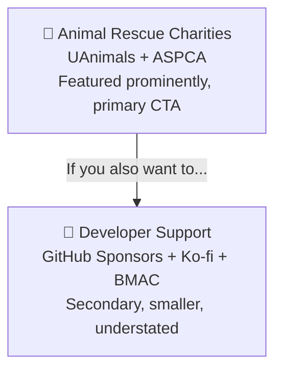
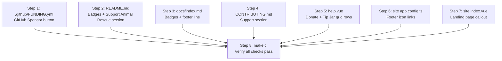

# Add Support/Donation Links

**Status:** ✅ Complete
**Created:** 2026-03-08

## Overview

Add support and donation links across the project. The primary call-to-action is donating to animal rescue charities (UAnimals and ASPCA, in that order). Personal developer donation links (Ko-fi, Buy Me a Coffee, GitHub Sponsors) are secondary — presented as an alternative, not the headline.

## Links

### Charities (primary — featured prominently)

| Organization | URL | Description |
|---|---|---|
| UAnimals | `https://uanimals.org/en/` | Rescuing and protecting animals in Ukraine |
| ASPCA | `https://www.aspca.org/ways-to-help` | Preventing cruelty to animals in the US |

### Developer Support (secondary — listed after charities)

| Platform | URL |
|----------|-----|
| GitHub Sponsors | `https://github.com/sponsors/ghent` |
| Ko-fi | `https://ko-fi.com/ghent` |
| Buy Me a Coffee | `https://buymeacoffee.com/ghentgames` |

## Content Framing

The messaging across all locations should follow this pattern:

> **Support Animal Rescue**
>
> Capacitarr is free software. If it saves you time, please consider donating to one of these animal rescue organizations instead of supporting me directly:
>
> - **UAnimals** — Rescuing and protecting animals in Ukraine
> - **ASPCA** — Preventing cruelty to animals in the US
>
> If you still want to support the developer directly: Ko-fi · Buy Me a Coffee · GitHub Sponsors

The exact wording will be adapted per location (badge row uses visual badges, help page uses grid layout, marketing site uses buttons), but the hierarchy is always: **charities first, developer links second and smaller**.

## Steps

### Step 1: Create `.github/FUNDING.yml`

**File:** `.github/FUNDING.yml` (new file)

This enables the native "Sponsor" button on the GitHub repository page. GitHub FUNDING.yml supports `custom` URLs for non-platform links, which is how to include the charity links.

```yaml
github: ghent
ko_fi: ghent
buy_me_a_coffee: ghentgames
custom:
  - https://uanimals.org/en/
  - https://www.aspca.org/ways-to-help
```

---

### Step 2: Add badges and Support section to README.md

**File:** `README.md`

**2a — Badge row (after line 15, the Reddit badge):**

Add charity badges first (prominently colored), then developer support badges:

```markdown
[](https://uanimals.org/en/)
[](https://www.aspca.org/ways-to-help)
[](https://github.com/sponsors/ghent)
[](https://ko-fi.com/ghent)
[](https://buymeacoffee.com/ghentgames)
```

> **Note:** The ASPCA and UAnimals badges may need custom SVG logos encoded in base64 since shields.io doesn't have built-in icons for these organizations, or we can use generic icons like `logo=heart` or omit the logo. Finalize during implementation.

**2b — New "Support" section (after the Community section, before License):**

```markdown
## Support Animal Rescue 🐾

Capacitarr is free software. If it saves you time, please consider donating to one of these animal rescue organizations:

- 🇺🇦 [UAnimals](https://uanimals.org/en/) — Rescuing and protecting animals in Ukraine
- 🐾 [ASPCA](https://www.aspca.org/ways-to-help) — Preventing cruelty to animals in the US

### Support the Developer

If you'd also like to support me directly:

- [GitHub Sponsors](https://github.com/sponsors/ghent)
- [Ko-fi](https://ko-fi.com/ghent)
- [Buy Me a Coffee](https://buymeacoffee.com/ghentgames)
```

---

### Step 3: Add badges and support line to docs/index.md

**File:** `docs/index.md`

**3a — Badge row (after line 15, the Reddit badge):**

Same badges as Step 2a.

**3b — Support line (before the author line at bottom):**

```markdown
---

**Support animal rescue:** [UAnimals](https://uanimals.org/en/) · [ASPCA](https://www.aspca.org/ways-to-help) — or support the developer: [GitHub Sponsors](https://github.com/sponsors/ghent) · [Ko-fi](https://ko-fi.com/ghent) · [Buy Me a Coffee](https://buymeacoffee.com/ghentgames)

*Author: Ghent Starshadow*
```

---

### Step 4: Add Support section to CONTRIBUTING.md

**File:** `CONTRIBUTING.md`

Append at the end of the file (after "Questions?" section):

```markdown

## Support

Capacitarr is free and always will be. If it's useful to you, I'd love for you to donate to one of these animal rescue organizations:

- [UAnimals](https://uanimals.org/en/) — Rescuing and protecting animals in Ukraine
- [ASPCA](https://www.aspca.org/ways-to-help) — Preventing cruelty to animals in the US

You can also support the developer directly via [GitHub Sponsors](https://github.com/sponsors/ghent), [Ko-fi](https://ko-fi.com/ghent), or [Buy Me a Coffee](https://buymeacoffee.com/ghentgames).
```

---

### Step 5: Add support links to the Help page About section

**File:** `frontend/app/pages/help.vue`

In the "About Capacitarr" details section, add two new rows to the Project Info grid (between the Community row at line ~539 and the License row at line ~541):

**Row 1 — "Donate" (charities, featured prominently):**

```html
<span class="text-muted-foreground">Donate</span>
<div class="space-y-1">
  <p class="text-xs text-foreground/70">
    Instead of supporting me, please consider donating to animal rescue:
  </p>
  <div class="flex items-center gap-3">
    <a
      href="https://uanimals.org/en/"
      target="_blank"
      rel="noopener noreferrer"
      class="inline-flex items-center gap-1.5 text-primary hover:underline"
    >
      <HeartIcon class="w-3.5 h-3.5" />
      UAnimals
      <ExternalLinkIcon class="w-3 h-3" />
    </a>
    <a
      href="https://www.aspca.org/ways-to-help"
      target="_blank"
      rel="noopener noreferrer"
      class="inline-flex items-center gap-1.5 text-primary hover:underline"
    >
      <PawPrintIcon class="w-3.5 h-3.5" />
      ASPCA
      <ExternalLinkIcon class="w-3 h-3" />
    </a>
  </div>
</div>
```

**Row 2 — "Tip Jar" (developer links, smaller/secondary):**

```html
<span class="text-muted-foreground">Tip Jar</span>
<div class="flex items-center gap-3">
  <a
    href="https://github.com/sponsors/ghent"
    target="_blank"
    rel="noopener noreferrer"
    class="inline-flex items-center gap-1.5 text-primary hover:underline"
  >
    GitHub Sponsors
    <ExternalLinkIcon class="w-3 h-3" />
  </a>
  <a
    href="https://ko-fi.com/ghent"
    target="_blank"
    rel="noopener noreferrer"
    class="inline-flex items-center gap-1.5 text-primary hover:underline"
  >
    Ko-fi
    <ExternalLinkIcon class="w-3 h-3" />
  </a>
  <a
    href="https://buymeacoffee.com/ghentgames"
    target="_blank"
    rel="noopener noreferrer"
    class="inline-flex items-center gap-1.5 text-primary hover:underline"
  >
    Buy Me a Coffee
    <ExternalLinkIcon class="w-3 h-3" />
  </a>
</div>
```

Also add `HeartIcon` and `PawPrintIcon` to the Lucide import on line 631:

```ts
import { ChevronRightIcon, ExternalLinkIcon, HeartIcon, PawPrintIcon, ShieldIcon } from 'lucide-vue-next';
```

> **Note:** No i18n keys are needed — the existing About section uses hardcoded English strings. The new rows follow the same pattern.

---

### Step 6: Add support links to the marketing site footer

**File:** `site/app/app.config.ts`

Update the `footer.links` array. Charity links come first:

```ts
footer: {
  credits: `© ${new Date().getFullYear()} Capacitarr`,
  colorMode: false,
  links: [{
    icon: 'i-lucide-heart',
    to: 'https://uanimals.org/en/',
    target: '_blank',
    'aria-label': 'Donate to UAnimals',
  }, {
    icon: 'i-lucide-paw-print',
    to: 'https://www.aspca.org/ways-to-help',
    target: '_blank',
    'aria-label': 'Donate to the ASPCA',
  }, {
    icon: 'i-simple-icons-githubsponsors',
    to: 'https://github.com/sponsors/ghent',
    target: '_blank',
    'aria-label': 'Sponsor on GitHub',
  }, {
    icon: 'i-simple-icons-kofi',
    to: 'https://ko-fi.com/ghent',
    target: '_blank',
    'aria-label': 'Support on Ko-fi',
  }, {
    icon: 'i-simple-icons-buymeacoffee',
    to: 'https://buymeacoffee.com/ghentgames',
    target: '_blank',
    'aria-label': 'Buy Me a Coffee',
  }, {
    icon: 'i-simple-icons-gitlab',
    to: 'https://gitlab.com/starshadow/software/capacitarr',
    target: '_blank',
    'aria-label': 'Capacitarr on GitLab',
  }],
},
```

> **Note:** Verify `i-lucide-paw-print` and `i-lucide-heart` resolve correctly in the Nuxt UI icon system. If not, fall back to Simple Icons or Heroicons equivalents.

---

### Step 7: Add support section to the marketing site landing page

**File:** `site/app/pages/index.vue`

Add a support callout section near the bottom of the landing page. Charity links are the primary CTA, developer links are secondary and understated:

```html
<section class="text-center py-16">
  <h2 class="text-2xl font-bold mb-2">Support Animal Rescue 🐾</h2>
  <p class="text-muted text-lg mb-6 max-w-xl mx-auto">
    Capacitarr is free software. If it saves you time, please consider donating to animal rescue instead of supporting me directly.
  </p>
  <div class="flex justify-center gap-4 mb-8">
    <UButton to="https://uanimals.org/en/" target="_blank" icon="i-lucide-heart" size="lg" color="primary">
      Donate to UAnimals
    </UButton>
    <UButton to="https://www.aspca.org/ways-to-help" target="_blank" icon="i-lucide-paw-print" size="lg" color="primary">
      Donate to ASPCA
    </UButton>
  </div>
  <p class="text-sm text-muted">
    Or support the developer:
    <a href="https://github.com/sponsors/ghent" target="_blank" class="underline">GitHub Sponsors</a> ·
    <a href="https://ko-fi.com/ghent" target="_blank" class="underline">Ko-fi</a> ·
    <a href="https://buymeacoffee.com/ghentgames" target="_blank" class="underline">Buy Me a Coffee</a>
  </p>
</section>
```

The exact implementation will be adapted to match the existing landing page design language.

---

### Step 8: Verify with `make ci`

Run `make ci` from the `capacitarr/` directory to ensure all lint, test, and security checks pass after the changes.

---

## File Change Summary

| File | Change Type | Description |
|------|-------------|-------------|
| `.github/FUNDING.yml` | New | GitHub "Sponsor" button with charities + developer platforms |
| `README.md` | Edit | Add 5 badges + "Support Animal Rescue" section with developer subsection |
| `docs/index.md` | Edit | Add 5 badges + support footer line |
| `CONTRIBUTING.md` | Edit | Append Support section (charities first) |
| `frontend/app/pages/help.vue` | Edit | Add "Donate" and "Tip Jar" rows to About grid + import icons |
| `site/app/app.config.ts` | Edit | Add charity + developer links to footer |
| `site/app/pages/index.vue` | Edit | Add prominent support callout section |

## Hierarchy Summary

Every location follows the same hierarchy:



## Step Diagram


