# App Navbar Donation Popover

**Status:** ✅ Complete
**Created:** 2026-03-08

## Overview

Port the donation/support popover from the Pages site header (`site/app/components/AppHeader.vue`) into the main Capacitarr application navbar (`frontend/app/components/Navbar.vue`).

The app uses **shadcn-vue** components (`UiPopover`, `UiButton`, `UiSeparator`) and **lucide-vue-next** icons, while the site uses Nuxt UI v4 (`UPopover`, `UButton`, `UIcon`). The content and messaging are identical; only the component API changes.

## Placement

The donation icon goes between the **Theme/Mode dropdown** and the **Help button** — this groups it with the informational/utility icons rather than the functional ones (engine control, version check).

```
[Engine] [Version] [Language] [Theme] [♥ Donate] [Help] [Logout]
```

## Steps

### Step 1: Add i18n keys to all locale files

**Files:** All 22 files in `frontend/app/locales/`

Add the following keys to `en.json` (under the `nav.*` namespace), then add equivalent translations to all other locale files:

```json
"donate.title": "Support Animal Rescue",
"donate.message": "Capacitarr is free software. If it saves you time, we'd love for you to donate to animal rescue instead of supporting us directly.",
"donate.uanimalsName": "UAnimals",
"donate.uanimalsDesc": "Rescuing animals in Ukraine 🇺🇦",
"donate.aspcaName": "ASPCA",
"donate.aspcaDesc": "Preventing cruelty to animals",
"donate.devHeading": "Support the Developer",
"donate.githubSponsors": "GitHub Sponsors",
"donate.kofi": "Ko-fi",
"donate.buyMeACoffee": "Buy Me a Coffee",
"donate.ariaLabel": "Support & Donate"
```

---

### Step 2: Add donation popover to Navbar.vue

**File:** `frontend/app/components/Navbar.vue`

Insert a `UiPopover` between the Theme/Mode dropdown and the Help button. Use the same `UiPopoverTrigger` + `UiPopoverContent` pattern as the existing version popover.

**Icon:** Import `HeartHandshakeIcon` from `lucide-vue-next` — this matches the site's `i-lucide-heart-handshake` and is visually distinct from the plain heart icon.

Also import `HeartIcon`, `PawPrintIcon`, and `ExternalLinkIcon` for use inside the popover content.

The popover content structure:

```
┌─────────────────────────────────┐
│ 🐾 Support Animal Rescue       │
│                                 │
│ Capacitarr is free software...  │
│                                 │
│ ┌─────────────────────────────┐ │
│ │ ♥  UAnimals                 │ │
│ │    Rescuing animals in UA 🇺🇦│ │
│ └─────────────────────────────┘ │
│ ┌─────────────────────────────┐ │
│ │ 🐾 ASPCA                    │ │
│ │    Preventing cruelty       │ │
│ └─────────────────────────────┘ │
│                                 │
│ ─────── separator ────────────  │
│                                 │
│ SUPPORT THE DEVELOPER           │
│ [GH Sponsors] [Ko-fi] [BMC]    │
└─────────────────────────────────┘
```

Use Tailwind utility classes from the design system — `text-sm`, `text-xs`, `text-muted-foreground`, `font-semibold`, `hover:bg-accent`, `rounded-md`, etc. — to match the existing popover style in the navbar. No scoped CSS needed; the shadcn-vue popover already handles positioning, backdrop, and border.

The charity link rows use `<a>` tags with flex layout:
- Icon on the left
- Name + description stacked
- External link icon on the right, auto-margin-left

The developer links use a flex-wrap row of small inline links.

---

### Step 3: Verify with `make ci`

Run `make ci` to ensure lint, type-check, and tests pass.

---

### Step 4: Verify visually with Docker

Run `docker compose up --build` and verify the popover renders correctly in the browser at `localhost:2187`.

---

## File Change Summary

| File | Change | Description |
|------|--------|-------------|
| `frontend/app/locales/en.json` | Edit | Add `donate.*` i18n keys |
| `frontend/app/locales/*.json` | Edit | Add `donate.*` i18n keys for all 21 other locales |
| `frontend/app/components/Navbar.vue` | Edit | Add donation popover between Theme dropdown and Help |

## Architecture

```mermaid
flowchart LR
    subgraph Navbar Right Section
        ENGINE["EngineControl"]
        VERSION["Version Popover"]
        LANG["Language Dropdown"]
        THEME["Theme Dropdown"]
        DONATE["Donation Popover<br/>HeartHandshakeIcon"]
        HELP["Help Link"]
        LOGOUT["Logout"]
    end

    ENGINE --> VERSION --> LANG --> THEME --> DONATE --> HELP --> LOGOUT

    DONATE -->|"click"| POPOVER["UiPopoverContent<br/>w-72 p-4"]

    subgraph Popover Content
        CHARITY_HDR["🐾 Support Animal Rescue"]
        MSG["Message text"]
        UA_LINK["UAnimals - external"]
        ASPCA_LINK["ASPCA - external"]
        SEP["UiSeparator"]
        DEV_HDR["Support the Developer"]
        GH_LINK["GitHub Sponsors"]
        KOFI_LINK["Ko-fi"]
        BMC_LINK["Buy Me a Coffee"]
    end

    POPOVER --> CHARITY_HDR
    CHARITY_HDR --> MSG --> UA_LINK --> ASPCA_LINK --> SEP --> DEV_HDR --> GH_LINK
    GH_LINK --> KOFI_LINK --> BMC_LINK
```


