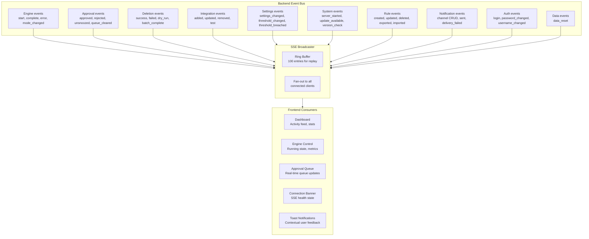

# Codebase Audit & Roadmap Ideas

**Date:** 2026-03-09
**Status:** ✅ Complete (reference document)

---

## 1. Performance, Efficiency, and Code Quality

### Overall Assessment: **Excellent — well-engineered application**

#### Architecture Strengths

- **Single binary deployment** — The `go:embed` approach embedding the Nuxt frontend into the Go binary is ideal for this use case. Zero runtime dependencies beyond Alpine, `ca-certificates`, `tzdata`, `su-exec`, and `curl`. The final image is ~30 MB.
- **Strict service layer** — The `services.Registry` pattern with constructor injection prevents the "fat routes" anti-pattern. Every service gets `*gorm.DB` + `*events.EventBus` — no global state.
- **Lean dependency tree** — `go.mod` has only 8 direct dependencies (Echo, GORM, SQLite, JWT, cron, crypto, rate, goose). No heavyweight frameworks. The SQLite driver uses Wazero (pure Go WASM) so there's no CGO requirement.

#### Memory & CPU Efficiency

| Area | Implementation | Verdict |
|------|---------------|---------|
| **HTTP client** | Single `sharedHTTPClient` with 30s timeout, connection pooling via `http.Transport` defaults | ✅ Good |
| **Event bus** | Buffered channels (256 per subscriber), non-blocking publish with drop-on-full | ✅ Efficient |
| **SSE broadcaster** | Fixed `ringBufferSize = 100`, per-client buffer of 64, pre-formatted `[]byte` payloads | ✅ Zero-alloc fan-out |
| **TTL cache** | Simple `map[string]Entry` with `janitor` goroutine at `ttl/2` interval | ✅ Appropriate |
| **Deletion worker** | Bounded channel (`cap=500`), 3s `rate.Limiter` to avoid hammering *arr APIs | ✅ Good backpressure |
| **Poller** | Single goroutine with `time.Timer`, `atomic` counters for thread-safe stats | ✅ Minimal overhead |
| **Login rate limiter** | In-memory sliding window per-IP, background cleanup every 5 min | ✅ Right-sized for single instance |

#### What's NOT Bloated

- No ORM query builder abstraction layers — direct GORM calls in services
- No dependency injection framework — manual wiring in `NewRegistry()`
- No message queue, no Redis, no external cache — everything is in-process
- The SSE JSON serialization avoids unmarshal/re-marshal by doing byte-level surgery to inject the `"message"` field

#### Minor Observations (Not Issues)

1. **`io.ReadAll`** in `DoAPIRequest()` reads the full response body into memory. For *arr APIs returning thousands of media items, this is fine (JSON blobs of a few MB at most), but it's worth noting there's no streaming JSON decoder.

2. **Sequential integration fetching** — `fetchAllIntegrations()` iterates configs in a `for` loop. If you have 5+ integrations, each with 1-5s API latency, the poll cycle serializes all those network calls. This is a deliberate simplicity trade-off — parallelizing with `errgroup` would reduce cycle time but adds complexity.

3. **GORM overhead** — GORM adds reflection-based mapping overhead compared to raw `database/sql`, but for a tool that makes a few dozen DB calls per poll cycle against SQLite, this is completely negligible.

### Profiling Capabilities

You **can** profile it, though there's no built-in `pprof` endpoint currently:

- **Go's `net/http/pprof`** — Adding a single import and route would expose CPU/memory/goroutine profiles over HTTP. This is the standard approach for Go apps.
- **SQLite** — You could add a `PRAGMA optimize` call on shutdown or periodic `ANALYZE` statements, but SQLite auto-maintains its query planner stats.
- **Engine cycle timing** — You already track `DurationMs` per engine run in `EngineRunStats`, which gives you production profiling data for the hot path.

If you want to add a pprof endpoint, it's literally 3 lines in `main.go`:
```go
import _ "net/http/pprof"
// Then in a debug-only route:
protected.GET("/debug/pprof/*", echo.WrapHandler(http.DefaultServeMux))
```

---

## 2. SSE Usage — Comprehensive & Well-Designed

### What SSE Currently Covers

The SSE implementation is **thorough**. The `SSEBroadcaster` receives every event published to the `EventBus`, and the frontend's `useEventStream` composable provides typed handler registration. There are **39 event types** flowing through it:



### Where You Could Additionally Use SSE

The coverage is quite complete. A few edge areas where SSE could add value, but they're optional/marginal:

| Area | Current Behavior | SSE Opportunity | Priority |
|------|-----------------|-----------------|----------|
| **Integration sync status** | `lastSync`, `lastError` written to DB, polled by frontend | Could emit `integration_sync_complete` events so the Settings > Integrations page shows live sync timestamps without refresh | Low — users rarely stare at this page |
| **Deletion worker progress** | `CurrentlyDeleting()` exposes the current item, but the frontend fetches `/worker/stats` via REST | Could stream `deletion_progress` events with queue depth + current item for a live progress bar | Low — deletion batches are usually small (3-10 items) |
| **Disk group changes** | Disk groups are upserted during poll cycles | Already implicitly covered by `engine_complete` + `threshold_breached` — the dashboard can refresh disk data on those events | Already handled |

**Bottom line:** SSE is used for essentially everything that matters. The real-time activity feed, engine state, approval queue, connection health, and toast notifications are the high-value use cases, and they're all covered. The marginal additions above aren't worth the complexity.

### SSE Architecture Quality

- **Ring buffer replay** via `Last-Event-ID` — correctly handles reconnection without missed events
- **30s keepalive** prevents proxy timeouts
- **`X-Accel-Buffering: no`** header disables nginx buffering
- **Exponential backoff** on the client with 30s cap
- **Singleton pattern** — one `EventSource` per browser tab, shared across all composables

---

## 3. Feature Completeness — Ideas for New Functionality

### What Already Exists (Feature Inventory)

| Feature Area | Status |
|-------------|--------|
| Multi-*arr integration (Sonarr, Radarr, Lidarr, Readarr) | ✅ |
| Multi-media-server enrichment (Plex, Jellyfin, Emby, Tautulli, Overseerr) | ✅ |
| Weighted scoring engine with 6 factors | ✅ |
| Custom rules with keep/remove effects | ✅ |
| 3 execution modes (dry-run, approval, auto) | ✅ |
| Approval queue with snooze/unsnooze | ✅ |
| Audit log with score breakdown | ✅ |
| Time-series disk history with rollups (raw → hourly → daily → weekly) | ✅ |
| Lifetime statistics | ✅ |
| Notifications (Discord, Slack) with per-channel event subscriptions | ✅ |
| Real-time SSE event stream (39 event types) | ✅ |
| Login rate limiting | ✅ |
| API key authentication | ✅ |
| Reverse proxy auth header support | ✅ |
| Rule import/export | ✅ |
| Auto-update checking via GitLab releases | ✅ |
| Data management (reset/clear) | ✅ |
| i18n (22 languages) | ✅ |
| Dark/light theme | ✅ |
| Docker health checks | ✅ |
| Graceful shutdown with ordered teardown | ✅ |
| Orphaned approval recovery on restart | ✅ |
| OpenAPI spec | ✅ |

### Ideas Worth Considering

Roughly sorted by value/effort ratio:

#### High Value, Moderate Effort

1. **Generic webhook notifications** — Let external tools (Home Assistant, n8n, etc.) receive events via arbitrary HTTP POST callbacks. A "webhook" notification channel type (beyond Discord/Slack) would let users integrate with anything. The endpoints for triggering actions already exist via API key auth.

2. **Per-integration scoring overrides** — Currently, all integrations share the same weight preferences in `PreferenceSet`. A user with Sonarr (TV) and Radarr (movies) might want different weights for TV vs. movies (e.g., "I care more about watch history for TV but more about ratings for movies"). This could be done as optional per-integration-type weight overrides.

3. **Scheduled quiet hours / maintenance windows** — Let users say "don't run the engine or execute deletions between 8pm-6am" or "only delete on weekends." The cron infrastructure (`jobs.Start()`) is already there — this would be a preference that the poller checks before executing.

#### Medium Value, Low Effort

4. **Email notifications** — SMTP sender alongside Discord/Slack. Many selfhosters run Mailrise or similar.

5. **Ntfy / Gotify / Apprise support** — The selfhosted community loves these lightweight push notification tools. Adding Ntfy would be a simple HTTP POST sender.

6. **Protected items report/dashboard** — `IsProtected` is already tracked during evaluation. Surfacing a "Protected Items" tab showing what rules are protecting what media would help users validate their rules are working correctly.

7. **Score preview / "what if" simulator** — Before changing weights, let users preview how the scoring would change. `engine.EvaluateMedia()` is a pure function — calling it with hypothetical weights and returning the results without side effects is straightforward. The `preview.go` route already exists but could be more prominent in the UI.

8. **Backup/restore** — Export the entire SQLite database (or a structured JSON dump of config + rules + preferences) for backup purposes. Users moving between hosts would appreciate this.

#### Nice-to-Have, Lower Priority

9. **Multi-user support** — Currently single-user (one `AuthConfig` row). Some might want read-only dashboard access for household members without giving them approval/delete powers.

10. **Prometheus metrics endpoint** — For users who run Grafana dashboards. Expose `/metrics` with gauge values for disk usage, engine stats, queue depth, SSE client count.

11. **Mobile PWA enhancements** — If the Nuxt app registers a service worker for offline cache, users could "install" it as a home screen app and get basic offline viewing of cached stats.

12. **Plex collection-aware scoring** — `Collections` are already fetched from Plex. A rule like "never delete items in collection 'Favorites'" would be powerful (this may already work via tags/custom rules, but dedicated collection support would be more intuitive).

### Conclusion

The core product is **done and polished**. If this were a commercial product, it's past MVP and into "1.0 release" territory. The ideas above are "1.x" enhancements — nice additions but nothing that blocks shipping. The strongest candidates to pursue if iterating further would be **generic webhook notifications** (item 1) and **per-integration scoring overrides** (item 2), as those address the most common user customization requests for tools in this category.
