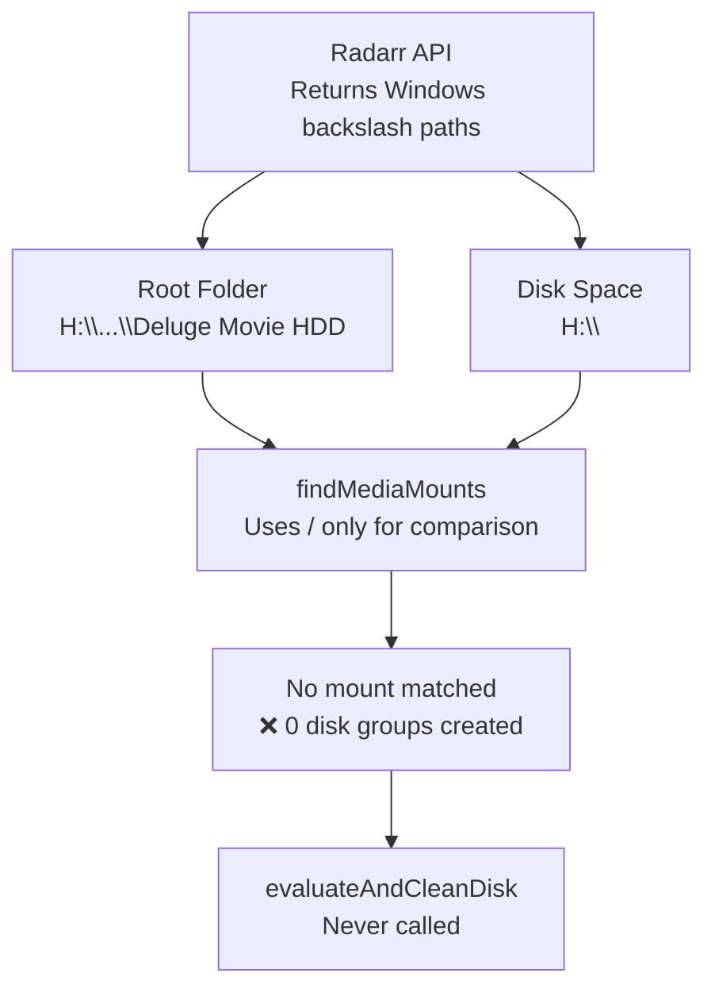
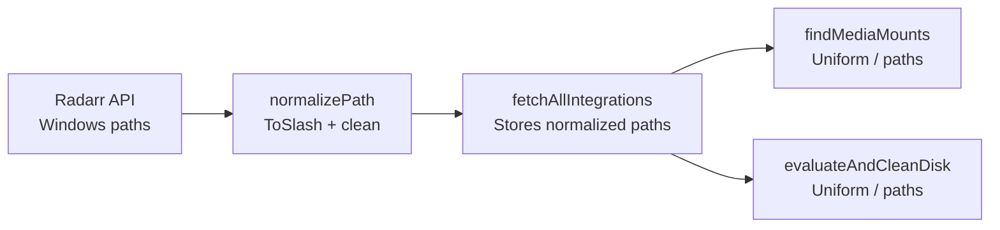

# Windows Path Normalization for *arr Integration

**Date:** 2026-03-15
**Status:** ✅ Complete
**Scope:** `capacitarr` (single repo)
**Branch:** `fix/windows-path-normalization`

## Problem

When Radarr runs on Windows (e.g., with Google Drive mapped to a drive letter), it returns backslash paths from its APIs:

- **Root folder API** (`/api/v3/rootfolder`): `H:\<User>\Google Movie HDD\Deluge Movie HDD`
- **Disk space API** (`/api/v3/diskspace`): `H:\` (or similar Windows drive root)
- **Movie paths** (`/api/v3/movie`): `H:\<User>\Google Movie HDD\Deluge Movie HDD\SomeMovie (2024)`

Capacitarr runs in Docker (Linux) and its path matching logic in `findMediaMounts()` uses exclusively forward-slash (`/`) operations:

```go
cleanRF := strings.TrimRight(rf, "/")           // Only trims "/"
cleanMount := strings.TrimRight(mountPath, "/")  // Only trims "/"

if strings.HasPrefix(cleanRF, cleanMount+"/") || cleanRF == cleanMount {
```

This causes a complete failure to match root folders to disk space entries when paths use backslashes, resulting in:
- **0 disk groups created** — the dashboard shows no storage information
- **0 items evaluated** — the engine never runs despite 4,637 media items being fetched

### Evidence from Debug Log

```
Root folder found  path="H:\\<User>\\Google Movie HDD\\Deluge Movie HDD"
Poll cycle complete  totalItems=4637  evaluated=0  flagged=0  protected=0
```

No "Matched root folder to mount" log line appears, confirming the matching failure.

## Root Cause Analysis



### Affected Code Locations

| File | Line | Issue |
|------|------|-------|
| `internal/poller/poller.go` | 240 | `strings.TrimRight(rf, "/")` — only trims `/`, not `\` |
| `internal/poller/poller.go` | 245 | `strings.TrimRight(mountPath, "/")` — only trims `/`, not `\` |
| `internal/poller/poller.go` | 254 | `strings.HasPrefix(cleanRF, cleanMount+"/")` — only checks `/` separator |
| `internal/poller/evaluate.go` | 61 | `strings.HasPrefix(item.Path, group.MountPath)` — path separator mismatch if not normalized |

### Secondary Issue: Missing Diagnostic Logging

The disk space entries returned by Radarr are not logged individually, making it impossible to see what paths were available for matching. Only root folders are logged (in `fetch.go` line 127).

## Solution Design

### Strategy: Normalize at Data Ingestion

Rather than patching every comparison site, normalize all external paths to forward slashes when they enter the system. This ensures all downstream logic works consistently regardless of the source OS.



### Helper Function

Create `normalizePath()` in the `poller` package using `strings.ReplaceAll()`:

```go
// normalizePath converts backslash path separators to forward slashes for
// consistent cross-platform path comparison. This is necessary because *arr
// services running on Windows return backslash paths (e.g. H:\Movies), but
// Capacitarr runs in Docker (Linux). We use strings.ReplaceAll instead of
// filepath.ToSlash because the latter only converts the OS-native separator,
// and on Linux backslash is not treated as a path separator.
func normalizePath(p string) string {
    return strings.ReplaceAll(p, `\`, "/")
}
```

> **Implementation note:** The initial plan used `filepath.ToSlash()`, but testing
> revealed it only converts the *current OS* path separator. Since Capacitarr runs
> on Linux (in Docker), `\` is not `filepath.Separator` and `filepath.ToSlash()` is
> a no-op for backslash characters. `strings.ReplaceAll` is the correct approach.

This converts:
- `H:\Movies` → `H:/Movies`
- `H:\` → `H:/`
- `/media/movies` → `/media/movies` (no change)
- `\\server\share` → `//server/share` (UNC paths)

### Path Comparison After Normalization

With normalized paths, the existing `findMediaMounts()` logic works correctly:

| Root Folder | Disk Path | After Normalize | TrimRight `/` | HasPrefix Check | Result |
|---|---|---|---|---|---|
| `H:\...\Deluge Movie HDD` | `H:\` | `H:/.../Deluge Movie HDD` vs `H:/` | `H:/.../Deluge Movie HDD` vs `H:` | `HasPrefix(..., "H:/")` | ✅ Match |
| `/media/movies` | `/media` | unchanged | `/media/movies` vs `/media` | `HasPrefix(..., "/media/")` | ✅ Match |
| `D:\TV` | `D:\` | `D:/TV` vs `D:/` | `D:/TV` vs `D:` | `HasPrefix("D:/TV", "D:/")` | ✅ Match |

## Implementation Steps

### Step 1: Create `normalizePath()` helper

**File:** `internal/poller/poller.go`

Add a package-level helper function that wraps `filepath.ToSlash()`. This is intentionally simple — `filepath.ToSlash()` is the Go standard library's canonical way to normalize path separators.

### Step 2: Normalize paths in `fetchAllIntegrations()`

**File:** `internal/poller/fetch.go`

Apply `normalizePath()` at three ingestion points:

1. **Root folders** (line ~124): Normalize `f` before storing in `rootFolders` map
2. **Disk space entries** (line ~143): Normalize `d.Path` before storing in `diskMap`
3. **Media item paths** (line ~89-91): Normalize `items[i].Path` after fetching

### Step 3: Add debug logging for disk space entries

**File:** `internal/poller/fetch.go`

Add a `slog.Debug()` call inside the disk space collection loop to log each disk entry path, making future diagnosis easier.

### Step 4: Write unit tests for `findMediaMounts()`

**File:** `internal/poller/poller_test.go`

Add table-driven tests covering:

- Unix paths (existing behavior, regression guard)
- Windows drive letter paths (`G:\Movies` on `G:\`)
- Windows paths with spaces and deep nesting (the exact user scenario)
- UNC paths (`\\server\share\movies`)
- Mixed mount specificity (more specific mount wins)
- Root fallback behavior (single root `/` matches everything)
- Multiple mounts with root pruning

### Step 5: Write unit tests for `normalizePath()`

**File:** `internal/poller/poller_test.go`

Verify normalization for:
- Forward-slash paths (no-op)
- Backslash paths (converted to forward slash)
- Windows drive roots (`H:\` → `H:/`)
- UNC paths
- Empty strings

### Step 6: Run `make ci`

Validate all tests pass and no lint issues are introduced.

## Test Matrix

| Test Case | Root Folder | Disk Space Path | Expected Mount Match |
|---|---|---|---|
| Unix standard | `/media/movies` | `/media` | `/media` |
| Unix root | `/data/movies` | `/` | `/` |
| Windows drive root | `G:\Movies` | `G:\` | `G:\` (normalized: `G:/`) |
| Windows deep path with spaces | `H:\<User>\Google Movie HDD\Deluge Movie HDD` | `H:\` | `H:\` (normalized: `H:/`) |
| Most specific mount wins | `/media/movies` | `/` and `/media` | `/media` |
| No match | `/data/movies` | `/media` | no match |
| UNC path | `\\server\share\movies` | `\\server\share` | `\\server\share` (normalized: `//server/share`) |

## Files Modified

| File | Change |
|------|--------|
| `internal/poller/poller.go` | Add `normalizePath()` helper; apply it in `findMediaMounts()` for defensive normalization |
| `internal/poller/fetch.go` | Normalize root folder paths, disk space paths, and media item paths at ingestion |
| `internal/poller/poller_test.go` | Add tests for `normalizePath()` and expanded `findMediaMounts()` tests |
| `internal/poller/fetch.go` | Add debug logging for disk space entries |
