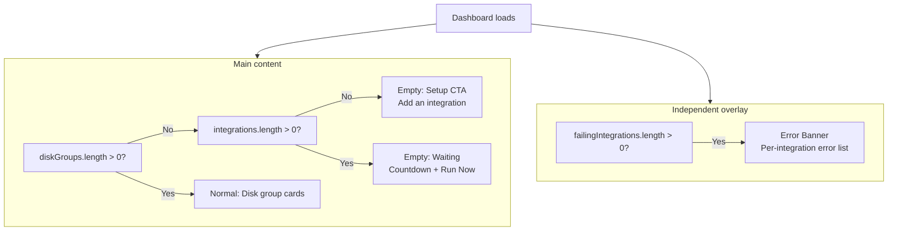

# Dashboard Empty State Improvements

**Date:** 2026-03-16
**Status:** ✅ Complete
**Scope:** `capacitarr` (single repo)
**Branch:** `feature/disk-size-override` (committed on existing branch instead of separate branch)
**Depends on:** `feature/disk-size-override` (contextually related but not a hard dependency)

## Motivation

When a new user installs Capacitarr, the dashboard shows a single empty state: "No disk groups yet — Add integrations in Settings and data will appear on the next poll cycle." This is confusing because:

1. **No differentiation** — Users can't tell if they haven't configured integrations or if they just need to wait for the first poll
2. **Errors are buried** — Integration errors (`lastError`) are only visible in Settings → Integrations, not on the dashboard where users spend most of their time
3. **"Poll cycle" is jargon** — New users don't know what a poll cycle is or that the default is 5 minutes
4. **No action path** — There's no button to navigate directly to Settings from the empty state

## Design

### Two Independent Concerns

The dashboard has two independent display concerns that operate in parallel:

1. **Main content area** — 3 states based on data availability
2. **Error banner** — independent overlay based on integration health



Three checks total: `diskGroups.length`, `integrations.length`, `failingIntegrations.length`.

### Main Content States

#### Empty: Setup CTA

Shown when `diskGroups.length === 0 && integrations.length === 0`.

- Icon: `ServerIcon` or `PlusCircleIcon`
- Title: "Get started by adding an integration"
- Description: "Connect Sonarr, Radarr, or another *arr service to begin monitoring disk usage."
- Action: `<UiButton>` linking to `/settings` (integrations tab)

#### Empty: Waiting for Poll

Shown when `diskGroups.length === 0 && integrations.length > 0`.

- Icon: `LoaderCircleIcon` (with `animate-spin`) or `ClockIcon`
- Title: "Waiting for first poll…"
- Description: "Disk groups appear automatically when your *arr services are polled. This usually takes up to {minutes} minutes."
- Poll interval: Read from preferences (`pollIntervalSeconds / 60`)
- Optional: "Run Now" button wired to `useEngineControl.runNow()`

#### Normal Dashboard

Shown when `diskGroups.length > 0`. Existing behavior — disk group cards, charts, stats.

### Error Banner (Independent)

Shown whenever `failingIntegrations.length > 0`, regardless of which main content state is active. Operates independently — not part of the empty state logic.

- Renders as a `UiAlert variant="destructive"` above the main content
- Title: "{count} integration(s) have errors"
- Collapsible detail rows: integration name + type + `lastError` message
- "View in Settings" link
- Dismissible per-session (optional — prevents nagging, reappears on reload)

Examples:
- New install with bad API key → Error banner shows above the "Waiting for poll" empty state
- Working Sonarr + broken Radarr → Error banner shows above the normal disk group cards
- All integrations healthy → No banner

### Rules Page: Threshold Empty State

The `RuleDiskThresholds.vue` component currently uses `v-if="diskGroups.length > 0"` which hides the entire card. Instead, always show the card with a placeholder message when no disk groups exist.

## Implementation Steps

### Step 1: Add i18n Keys

**File:** `frontend/app/locales/en.json`

```json
"dashboard.emptySetup.title": "Get started by adding an integration",
"dashboard.emptySetup.description": "Connect Sonarr, Radarr, or another *arr service to begin monitoring disk usage.",
"dashboard.emptySetup.action": "Go to Settings",
"dashboard.emptyWait.title": "Waiting for first poll…",
"dashboard.emptyWait.description": "Disk groups appear automatically when your *arr services are polled. This usually takes up to {minutes} minutes.",
"dashboard.emptyWait.runNow": "Run Now",
"dashboard.errorBanner.title": "{count} integration(s) have errors",
"dashboard.errorBanner.description": "Some integrations failed to connect. Disk data from these sources may be missing.",
"dashboard.errorBanner.action": "View in Settings",
"rules.diskThresholdsEmpty": "Threshold settings will appear here once disk groups are detected from your *arr services."
```

### Step 2: Create DashboardEmptyState Component

**File:** `frontend/app/components/DashboardEmptyState.vue`

Props:
- `integrations: IntegrationConfig[]`
- `pollIntervalSeconds: number`

Renders one of two states based on `integrations.length`:
- Setup CTA (no integrations)
- Waiting for poll (integrations exist)

Uses shadcn components (`UiCard`, `UiButton`), lucide icons.

### Step 3: Create IntegrationErrorBanner Component

**File:** `frontend/app/components/IntegrationErrorBanner.vue`

Props:
- `integrations: IntegrationConfig[]`

Internally filters to `failingIntegrations = integrations.filter(i => i.lastError)`. Renders nothing if none are failing. Uses `UiAlert variant="destructive"` with collapsible detail rows.

### Step 4: Update Dashboard Page

**File:** `frontend/app/pages/index.vue`

Replace the existing empty state (`v-if="!engineStats && !loading"`) with:

```html
<!-- Error banner (independent, above all content) -->
<IntegrationErrorBanner :integrations="allIntegrations" />

<!-- Empty state (when no disk groups) -->
<DashboardEmptyState
  v-if="diskGroups.length === 0 && !loading"
  :integrations="allIntegrations"
  :poll-interval-seconds="engineStats?.pollIntervalSeconds ?? 300"
/>

<!-- Normal content (when disk groups exist) -->
<div v-if="diskGroups.length > 0" class="space-y-5 mb-6">
  <DiskGroupSection ... />
</div>
```

### Step 5: Update Rules Page Threshold Card

**File:** `frontend/app/components/rules/RuleDiskThresholds.vue`

Change `v-if="diskGroups.length > 0"` to always render the card. Show a placeholder message when no disk groups exist.

### Step 6: Add i18n Keys to All Locales

**Files:** All 22 locale files in `frontend/app/locales/`

Add keys from Step 1 to all locales. Use English text as placeholders for non-English locales.

### Step 7: Run `make ci`

Verify all lint, tests, typecheck, and security checks pass.

## Files Modified

| File | Change |
|------|--------|
| `frontend/app/locales/en.json` | New i18n keys |
| `frontend/app/locales/*.json` (21 others) | Placeholder i18n keys |
| `frontend/app/components/DashboardEmptyState.vue` | New component (setup CTA / waiting) |
| `frontend/app/components/IntegrationErrorBanner.vue` | New component (error list) |
| `frontend/app/pages/index.vue` | Replace empty state, add error banner |
| `frontend/app/components/rules/RuleDiskThresholds.vue` | Always show card, add empty placeholder |

## Edge Cases

| Scenario | Behavior |
|---|---|
| No integrations, no errors | Setup CTA only (no banner) |
| Integrations exist, all healthy, no disk groups | Waiting for poll (no banner) |
| Integrations exist, some failing, no disk groups | Waiting for poll + error banner |
| Integrations exist, all failing, no disk groups | Waiting for poll + error banner (poll will fail, but the error banner explains why) |
| Disk groups exist, all integrations healthy | Normal dashboard (no banner) |
| Disk groups exist, some integrations failing | Normal dashboard + error banner |
| Integration error clears on next poll | Banner disappears on data refresh |
| User dismisses banner | Hidden for current session; reappears on reload |
