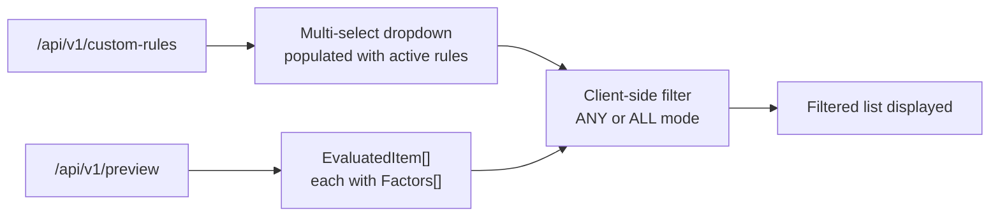
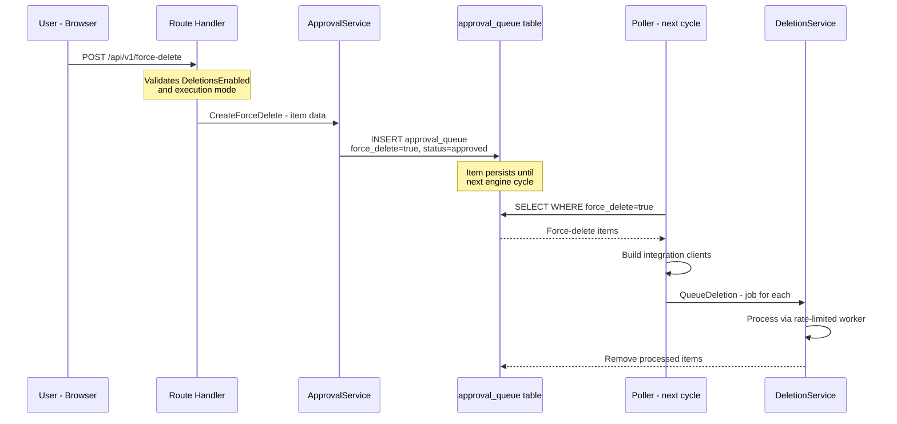

# Rule Filtering & Force Delete

**Status:** ✅ Complete (rule filter + force-delete backend; frontend force-delete UI deferred to Library Management page)
**Branch:** `feature/rule-filter-force-delete`
**Created:** 2026-03-16

## Overview

Two user-requested features for the Deletion Priority view:

1. **Filter by Applied Rules** — Allow users to filter the Deletion Priority list by which custom rules matched each item. Supports multi-rule selection with AND/OR logic.
2. **Manual Force Delete** — Allow users to mark items for deletion regardless of disk threshold settings. Items are processed on the next engine run.

## Outcome

- **Feature 1 (Rule Filter):** ✅ Fully implemented — backend `RuleID` field + frontend filter popover with ANY/ALL toggle.
- **Feature 2 (Force Delete):** ✅ Backend complete — API route, service methods, poller processing, migration. ⏸️ Frontend UI deferred to a dedicated Library Management page (see `20260317T1101Z-library-management-page.md`). The selection-mode UI was initially implemented in the Deletion Priority view but reverted because:
  - The Deletion Priority view is a read-only scoring preview; adding destructive actions blurred the line between preview and action.
  - Show groups in poster mode were wrapped in popovers that intercepted selection clicks.
  - Season-level granularity required flat (ungrouped) rows, which conflicts with the grouped display in the Deletion Priority view.
  - A dedicated Library Management page with flat season rows is a better UX for bulk force-delete operations.

---

## Feature 1: Filter Deletion Priority by Applied Rules

### Design

### Implementation Steps

#### Step 1: Add `RuleID` to `ScoreFactor` (Backend) — ✅ Complete

Added `RuleID *uint json:"ruleId,omitempty"` to `ScoreFactor` struct. Set `RuleID: &rule.ID` in all 6 effect branches of `applyRules()`.

**Files modified:**
- `backend/internal/engine/score.go`
- `backend/internal/engine/rules.go`

#### Step 2: Update Frontend TypeScript Types — ✅ Complete

Added `ruleId?: number` to `ScoreFactor` interface and `forceDelete?: boolean` to `ApprovalQueueItem` interface.

**Files modified:**
- `frontend/app/types/api.ts`

#### Step 3: Add Rule Filter UI to RulePreviewTable — ✅ Complete

Added a multi-select popover to the filter bar with:
- Checkbox list of enabled rules
- ANY/ALL toggle for filter mode
- "Clear rule filter" button
- Integration into `filteredGroupedPreview` computed property

**Files modified:**
- `frontend/app/components/rules/RulePreviewTable.vue`
- `frontend/app/pages/rules.vue` (passes `rules` prop)

#### Step 4: Add i18n Strings — ✅ Complete

Added `rules.filterByRule`, `rules.filterModeAny`, `rules.filterModeAll`, `rules.clearRuleFilter` to all 22 locale files.

**Files modified:**
- `frontend/app/locales/*.json`

#### Step 5: Tests — ✅ Complete

Added 3 new tests:
- `TestApplyRules_RuleIDPropagation` — verifies RuleID is set on matched rule factors
- `TestApplyRules_AlwaysKeepRuleID` — verifies RuleID on always_keep factors
- `TestApplyRules_WeightFactorsHaveNilRuleID` — verifies weight factors don't have RuleID

**Files modified:**
- `backend/internal/engine/rules_test.go`

---

## Feature 2: Manual Force Delete

### Design

Force-delete uses the existing `approval_queue` table with a new `force_delete` boolean column. Items marked for force-delete are processed by the poller on the next engine cycle, bypassing the threshold check. The `ClearQueue()` method preserves force-delete items.

### Implementation Steps

#### Step 6: Database Migration — ✅ Complete

Added `force_delete BOOLEAN NOT NULL DEFAULT FALSE` column to `approval_queue` table. Added `ForceDelete bool` field to `ApprovalQueueItem` model.

**Files created/modified:**
- `backend/internal/db/migrations/00010_add_force_delete.sql`
- `backend/internal/db/models.go`

#### Step 7: Update `ClearQueue()` — ✅ Complete

Updated `ClearQueue()` WHERE clause to add `AND force_delete = false` so force-delete items survive the below-threshold queue clearing.

**Files modified:**
- `backend/internal/services/approval.go`

#### Step 8: Add `CreateForceDelete()` Service Method — ✅ Complete

Added three new methods to `ApprovalService`:
- `CreateForceDelete()` — inserts with `force_delete=true`, `status=approved`, reason prefixed with "Force delete: "
- `ListForceDeletes()` — queries approved force-delete items
- `RemoveForceDelete()` — removes a processed force-delete item

**Files modified:**
- `backend/internal/services/approval.go`

#### Step 9: Add Force-Delete Route — ✅ Complete

Added `POST /api/v1/force-delete` endpoint that:
- Validates `DeletionsEnabled` is true (409 if disabled)
- Validates execution mode is not `dry-run` (409 if dry-run)
- Accepts an array of items to force-delete
- Returns `{"queued": N, "total": N}`

**Files modified:**
- `backend/routes/approval.go`

#### Step 10: Process Force-Delete Items in Poller — ✅ Complete

Added `processForceDeletes()` method to the poller that:
- Runs after the threshold check (even when below threshold)
- Queries `approval_queue WHERE force_delete = true AND status = approved`
- Builds integration clients and queues each item for deletion
- Removes processed items from the queue
- Respects `DeletionsEnabled` preference

**Files modified:**
- `backend/internal/poller/evaluate.go`

#### Steps 11-12: Frontend Force-Delete UI — ⏸️ Deferred

The selection-mode UI (Select button, checkboxes, floating action bar, confirmation dialog) was initially implemented in `RulePreviewTable.vue` but **reverted** after testing revealed UX issues:
- Show groups in poster mode were wrapped in `UiPopover` which intercepted selection clicks
- Table mode needed a separate checkbox column implementation
- Season-level granularity required flat (ungrouped) rows

**Decision:** Force-delete frontend UI will be implemented on a dedicated Library Management page instead. See `20260317T1101Z-library-management-page.md`.

#### Step 13: Audit Trail — ✅ Complete

Force-delete items have their reason prefixed with "Force delete: " in `CreateForceDelete()` for audit trail clarity.

---

## Safety Considerations

1. **DeletionsEnabled guard** — Force-delete respects the global `DeletionsEnabled` preference. If disabled, the API returns 409 Conflict.
2. **Dry-run mode guard** — Force-delete is not available in dry-run mode. The API returns 409 Conflict.
3. **Audit trail** — Force-deletes are logged with a distinct "Force delete: " reason prefix.
4. **Queue clearing** — Force-delete items are excluded from the below-threshold queue clearing.

---

## Cross-Cutting

#### Step 14: Run `make ci` — ✅ Complete

Full CI pipeline passes: lint (Go + ESLint + Prettier), tests, security (Semgrep).

#### Step 15: i18n for All Locales — ✅ Complete

Rule filter strings added to all 22 locale files. Selection-mode-specific strings were added then removed during the UI revert.
