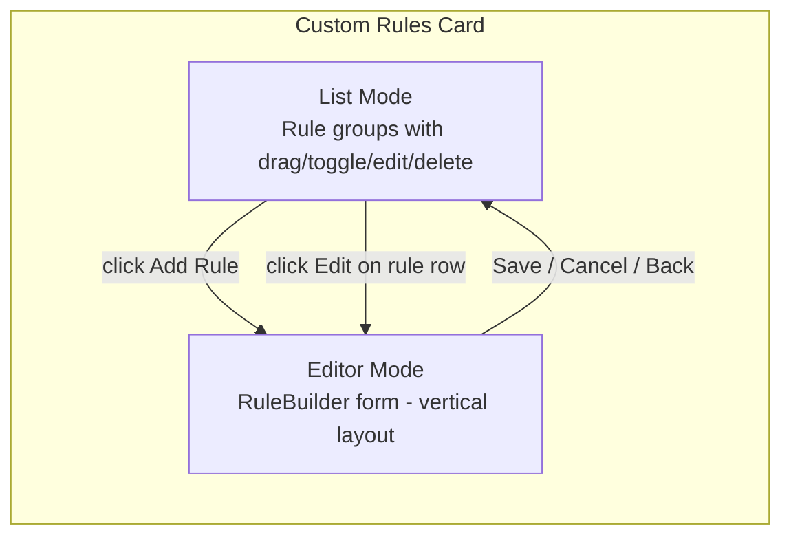
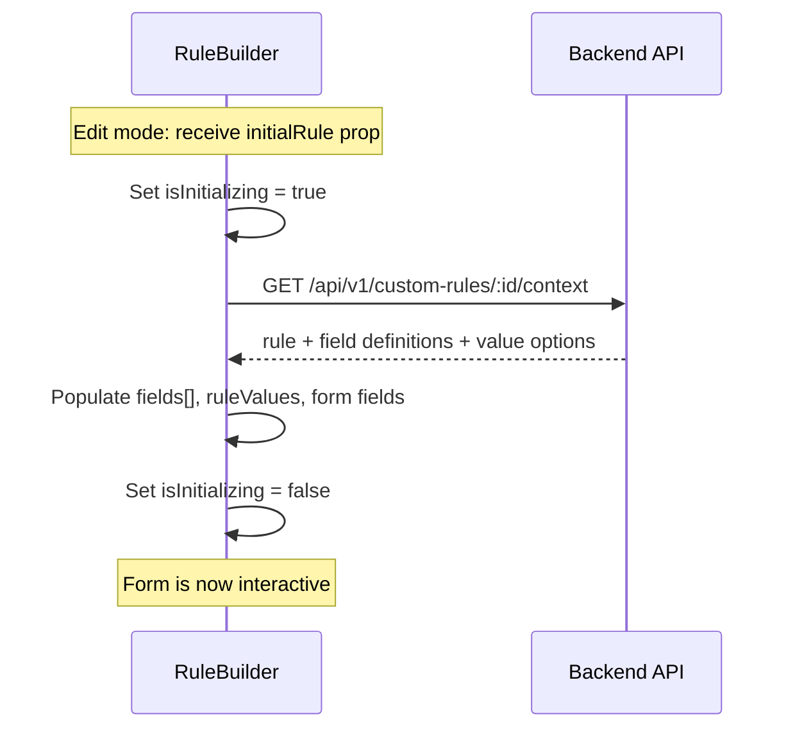

# Edit Custom Rules — Card State-Swap UI

**Created:** 2026-03-21T01:11Z
**Status:** ✅ Complete
**Branch:** `feature/edit-custom-rules`

## Overview

Add the ability to edit existing custom rules through a card state-swap UI pattern. Both rule creation and editing use the same form, displayed by swapping the rule list card's content with the `RuleBuilder` form. The rule list fades out and the form fades in within the same card boundary, with a "← Back to Rules" link to return.

Additionally, streamline the backend: fix missing validation in `RulesService.Update()`, extract field definitions from the route handler into a service method, and add a combined "rule context" endpoint that returns all data needed to prepopulate the edit form in a single round-trip.

## Motivation

Currently, editing a custom rule requires deleting it and re-creating it from scratch. This loses the rule's position in the sort order and is a poor user experience. The backend `PUT /api/v1/custom-rules/:id` endpoint already supports full rule updates — only the frontend UI is missing.

The backend also has a **validation gap**: `RulesService.Update()` performs zero input validation (no field/operator/value checks, no effect validation), while `RulesService.Create()` validates all of these. This violates the service layer architecture rule that services are responsible for validation and maintaining invariants. With a full edit UI now sending arbitrary user input to `Update()`, this must be fixed.

## Design

### Card State-Swap Pattern



When the user clicks "Add Rule" or the edit pencil icon on any rule row, the card content transitions from the rule list to the `RuleBuilder` form. The form shows:
- A header: "← Back to Rules" + title ("Add Rule" or "Edit Rule")
- A vertical layout of the 5 cascading fields (service, field, operator, value, effect)
- Cancel and Save buttons at the bottom

For edit mode, the form is prepopulated with the existing rule's data after loading the required API data. The combined context endpoint (Phase 3) provides all data in a single call, eliminating the cascade latency.

### Edit Initialization Flow (with combined endpoint)



For create mode (no `initialRule`), the existing two-step cascade remains unchanged.

### Affected Files

| File | Change |
|------|--------|
| `backend/internal/services/rules.go` | Extract `validateRule()`, fix `Update()` validation, add `GetRuleContext()` |
| `backend/routes/rulefields.go` | Extract field definitions into service method, add `/custom-rules/:id/context` route |
| `backend/internal/services/rules_test.go` | Tests for validation, context endpoint |
| `backend/routes/rules_test.go` | Tests for validation error responses |
| `frontend/app/components/RuleBuilder.vue` | Add `initialRule` prop, `isInitializing` guard, `initializeForEdit()` method |
| `frontend/app/components/rules/RuleCustomList.vue` | Card state-swap, edit button |
| `frontend/app/pages/rules.vue` | Wire `editRule()` handler |
| `frontend/app/locales/*.json` (all 18+ locale files) | New i18n keys |

---

## Phase 1: RulesService — Extract and Fix Validation

### Step 1.1: Extract shared `validateRule()` method

**File:** `backend/internal/services/rules.go`

Extract the validation logic from `Create()` into a shared private method:

```go
// validateRule checks required fields and effect validity.
// Called by both Create() and Update() to maintain invariants.
func (s *RulesService) validateRule(rule db.CustomRule) error {
    if rule.Field == "" || rule.Operator == "" || rule.Value == "" {
        return fmt.Errorf("%w: field, operator, and value are required", ErrRuleValidation)
    }
    if rule.Effect == "" {
        return fmt.Errorf("%w: effect field is required", ErrRuleValidation)
    }
    if !db.ValidEffects[rule.Effect] {
        return fmt.Errorf(
            "%w: effect must be one of: always_keep, prefer_keep, lean_keep, lean_remove, prefer_remove, always_remove",
            ErrRuleValidation,
        )
    }
    return nil
}
```

### Step 1.2: Refactor `Create()` to use `validateRule()`

**File:** `backend/internal/services/rules.go`

Replace the inline validation in `Create()`:

```go
func (s *RulesService) Create(rule db.CustomRule) (*db.CustomRule, error) {
    if err := s.validateRule(rule); err != nil {
        return nil, err
    }
    rule.Enabled = true
    // ... rest unchanged
}
```

### Step 1.3: Add validation to `Update()`

**File:** `backend/internal/services/rules.go`

Add validation call and preserve sort order and enabled status from the existing record when not explicitly set:

```go
func (s *RulesService) Update(id uint, rule db.CustomRule) (*db.CustomRule, error) {
    var existing db.CustomRule
    if err := s.db.First(&existing, id).Error; err != nil {
        return nil, fmt.Errorf("%w: %v", ErrRuleNotFound, err)
    }

    if err := s.validateRule(rule); err != nil {
        return nil, err
    }

    rule.ID = existing.ID
    // Preserve sort_order if not explicitly provided (toggle/reorder calls don't change it)
    if rule.SortOrder == 0 {
        rule.SortOrder = existing.SortOrder
    }

    if err := s.db.Save(&rule).Error; err != nil {
        slog.Error("Failed to update custom rule", "component", "services", "id", id, "error", err)
        return nil, fmt.Errorf("failed to update rule: %w", err)
    }

    s.bus.Publish(events.RuleUpdatedEvent{
        RuleID: rule.ID,
        Field:  rule.Field,
        Effect: rule.Effect,
    })

    return &rule, nil
}
```

### Step 1.4: Update route handler to return validation errors

**File:** `backend/routes/rules.go`

The `PUT /custom-rules/:id` handler already checks for `ErrRuleNotFound` but not `ErrRuleValidation`. Add the check:

```go
rule, err := reg.Rules.Update(uint(id), updated)
if err != nil {
    if errors.Is(err, services.ErrRuleNotFound) {
        return apiError(c, http.StatusNotFound, "Rule not found")
    }
    if errors.Is(err, services.ErrRuleValidation) {
        return apiError(c, http.StatusBadRequest, err.Error())
    }
    slog.Error("Failed to update custom rule", ...)
    return apiError(c, http.StatusInternalServerError, "Failed to update rule")
}
```

### Step 1.5: Tests for validation

**File:** `backend/internal/services/rules_test.go`

Add tests:
- `TestRulesService_Update_ValidationErrors` — verify that `Update()` rejects empty field, empty operator, empty value, empty effect, and invalid effect values with `ErrRuleValidation`
- `TestRulesService_Update_PreservesSortOrder` — verify that updating a rule without explicit sort order preserves the existing sort order
- `TestRulesService_Create_UsesValidateRule` — verify the refactored `Create()` still produces the same validation errors

**File:** `backend/routes/rules_test.go`

Add tests:
- `TestUpdateRule_ValidationError` — verify that `PUT /custom-rules/:id` with invalid payload returns 400 (not 500)

---

## Phase 2: Extract Field Definitions into Service

### Step 2.1: Define `FieldDef` struct and `RuleFieldService` method

**File:** `backend/internal/services/rules.go`

Add a `FieldDef` struct and a method to `RulesService`:

```go
// FieldDef describes a rule field available for matching.
type FieldDef struct {
    Field     string   `json:"field"`
    Label     string   `json:"label"`
    Type      string   `json:"type"`
    Operators []string `json:"operators"`
}

// GetFieldDefinitions returns available rule fields based on the service type
// and enrichment integrations. If serviceType is empty, returns all fields.
func (s *RulesService) GetFieldDefinitions(serviceType string, enrichment EnrichmentPresence) []FieldDef {
    // ... logic extracted from routes/rulefields.go
}
```

### Step 2.2: Define `EnrichmentPresence` struct

**File:** `backend/internal/services/rules.go`

Move `enrichmentPresence` from `routes/rulefields.go` to the service layer:

```go
// EnrichmentPresence tracks which enrichment integration types are enabled.
type EnrichmentPresence struct {
    HasTautulli bool
    HasSeerr    bool
    HasMedia    bool
}
```

### Step 2.3: Extract `DetectEnrichment` to `IntegrationService`

**File:** `backend/internal/services/integration.go`

Add a public method:

```go
// DetectEnrichment scans enabled integrations and returns which enrichment
// services are available (Tautulli, Seerr, Plex/Jellyfin/Emby).
func (s *IntegrationService) DetectEnrichment() EnrichmentPresence {
    configs, _ := s.ListEnabled()
    var p EnrichmentPresence
    for _, cfg := range configs {
        switch cfg.Type {
        case string(integrations.IntegrationTypeTautulli):
            p.HasTautulli = true
        case string(integrations.IntegrationTypeSeerr):
            p.HasSeerr = true
        case string(integrations.IntegrationTypePlex),
            string(integrations.IntegrationTypeJellyfin),
            string(integrations.IntegrationTypeEmby):
            p.HasMedia = true
        }
    }
    return p
}
```

Note: `EnrichmentPresence` can live in `services/rules.go` or a shared types file — wherever avoids circular imports.

### Step 2.4: Refactor `routes/rulefields.go` to use service method

**File:** `backend/routes/rulefields.go`

Replace the inline field-building logic with:

```go
protected.GET("/rule-fields", func(c echo.Context) error {
    serviceType := c.QueryParam("service_type")
    enrichment := reg.Integration.DetectEnrichment()
    fields := reg.Rules.GetFieldDefinitions(serviceType, enrichment)
    return c.JSON(http.StatusOK, fields)
})
```

Remove `enrichmentPresence`, `detectEnrichment()`, and `appendEnrichmentFields()` from the route handler — they now live in services.

### Step 2.5: Tests for field definitions

**File:** `backend/internal/services/rules_test.go`

Add tests:
- `TestRulesService_GetFieldDefinitions_AllTypes` — verify base fields present
- `TestRulesService_GetFieldDefinitions_SonarrSpecific` — verify Sonarr fields included when service type is "sonarr"
- `TestRulesService_GetFieldDefinitions_EnrichmentFields` — verify Tautulli/Seerr/media fields appear based on enrichment presence
- `TestRulesService_GetFieldDefinitions_MediaTypeAlways` — verify "Media Type" field always present

---

## Phase 3: Combined Rule Context Endpoint

### Step 3.1: Add `GetRuleContext()` to `RulesService`

**File:** `backend/internal/services/rules.go`

```go
// RuleContext contains all data needed to prepopulate the rule editor for an existing rule.
type RuleContext struct {
    Rule   db.CustomRule          `json:"rule"`
    Fields []FieldDef             `json:"fields"`
    Values *RuleValuesResult      `json:"values,omitempty"`
}

// GetRuleContext returns the rule, its available field definitions, and value
// options/suggestions for the rule's current field. This provides all data the
// frontend needs to prepopulate the rule editor in a single round-trip.
func (s *RulesService) GetRuleContext(id uint) (*RuleContext, error) {
    var rule db.CustomRule
    if err := s.db.First(&rule, id).Error; err != nil {
        return nil, fmt.Errorf("%w: %v", ErrRuleNotFound, err)
    }

    // Get the integration config to determine service type
    config, err := s.integrations.GetByID(rule.IntegrationID)
    if err != nil {
        return nil, fmt.Errorf("failed to get integration: %w", err)
    }

    enrichment := s.integrations.DetectEnrichment()
    fields := s.GetFieldDefinitions(config.Type, enrichment)

    // Fetch value options for the current field
    values, valErr := s.integrations.FetchRuleValues(rule.IntegrationID, rule.Field)
    if valErr != nil {
        // Non-fatal — values are nice-to-have for prepopulation
        slog.Warn("Failed to fetch rule values for context", "ruleId", id, "field", rule.Field, "error", valErr)
    }

    return &RuleContext{
        Rule:   rule,
        Fields: fields,
        Values: values,
    }, nil
}
```

Note: `s.integrations` will need to be wired via the `SetDependencies` or extended `SetFieldDependencies` pattern already used by `PreviewService`. The `IntegrationLister` interface needs a `GetByID` method and `DetectEnrichment` method, or a new `IntegrationContextProvider` interface.

### Step 3.2: Add interface for IntegrationService dependencies

**File:** `backend/internal/services/rules.go`

Add an interface that `RulesService` depends on:

```go
// IntegrationContextProvider provides integration metadata needed for rule context building.
type IntegrationContextProvider interface {
    GetByID(id uint) (*db.IntegrationConfig, error)
    DetectEnrichment() EnrichmentPresence
    FetchRuleValues(integrationID uint, action string) (*RuleValuesResult, error)
}
```

Add `SetIntegrationProvider(provider IntegrationContextProvider)` to `RulesService` and wire it in `NewRegistry()`.

### Step 3.3: Register route

**File:** `backend/routes/rules.go`

```go
protected.GET("/custom-rules/:id/context", func(c echo.Context) error {
    id, err := strconv.ParseUint(c.Param("id"), 10, 64)
    if err != nil {
        return apiError(c, http.StatusBadRequest, "Invalid ID")
    }

    ctx, err := reg.Rules.GetRuleContext(uint(id))
    if err != nil {
        if errors.Is(err, services.ErrRuleNotFound) {
            return apiError(c, http.StatusNotFound, "Rule not found")
        }
        slog.Error("Failed to get rule context", "component", "api", "id", id, "error", err)
        return apiError(c, http.StatusInternalServerError, "Failed to get rule context")
    }
    return c.JSON(http.StatusOK, ctx)
})
```

### Step 3.4: Tests

**File:** `backend/internal/services/rules_test.go`

- `TestRulesService_GetRuleContext_Success` — returns rule, fields, and values
- `TestRulesService_GetRuleContext_NotFound` — returns ErrRuleNotFound
- `TestRulesService_GetRuleContext_ValuesFallback` — returns rule + fields even when value fetch fails

**File:** `backend/routes/rules_test.go`

- `TestGetRuleContext_Success` — 200 with full context
- `TestGetRuleContext_NotFound` — 404

---

## Phase 4: RuleBuilder — Add Edit Mode Support

### Step 4.1: Add `initialRule` prop and `mode` computed

**File:** `frontend/app/components/RuleBuilder.vue`

Add a new optional prop:

```ts
const props = defineProps<{
  integrations: Integration[];
  initialRule?: {
    id: number;
    integrationId: number;
    field: string;
    operator: string;
    value: string;
    effect: string;
  };
}>();
```

Add a computed for the current mode:

```ts
const isEditMode = computed(() => !!props.initialRule);
```

### Step 4.2: Add `isInitializing` guard ref

**File:** `frontend/app/components/RuleBuilder.vue`

```ts
const isInitializing = ref(false);
```

Guard both cascade functions to skip downstream resets during initialization:

```ts
async function onServiceChange() {
  if (isInitializing.value) return;
  form.field = '';
  form.operator = '';
  // ... rest unchanged
}

async function onFieldChange() {
  if (isInitializing.value) return;
  form.operator = '';
  form.value = '';
  // ... rest unchanged
}
```

### Step 4.3: Add `initializeForEdit()` using the context endpoint

**File:** `frontend/app/components/RuleBuilder.vue`

Use the combined endpoint from Phase 3:

```ts
interface RuleContext {
  rule: { id: number; integrationId: number; field: string; operator: string; value: string; effect: string };
  fields: FieldDef[];
  values: RuleValuesResponse | null;
}

async function initializeForEdit() {
  if (!props.initialRule) return;

  isInitializing.value = true;
  try {
    // Single API call returns fields + values + rule
    const ctx = (await api(`/api/v1/custom-rules/${props.initialRule.id}/context`)) as RuleContext;

    // Populate field definitions directly (no API call needed)
    fields.value = ctx.fields;

    // Populate value options directly (no API call needed)
    ruleValues.value = ctx.values;

    // Set all form fields at once — cascades are suppressed by isInitializing
    form.integrationId = String(props.initialRule.integrationId);
    form.field = props.initialRule.field;
    form.operator = props.initialRule.operator;
    form.value = props.initialRule.value;
    form.effect = props.initialRule.effect;
  } finally {
    isInitializing.value = false;
  }
}

onMounted(() => {
  if (props.initialRule) {
    initializeForEdit();
  }
});
```

### Step 4.4: Add `update` emit and modify `submitRule()`

**File:** `frontend/app/components/RuleBuilder.vue`

Update the emits to distinguish between create and update:

```ts
const emit = defineEmits<{
  (e: 'save', rule: { integrationId: number; field: string; operator: string; value: string; effect: string }): void;
  (e: 'update', id: number, rule: { integrationId: number; field: string; operator: string; value: string; effect: string }): void;
  (e: 'cancel'): void;
}>();
```

Modify `submitRule()`:

```ts
function submitRule() {
  if (!isFormValid.value) return;
  const ruleData = {
    integrationId: Number(form.integrationId),
    field: form.field,
    operator: form.operator,
    value: valueNotRequired.value ? 'true' : String(form.value),
    effect: form.effect,
  };

  if (isEditMode.value && props.initialRule) {
    emit('update', props.initialRule.id, ruleData);
  } else {
    emit('save', ruleData);
  }

  // Only reset form on create (edit mode will unmount when returning to list)
  if (!isEditMode.value) {
    form.integrationId = '';
    form.field = '';
    form.operator = '';
    form.value = '';
    form.effect = '';
    fields.value = [];
    ruleValues.value = null;
    comboboxSearch.value = '';
  }
}
```

### Step 4.5: Show loading overlay during initialization

**File:** `frontend/app/components/RuleBuilder.vue`

Wrap the form grid in a relative container and show a loading overlay while `isInitializing` is true:

```vue
<div class="relative">
  <div
    v-if="isInitializing"
    class="absolute inset-0 flex items-center justify-center bg-background/80 rounded-lg z-10"
  >
    <LoaderCircleIcon class="w-5 h-5 animate-spin text-muted-foreground" />
  </div>

  <div class="grid grid-cols-1 sm:grid-cols-2 lg:grid-cols-5 gap-3"
       :class="{ 'opacity-50 pointer-events-none': isInitializing }">
    <!-- existing form fields -->
  </div>
</div>
```

### Step 4.6: Update the save button label

**File:** `frontend/app/components/RuleBuilder.vue`

Change the save button to show "Save Rule" for create and "Update Rule" for edit:

```vue
<UiButton :disabled="!isFormValid || isInitializing" @click="submitRule">
  {{ isEditMode ? $t('rules.updateRule') : $t('rules.saveRule') }}
</UiButton>
```

---

## Phase 5: RuleCustomList — Card State-Swap + Edit Button

### Step 5.1: Add component state for list vs editor mode

**File:** `frontend/app/components/rules/RuleCustomList.vue`

Add refs to track the view mode:

```ts
type ViewMode = 'list' | 'add' | 'edit';

const viewMode = ref<ViewMode>('list');
const editingRule = ref<CustomRule | null>(null);
```

Remove the existing `showAddRule` ref — it's replaced by `viewMode === 'add'`.

### Step 5.2: Replace inline RuleBuilder with card state-swap

**File:** `frontend/app/components/rules/RuleCustomList.vue`

Restructure the `<UiCardContent>` to switch between list and editor views:

```vue
<UiCardContent>
  <!-- Editor Mode (Add or Edit) -->
  <div v-if="viewMode !== 'list'"
       v-motion
       :initial="{ opacity: 0, x: 12 }"
       :enter="{ opacity: 1, x: 0, transition: { duration: 200 } }">
    <div class="flex items-center gap-2 mb-4">
      <UiButton variant="ghost" size="sm" @click="viewMode = 'list'; editingRule = null">
        <ArrowLeftIcon class="w-4 h-4" />
        {{ $t('rules.backToRules') }}
      </UiButton>
      <span class="text-sm font-medium">
        {{ viewMode === 'edit' ? $t('rules.editRule') : $t('rules.addRule') }}
      </span>
    </div>

    <RuleBuilder
      :key="editingRule?.id ?? 'new'"
      :integrations="integrations"
      :initial-rule="editingRule ? {
        id: editingRule.id,
        integrationId: editingRule.integrationId ?? 0,
        field: editingRule.field,
        operator: editingRule.operator,
        value: editingRule.value,
        effect: editingRule.effect,
      } : undefined"
      @save="onAddRule"
      @update="onUpdateRule"
      @cancel="viewMode = 'list'; editingRule = null"
    />
  </div>

  <!-- List Mode -->
  <div v-else
       v-motion
       :initial="{ opacity: 0, x: -12 }"
       :enter="{ opacity: 1, x: 0, transition: { duration: 200 } }">
    <!-- existing rule list content (empty state + grouped rules) -->
  </div>
</UiCardContent>
```

### Step 5.3: Add edit button to each rule row

**File:** `frontend/app/components/rules/RuleCustomList.vue`

In the rule row's action buttons area (after the effect badge, before the delete button), add an edit button:

```vue
<UiButton
  variant="ghost"
  size="icon-sm"
  aria-label="Edit rule"
  class="text-muted-foreground hover:text-foreground shrink-0"
  @click="editingRule = rule; viewMode = 'edit'"
>
  <PencilIcon class="w-4 h-4" />
</UiButton>
```

Import `PencilIcon` and `ArrowLeftIcon` from `lucide-vue-next`.

### Step 5.4: Update the "Add Rule" button to use state-swap

**File:** `frontend/app/components/rules/RuleCustomList.vue`

Change the existing "Add Rule" button:

```vue
<UiButton size="sm" @click="viewMode = 'add'; editingRule = null">
  <PlusIcon class="w-3.5 h-3.5" />
  {{ $t('rules.addRule') }}
</UiButton>
```

### Step 5.5: Add `edit-rule` emit and handlers

**File:** `frontend/app/components/rules/RuleCustomList.vue`

Add the emit:

```ts
const emit = defineEmits<{
  'add-rule': [rule: { integrationId: number; field: string; operator: string; value: string; effect: string }];
  'edit-rule': [id: number, rule: { integrationId: number; field: string; operator: string; value: string; effect: string }];
  'delete-rule': [id: number];
  'toggle-enabled': [rule: CustomRule, enabled: boolean];
  'reorder': [order: number[]];
}>();

function onAddRule(rule: { integrationId: number; field: string; operator: string; value: string; effect: string }) {
  emit('add-rule', rule);
  viewMode.value = 'list';
}

function onUpdateRule(id: number, rule: { integrationId: number; field: string; operator: string; value: string; effect: string }) {
  emit('edit-rule', id, rule);
  viewMode.value = 'list';
  editingRule.value = null;
}
```

---

## Phase 6: Rules Page — Wire Edit Handler

### Step 6.1: Add `editRule()` function

**File:** `frontend/app/pages/rules.vue`

```ts
async function editRule(
  id: number,
  rule: { integrationId: number; field: string; operator: string; value: string; effect: string },
) {
  try {
    await api(`/api/v1/custom-rules/${id}`, {
      method: 'PUT',
      body: { ...rule, id },
    });
    addToast($t('rules.ruleUpdated'), 'success');
    await fetchRules();
  } catch {
    addToast($t('rules.ruleUpdateFailed'), 'error');
  }
}
```

### Step 6.2: Wire the `edit-rule` event

**File:** `frontend/app/pages/rules.vue`

Update the `RulesRuleCustomList` usage:

```vue
<RulesRuleCustomList
  :rules="rules"
  :integrations="allIntegrations"
  @add-rule="addRule"
  @edit-rule="editRule"
  @delete-rule="deleteRule"
  @toggle-enabled="toggleRuleEnabled"
  @reorder="reorderRules"
/>
```

---

## Phase 7: i18n

### Step 7.1: Add English locale keys

**File:** `frontend/app/locales/en.json`

Add under the `rules.*` section:

```json
"rules.editRule": "Edit Rule",
"rules.backToRules": "Back to Rules",
"rules.updateRule": "Update Rule",
"rules.saveRule": "Save Rule",
"rules.ruleUpdated": "Rule updated",
"rules.ruleUpdateFailed": "Failed to update rule"
```

### Step 7.2: Add translated keys to all other locale files

Add the same keys to all 17+ non-English locale files with appropriate translations:

`de.json`, `es.json`, `fr.json`, `it.json`, `nl.json`, `pl.json`, `pt-BR.json`, `ro.json`, `sv.json`, `fi.json`, `da.json`, `nb.json`, `tr.json`, `ja.json`, `ko.json`, `zh-CN.json`, `zh-TW.json`, `cs.json`, `hu.json`, `uk.json`, `ru.json`

---

## Phase 8: Frontend Tests

### Step 8.1: RuleBuilder unit tests for edit mode

**File:** `frontend/app/components/RuleBuilder.test.ts` (new or update existing)

Tests:
- Renders with `initialRule` prop and shows loading overlay
- After initialization completes, form fields are prepopulated with the initial rule values
- `onServiceChange` and `onFieldChange` do NOT reset downstream values during initialization
- Submitting in edit mode emits `update` event with `(id, ruleData)` instead of `save`
- Submitting in create mode emits `save` event (existing behavior)
- Cancel button emits `cancel` in both modes

### Step 8.2: RuleCustomList unit tests for state-swap

**File:** `frontend/app/components/rules/RuleCustomList.test.ts` (new or update existing)

Tests:
- Initially shows list mode with rule rows
- Clicking "Add Rule" switches to editor mode with empty form
- Clicking edit pencil on a rule switches to editor mode with that rule's data
- "Back to Rules" returns to list mode
- Saving in add mode emits `add-rule` and returns to list
- Saving in edit mode emits `edit-rule` with the rule ID and returns to list

### Step 8.3: Rules page integration test for edit flow

**File:** `frontend/app/pages/rules.test.ts` (update existing if exists)

Tests:
- `editRule()` calls `PUT /api/v1/custom-rules/:id` with the correct payload
- On success, shows toast and refreshes rules list
- On failure, shows error toast

---

## Phase 9: CI Verification

### Step 9.1: Run `make ci`

Run `make ci` from the `capacitarr/` directory to verify:
- All backend tests pass (validation, context endpoint, route handler changes)
- All frontend tests pass
- Linting passes
- No new warnings

---

## Summary of Changes

| Area | Files Changed | Type |
|------|---------------|------|
| Validation fix | `services/rules.go`, `routes/rules.go` | Modified — extract validation, fix Update() |
| Field definitions | `services/rules.go`, `services/integration.go`, `routes/rulefields.go` | Modified — extract to service layer |
| Context endpoint | `services/rules.go`, `routes/rules.go` | New — combined data endpoint |
| RuleBuilder | `RuleBuilder.vue` | Modified — add edit mode support |
| RuleCustomList | `RuleCustomList.vue` | Modified — state-swap UI + edit button |
| Rules page | `rules.vue` | Modified — wire edit handler |
| Locale files | 18+ JSON files | Modified — new i18n keys |
| Backend tests | `rules_test.go` (2 files) | New/modified |
| Frontend tests | 2-3 test files | New/modified |
